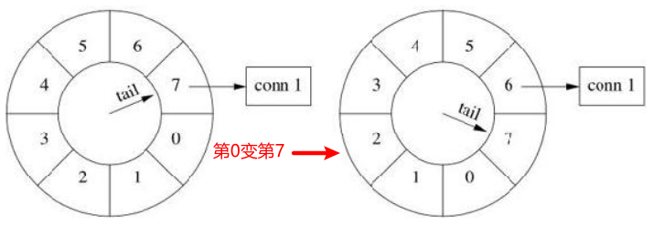
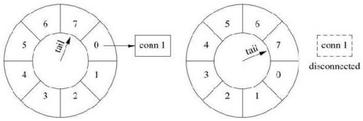
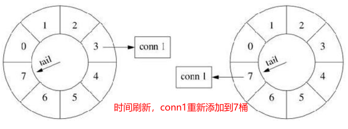

一个连接如果若干秒没有收到数据，就被认为是空闲连接，应该被踢掉。

# 1 时间轮基本概念

# 2 处理空闲连接的原理
连接超时不需要精确定时，只要大致8秒超时断开就行，多一秒、少一秒关系不大。处理连接超时可用一个简单的数据结构：**8个桶组成的循环队列**。

- 第1个桶放1秒之后将要超时的连接，第2个桶放2秒之后将要超时的连接，依此类推
- 每个连接一收到数据就把自己放到第8个桶，然后在每秒的timer里把第一个桶里的连接断开，**把这个空桶挪到队尾（相当于第8个桶又变成空）**这样大致可以做到8秒没有数据就超时断开连接。更重要的是，**每次不用检查全部的连接，只要检查第一个桶里的连接**，相当于把任务分散了。


原理图示如下：

1. 将要删除的连接conn1添加到最后，等待8秒后删除：



2. 8秒后，conn1处理时间轮开头，需要被立刻删除。删除后，第0再度变为第7



3. 如果中间连接又有数据收发，就需要重新计时，即将conn1放到时间轮末尾：



# 3 代码解析
代码位置`examples/idleconnection/`我们不会真的把一个连接从一个格子移到另一个格子（复杂且容易出错），而是采用**引用计数**的办法，用shared_ptr来管理Entry。如果连接收到数据，就把对应的EntryPtr放到这个格子里，这样它的引用计数就递增了。当Entry的引用计数递减到零时，说明它没有在任何一个格子里出现，那么连接超时，Entry的析构函数会断开连接。
代码示例解析如下：

- 各个结构设计
```cpp
//时间轮里保存Entry弱指针
struct Entry : public muduo::copyable
{
    explicit Entry(const WeakTcpConnectionPtr &weakConn)
        : weakConn_(weakConn)
    {}

    ~Entry()
    {
        //判断指针是否存在，存在则关闭连接
        muduo::net::TcpConnectionPtr conn = weakConn_.lock();
        if (conn)
        {
            conn->shutdown();
        }
    }
    WeakTcpConnectionPtr weakConn_; //保存弱指针对象
};
typedef std::shared_ptr<Entry> EntryPtr;
typedef std::weak_ptr<Entry> WeakEntryPtr;
typedef std::unordered_set<EntryPtr> Bucket;//每个格子是一个set
typedef boost::circular_buffer<Bucket> WeakConnectionList;//模拟包含多个格子的时间轮
```


- 新连接建立时，创建一个Entry对象，添加到时间轮里即可：
```cpp
//新连接建立，创建一个Entry对象，添加到最后一个格子里
EntryPtr entry(new Entry(conn));
connectionBuckets_.back().insert(entry);
```


- 当连接接收到数据时，说明连接要延长关闭时间，这里巧妙的利用引用计数，避免了在格子间移动对象的复杂操作：
```cpp
WeakEntryPtr weakEntry(boost::any_cast<WeakEntryPtr>(conn->getContext()));
EntryPtr entry(weakEntry.lock());
if (entry)
{
    //如果收到数据，重新把Entry对象插入到时间轮最后
    //这样时间轮里可能有多个Entry对象的智能指针，但是只有当最后面的对象析构时，才会真正释放
    //因为是智能指针，这巧妙的利用了引用计数，不用移动Entry对象
    connectionBuckets_.back().insert(entry);
}
```


- 时间轮需要定时的清除空闲的连接，这里利用了circular_buffer的特性：
```cpp
loop->runEvery(1.0, std::bind(&EchoServer::onTimer, this));//注册定时任务，每秒调用一次onTimer函数
connectionBuckets_.resize(idleSeconds);//指定时间轮大小
//...
void EchoServer::onTimer()
{
    //添加一个新格子，由于circular_buffer规定了大小，所以头部的格子和智能指针会被自动析构
    connectionBuckets_.push_back(Bucket());
    dumpConnectionBuckets();
}
```

# 4 自定义链表的另一方法
代码位置：`examples/idleconnection/sortedlist.cc`另外一个思路是“选择排序”：使用链表将TcpConnection串起来（**node中保存每个连接建立的时间**），TcpConnection每次收到消息就把自己移到链表末尾，这样链表是按接收时间先后排序的。再用一个定时器定期从链表前端查找并踢掉超时的连接（需要计算时间差）。
```cpp
typedef std::weak_ptr<TcpConnection> WeakTcpConnectionPtr;
typedef std::list<WeakTcpConnectionPtr> WeakConnectionList;

struct Node : public muduo::copyable
{
    Timestamp lastReceiveTime;
    WeakConnectionList::iterator position;
};
```
