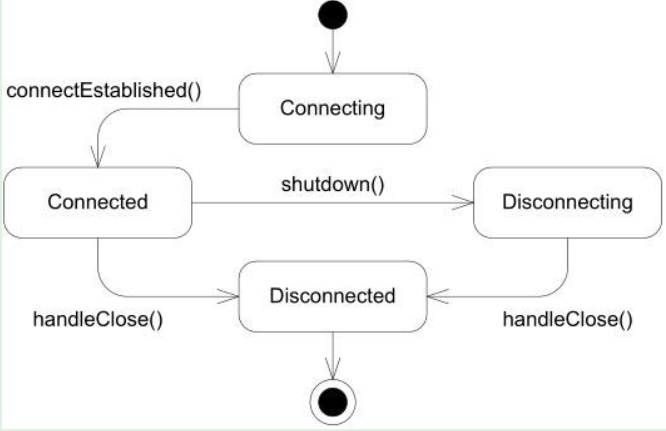

# 1 Acceptor处理新连接
Acceptor类负责监听socket并建立新连接，其逻辑很简单，不再附加代码注释，可参考：Acceptor的基本逻辑是：

1. 构造函数中创建server socket和对应channel对象，以及占位用的临时描述符
1. 在listen函数中，将server socket描述符添加到EventLoop的epoll wait list中接受监听
1. 当触发可写事件时，说明有新的client连接，调用handleRead回调，accept新连接并通过回调函数传递给App层

# 2. TcpServer管理连接
TcpServer类通过**唯一的Acceptor**处理新连接，连接建立后保存在类型为**TCP Connection**的成员变量connections_中。TcpServer是供App直接使用的，内嵌在用户程序中，创建和释放由用户程序控制。

1. TcpServer构造时，创建Acceptor对象并设置新连接回调，开始监听client连接
```cpp
acceptor_->setNewConnectionCallback( //设置新连接回调，新连接建立后调用newConnection
    std::bind(&TcpServer::newConnection, this, _1, _2));
```


2. client连接后，调用newConnection创建新TcpConnection对象，并将新连接加入到epoll wait list中监听IO事件
```cpp
TcpConnectionPtr conn(new TcpConnection(ioLoop, //有新连接，创建TcpConnectionPtr对象
                                        connName,
                                        sockfd,
                                        localAddr,
                                        peerAddr));
connections_[connName] = conn;                    //加入到map中保存
conn->setConnectionCallback(connectionCallback_); //设置各种回调函数
conn->setMessageCallback(messageCallback_);
conn->setWriteCompleteCallback(writeCompleteCallback_);
conn->setCloseCallback(std::bind(&TcpServer::removeConnection, this, _1)); //设置关闭时回调
//执行connectEstablished，将新连接加入到epoll wait list开始监听IO事件
//并通过connectionCallback_回调，将本TcpConnection传递给App层
ioLoop->runInLoop(std::bind(&TcpConnection::connectEstablished, conn));
```

# 3 TcpConnection
TcpConnection类是muduo最核心也是最复杂的类。TcpConnection是muduo里唯一默认使用shared_ptr来管理的类，也是唯一继承enable_shared_from_this的class，这源于其模糊的生命期。TcpConnection主要负责如下功能：

- 建立连接，触发监听IO事件
- 连接断开和关闭
- 提供接口给App，负责发送数据
- 接收socket数据，通知App处理

收发数据已在[Buffer类解析](https://www.yuque.com/barret/yg1uae/sg7mv1#TlWUM)中有解读，这里只关注一下连接的断开关闭：muduo中连接的关闭是分为**被动关闭和主动关闭**两种：



## 3.1 被动关闭
本端先关闭socket写通道，等对方检测到无法读数据主动关闭连接，本端的read返回0时再关闭整个连接。接口函数为TcpConnction::shutdown()
```cpp
void TcpConnection::shutdown() //被动关闭连接的入口
{
    // FIXME: use compare and swap
    if (state_ == kConnected)
    {
        setState(kDisconnecting); //设置状态为正在关闭
        loop_->runInLoop(std::bind(&TcpConnection::shutdownInLoop, this));
    }
}

void TcpConnection::shutdownInLoop()
{
    loop_->assertInLoopThread();
    if (!channel_->isWriting())
    { //如果当前没有发送数据，关闭写通道。如果有数据，等下一次loop循环再进入此函数
        socket_->shutdownWrite();
    }
}
//之后socket read得到0，channel会调用handleClose回调函数关闭连接
```

## 3.2 主动关闭
```cpp
void TcpConnection::forceClose() //主动关闭连接的接口
{
    if (state_ == kConnected || state_ == kDisconnecting)
    {
        setState(kDisconnecting);
        loop_->queueInLoop(std::bind(&TcpConnection::forceCloseInLoop, shared_from_this()));
    }
}

void TcpConnection::forceCloseInLoop()
{
    loop_->assertInLoopThread();
    if (state_ == kConnected || state_ == kDisconnecting)
    {
        handleClose(); //调用内部函数，read失败也会调用这个函数
    }
}
```

## 3.3 handleClose
```cpp
void TcpConnection::handleClose()
{
    setState(kDisconnected); //设置状态为关闭
    channel_->disableAll();  //取消所有IO事件的监听

    TcpConnectionPtr guardThis(shared_from_this()); //将本对象转换为智能指针
    connectionCallback_(guardThis); //回调，让TcpServer和TcpClient释放connection的智能指针
    //回调TcpServer::removeConnection，最后调用TcpConnection::connectDestroyed
    closeCallback_(guardThis);
}

void TcpConnection::connectDestroyed()
{
    loop_->assertInLoopThread();
    //...
    channel_->remove(); //删除channel， 从poller中删除channel引用
}
//之后TcpConnection对象因为引用计数为0被释放，内部的unique_ptr socket描述符也被自动释放
```
