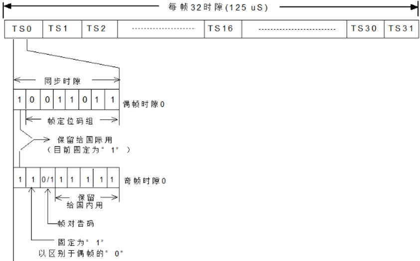
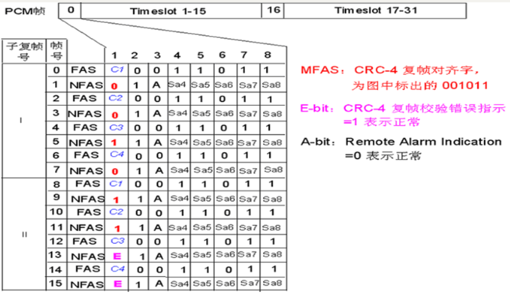
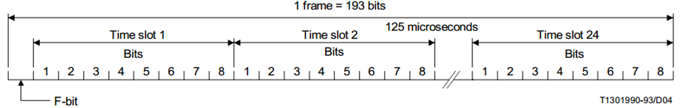
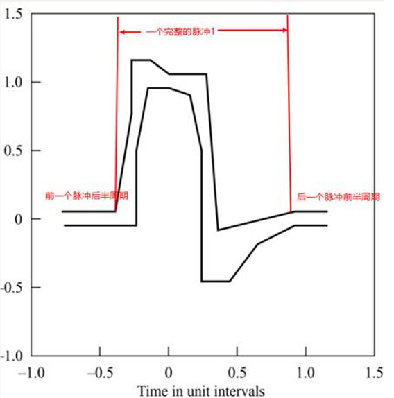

# 1 E1 interface

## 1.1 E1帧格式
E1帧格式分为两种，**double frame**和**crc4 multi frame**

- double frame格式如下，只关心TS0中的奇偶帧（TS0的数值不变，用于区分奇偶帧）： 

- **crc4复桢**是16个桢组成一个E1复桢，只关系每个桢中的TS0中第8位组成的校验码： 

## 1.2 E1告警类型

### 1.2.1 故障告警：

- LOS（Loss of signal：信号丢失）
- AIS（Alarm Indication Signal：告警指示信号）
- LFA（Loss of frame  alignment：帧失步）
- RAI（Remote Alarm Indication：远端告警指示）
- LMFA（Loss of Mulitframe Alignment：复帧失步）
- RMFA（Remote Multiframe Alignment：复帧对告）
- TS16-AIS（TS16 Alarm Indication Signal：16时隙AIS信号）

### 1.2.2 事件告警：

- CRC4 Error（CRC4检测错）
- BER of Frame Alignment > 1e-3（帧定位信号误码率过大）
- Slip（滑码）

# 2 T1 interface

## 2.1 T1帧格式

- F-bit：为**分帧位**，用于标识帧的结束和下一帧的开始
- ts24：为**D channel**，用于传输HDLC frame
- ts1-ts23：      为**B channel**， 用于传输语音数据
- frame采样率为8000      frame/s, 所以总的频率为**193bit * 8000 = 1544Kbit/s**

## 2.2 T1告警

### 2.2.1 故障告警：

- LOS（Loss of signal：信号丢失）， T1的LOS也叫**Red alarm**
- AIS（Alarm Indication Signal：告警指示信号），T1的AIS也叫**Blue alarm**
- LFA（Loss of frame alignment：帧失步）
- RAI（Remote Alarm Indication：远端告警指示），T1的RAI成为**Yellow alarm**

### 2.2.2 事件告警：

- CRC6 Error（CRC6检测错）
- BER of Frame Alignment > 1e-3（帧定位信号误码率过大）
- Slip（滑码）

## 2.3 T1标准波形
波形需要固定0 1 0的发送码型，不然模板是对应不上的：

# 3 什么是桢同步
虽然都叫做frame，HDLC frame其实是HDLC packet，是一个数据报。数据报是可以不发的，例如暂停一下，几秒钟几分钟之后，再有下一个数据报发过来。但是E1/T1帧不一样，它是有固定结构并且是以固定的速度发过来的，没有停顿这个概念。E1/T1帧长度固定，**不停地一个帧接一个帧发过来，中间没有空隙**。在接收端看来，当数据从线路上恢复出来以后，是一串数据比特流，我们知道这个比特流应该是E1/T1帧一帧接一帧连续的数据，但不知道每一帧从哪里开始，所以**需要找到帧的开始之处**。找到后就简单了，因为每一帧的长度是一样的，后面的帧就都能很容易地定位了。所以要接收T1数据，首先要获得帧同步。
