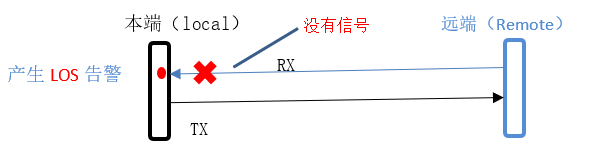
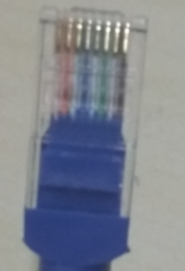
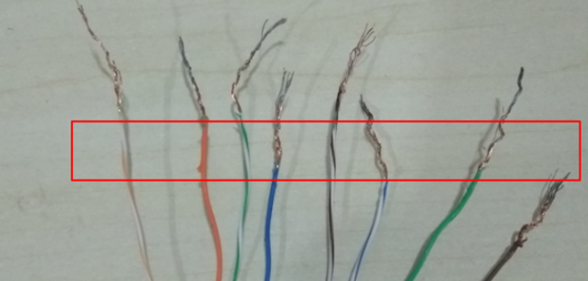
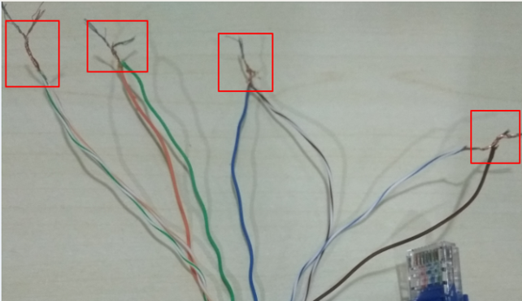
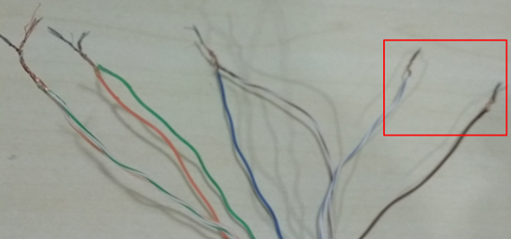
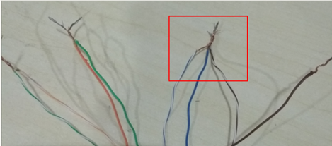

# 1 Lost Of SgnaI(LOS)
收端在176个连续脉冲周期内没有检查到E1线上信号变化，则上报此告警，同时通过NFAS向对端发送Remote Alarm Signal．即第三位被置1。

# 2 Remote Alarm Indication(RAI)
收端接收到NFAS，发现．第三位被置‘1‘，说明对端发送了Remode Alarm Signal，则上报此告警，对端发送Remode Alarm的原因包括：末收到信号．帧定界错误，误码率高、编解码错误，电源故障等。

# 3 Alarm Indication SignaI(AIS)
当发端停止发送正常数据，而改为发送全．1‘时，收端在2个帧周期内检查到的‘O’的数量少于3．则上报此告警．El线上具体信号的传送采用HDB3线码方式，实际上就是AMI(Altermate Mark Inversion)方式的1种改进．所以出现AIS告警时．E1线上的信号肯定是变化的，注意与LOS告警的区别，在什么情况卜．发送方会发送全‘1’信号，常见的情况育：发送方E1本端环回：传输设备的上级接收异常，向下游设备发送AIS信号，收端接收到AIS信号后，会通过NFAS向对端发送remote Alarm Signal。

# 4 如何模拟三种告警

## 4.1 准备工作
Here is the RJ45 cable that we will used to simulate the E1 alarms:

- the first E1 in this RJ45 line is 1,2,4,5;
- the second E1 is 3,6,7,8.

1. Firstly, we need to cut the RJ45 line and separate each line. Just like this:

2. Cross loop the first E1 with the second E1, with 1-->3, 2-->6, 4-->7, and 5-->8. Like this:

3. Plug in the RJ45 line in the board's E1 port directly (better without DDF), then the interface status should be **L1 active**. If interface status is still L1 inactive, you should check your RJ45 line.

## 4.2 模拟LOS

1. Plug out the RJ45 line from the NIAT-A board's E1 port.
1. Then the LOS alarm will be reported

## 4.3 模拟RAI

1. In the preparation, we cross loop the 8 lines. Here if we want to simulate the RAI alarm, we need to disconnect the loop 5-->8. It should be like this:

2. Plug in the RJ45 line in the NIAT-A board's E1 port directly. Then you will see the RAI alarm reported.

## 4.4 模拟AIS

1. In the preparation, we cross loop the 8 lines. Here if we want to simulate the AIS alarm, we need to disconnect the loop 5-->8 and then connect 4-->5-->7. It should be like this:

2. Plug in the RJ45 line in the NIAT-A board's E1 port directly. Then you will see the AIS alarm reported.
