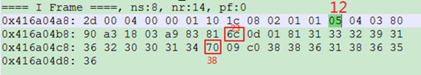
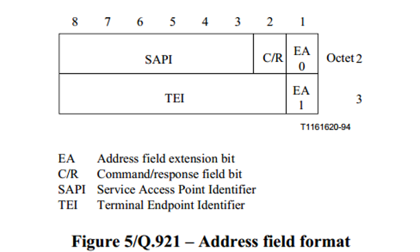
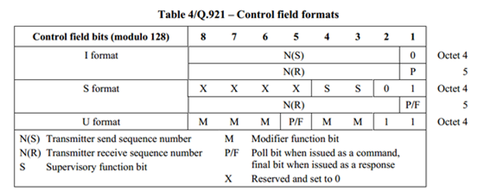
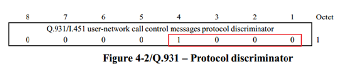
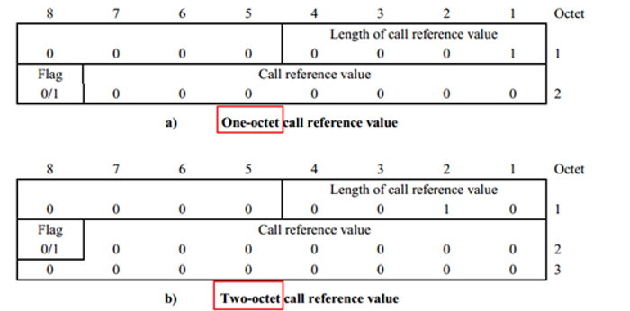
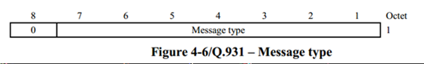
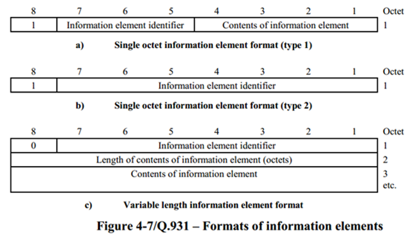

# 1 原始的PADR buffer


- **buffer length**
```cpp
((u16 *) frameData_)[0] = length;     //buffer的长度 - 4
```

- **buffer offset**
```cpp
((u16 *) frameData_)[1] = ifId; //(ifId << 1) | 1;  //那个接口发来的消息，interface id
```


# 2 **Q921 帧结构**

## 2.1 address field
```c
//address field
frameData_[4] = (sapi << 2)  | (CRon << 1) | 0; //SAPI和CRon的值
frameData_[5] = (tei << 1)  | 1;  //TEI的值
//end address field
```


## 2.2 **control field**
```cpp
//control field
frameData[6] = ns << 1;         //NS的值
frameData[7] = (frameData[7] & 0x01) | (nr << 1);  //NR的值
//end control field
```


# 3 Q931帧结构

## 3.1 **protocol discriminator**
```cpp
frameData[8] = 0x08;  //protocol discriminator
```


## 3.2 **call reference**
```cpp
frameData[9] = 0x02;  //call reference length, 表示下面哪种结构
frameData[10] = 0x00; // reference flag： 0 means the message is sent from the side that originates the call reference
frameData[11] = call_reference;
```


## 3.3 **message type**
```cpp
frameData[12] = msg_type;
```


## 3.4 **其他IE**
从_frameData[13]_开始，属于其他IE，不同message type，对应不同IE, 通过element identifier来判断属于什么IE，通过每个octet（8bit）的第8位判断该IE的内容是否结束**(1表示结束，0表示还有下一个octet）**。 下面介绍常见的called number和calling number的buffer结构：



