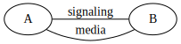
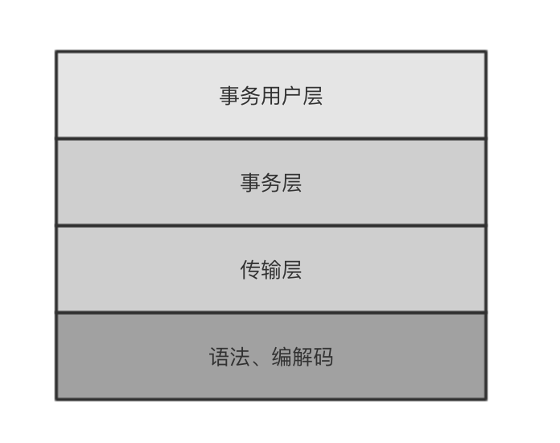
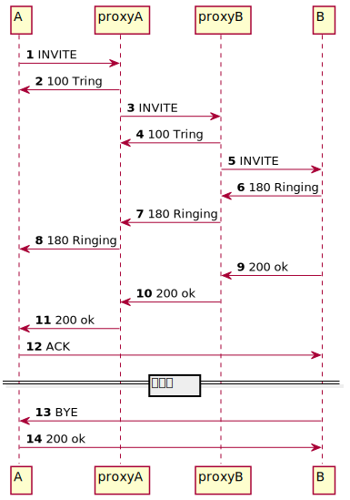

参考资料：SIP是Session Initiation Protocol的简写。SIP是用来创建、修改、删除session的一个**应用层协议**。SIP协议本身是一个应用层的媒体控制协议，一般用于打电话或多人会议的场景。要明确的是SIP本身并不提供媒体相关的功能，这个功能是由其他协议去完成（比如RTP用于通话）。SIP仅仅提供回话创建的信令控制。
在电话或者会议等场景，**媒体交流的前提是信令交互的完成**。例如你想向一个人说话的前提是你要明确对方是谁，以及对方在哪里，对方是否原意和你说话。

# 1 SIP功能介绍
SIP支持从5个方面来建立和关闭媒体流。

1. **用户定位**：这里的定位不是指GPS定位，而是指终端的IP地址信息
1. **用户可用性**：这是是指被叫方是否愿意接受你的呼叫
1. **用户能力检测**：不同的用户能力不同，有些只能语音交流，有些可以视频
1. **会话初始化**：在主叫和被叫之间建立Session
1. **会话管理**：更新session信息，关闭session

SIP协议本身并不能做那么多事情，SIP同时也需要一些其他的协议帮助。例如：

- RTP 实时传输协议([Real-time Transport Protocol](https://tools.ietf.org/html/rfc1889)) RFC 1889：负责传输实时数据以及提供QoS反馈。
- RTSP 实时流协议([Real-time Streaming Protocol](https://tools.ietf.org/html/rfc2326)) RFC 2326：负责传输流媒体数据
- SDP 会话描述协议([Session Description Protocol](https://tools.ietf.org/html/rfc2327)) RFC 2327：负责传递双方的支持哪些媒体编码，使用什么端口传输媒体数据等和媒体描述的信息
- MEGACO 媒体网关控制协议([Media Gateway Control Protocol](https://tools.ietf.org/html/rfc3015)) RFC 3015：定义了一些在物理媒体网关上使用的协议。

# 2 协议结构
IP是一个分层的协议。每层之间相互独立，并且每层都有自己的侧重点。

# 3 信令交互实例
SIP基于HTTP 请求响应的事务模型。每个事务用一个请求和至少一个响应组成：

1. A向自己的SIP服务器发起INVITE请求，proxyA的地址一般是软电话上配置的
1. proxyA回给A 100 Tring, 表示自己正在处理这个请求
1. proxyA发现自己无法定位B的位置，而把请求发给了proxyB
1. proxyB立即回给proxyA一个100 Tring, 表示自己正在处理
1. proxyB在自己的数据库中找到了B的IP地址，然后把INVITE发给B
1. B收到INVITE之后，回给proxyB 180，表示自己正在响铃
1. proxyB把180消息转发给了proxyA
1. proxyA把180消息转发给了A
1. B回给proxyB 200Ok消息，表示自己接听了电话
1. proxyB把200消息转发给了proxyA
1. proxyA把200消息转发给了A
1. AB双方在200消息之后，已经知道了对方的实际IP地址，A可以直接向B发送ACK消息。在ACK消息之后，AB双方就可以使用媒体流通信了。
1. B向A发送了BYE消息
1. A回给200OK表示同意

上面是一个最基本的SIP时序图，而真实的SIP时序图远远比上图要复杂的多。能够看懂时序图，并理解请求以及响应是按照什么规则流动的，是解决SIP问题的关键。

- [Session Initiation Protocol (SIP) Basic Call Flow Examples](https://tools.ietf.org/html/rfc3665) RFC 3665中，有常见的十几种注册和呼叫的时序图。
- sngrep可以根据信令获取SIP时序图，具体使用可以参考：[https://www.yuque.com/wangdd/opensips/sngrep](https://www.yuque.com/wangdd/opensips/sngrep)

