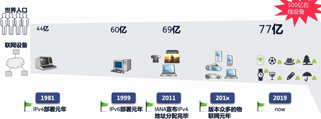
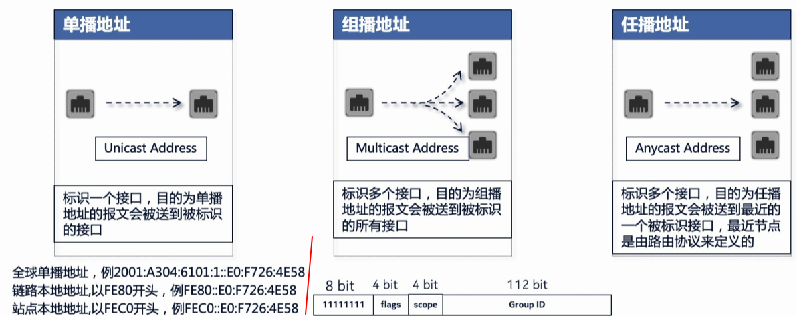
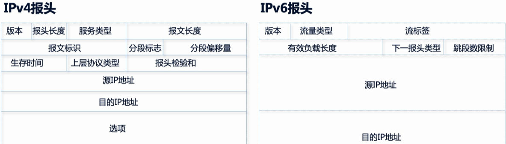

# 为什么需要IPv6
- IPv4总量不足
- IP地址分配不均，各个国家分配总量不符合需求



# IPv6的特点

- 地址数量多：2的128次方
- 简化、高效的报文结构
- 内置的安全特性
- 更好的支持移动性
- 更好的QoS控制
- 用组播代替广播
- 自动地址配置，方便IPv6忘了的部署
- 提供多种过渡机制


# IPv6的表示

## 书写格式

- 用十六进制表示
- 4位一组，中间用“：”隔开，共8组（16 * 8 = 128bit）
- 以0开头的组可以省略前面的0
- 连续多个全0的组可以用“::”表示（::只能出现一次）
- 地址前缀长度用“/xx”表示


比如如下的地址格式和简写
```
//全写格式：
2001：0410：0000：0001：0000：0000：0000：45ff /64
//简写格式：去除开头的0
2001：410：0：1：0：0：0：45ff /64
//间歇格式：简写全0组
2001：410：0：1::45ff /64
```


## 地址分类
IPv6的地址组成：**前缀+接口标识**

- 前缀：相当于IPv4的网络ID，如果两个ip不经过路由直接通信，前缀需要一致
- 接口标识：相当于IPv4的主机ID


例如上面例子的ip`2001:0410:0000:0001:0000:0000:0000:45ff/64`的地址构成如下

| 地址前缀，长度64 | 2001:0410:0000:0001 | 接口标识 | 0000:0000:45ff |
| --- | --- | --- | --- |

地址分类如下：

# IPv6的报文结构


- 所有可选字段被移出IPv6的抱头，或删除或置于扩展报头中
- 服务类型、传输协议和生存时间被改变
- 新增流标签域
- 固定的报头长度（40字节），不需要消耗过多的内存容量


