> 本文内容基于《TCP/IP 协议详解 卷一》


# 第一章 概述

## 1 分层
TCP/IP协议族通常被认为是一个四层协议系统，每一层负责不同的功能：应用层关心的是应用程序的细节，而不是数据在网络中的传输活动。下三层对应用程序一无所知，但它们要处理所有的通信细节。

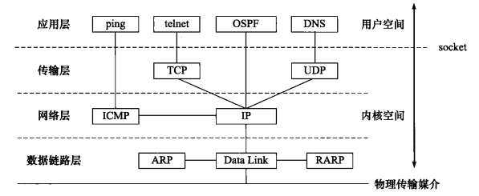

- 网络层IP提供的是一种不可靠的服务。也就是说，它只是尽可能快地把分组从源结点送到目的结点，但是并不提供任何可靠性保证。
- TCP在不可靠的IP层上提供了一个可靠的运输层。为了提供这种可靠的服务， TCP采用了**超时重传、发送和接收端到端的确认分组**等机制。


连接网络的途径是使用**路由器和网桥**：网桥是在链路层上对网络进行互连，而路由器则是在网络层上对网络进行互连。


## 2 互联网地址
IP地址分为五类：**区分各类地址最简单的方法是看它的第一个十进制整数。**

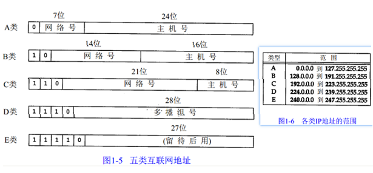


## 3 子网和掩码
子网是在ABC类ip地址的主机号的基础上再分为子网+主机号，同一子网的ip可以相互通信，例如：

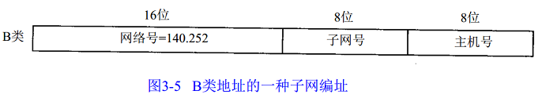
因此区分不同子网和IP，需要知道**有多少比特用于子网号及多少比特用于主机号**。这是在引导过程中通过子网掩码来确定的。**子网掩码是一个 32 bit的值，其中值为1的比特留给网络号和子网号，为 0的比特留给主机号**。如下图，子网掩码为255.255.255.0，也即/24：

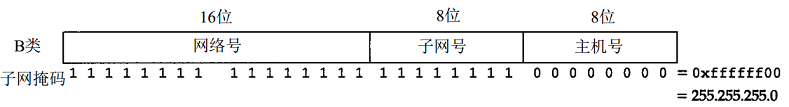
给定IP地址和子网掩码以后，主机就可以确定IP数据报的目的是：( 1)本子网上的主机；(2)本网络中其他子网中的主机；( 3)其他网络上的主机。例如下图，两个网络属于同一网络不同子网：

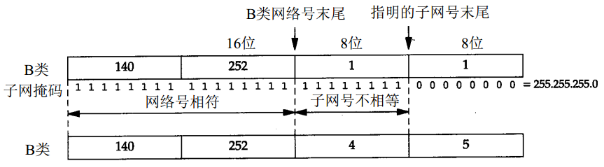


## 4 封装和分用
**封装**：当应用程序用 TCP传送数据时，数据被送入协议栈中，然后逐个通过每一层直到被当作一串比特流送入网络。其中每一层对收到的数据都要增加一些首部信息（有时还要增加尾部信息） ，该过程如下所示：

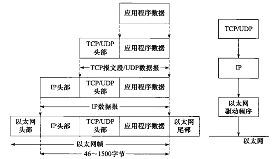

- IP在首部中存入一个长度为8 bit的数值，称作协议域。 1表示为ICMP协议， 2表示为IGMP协议， 6表示为TCP协议， 1 7表示为UDP协议
- TCP和UDP都用一个16 bit的端口号来表示不同的应用程序。TCP和UDP把源端口号和目的端口号分别存入报文首部中
- 以太网的帧首部也有一个 16 bit的帧类型域

**分用**：当目的主机收到一个以太网数据帧时，数据就开始从协议栈中由底向上升，同时去掉各层协议加上的报文首部。每层协议都要去检查报文首部中的协议标识，以确定接收数据的上层协议。

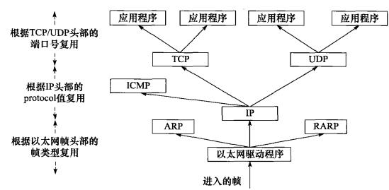


# 第二章 链路层

## 1 链路层作用
链路层主要有三个目的：

- 为IP模块发送和接收I P数据报；
- 为ARP模块发送 ARP请求和接收ARP应答；
- 为RARP发送RARP请求和接收RARP应答。


## 2 链路层协议

### 2.1 以太网和IEEE 802封装
两种帧格式都采用48 bit（6字节）的目的地址和源地址，ARP和RARP协议对32 bit的IP地址和48 bit的硬件地址进行映射。

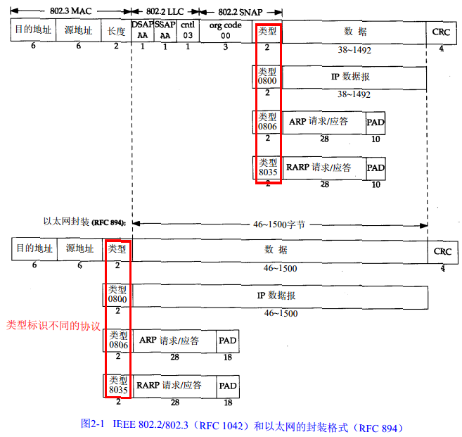
802.3标准定义的帧和以太网的帧都有最小长度要求。 802.3规定数据部分必须至少为 38字节，而对于以太网，则要求最少要有46字节。为了保证这一点，必须在不足的空间插入填充（pad）字节。**以太网的封装格式**是最为常见的封装格式。


### 2.2 PPP：点对点协议
PPP数据帧的格式看上去很像ISO的HDLC（**Q921桢**），每一帧都以标志字符 0x7e开始和结束。紧接着是一个地址字节，值始终是 0xff，然后是一个值为0x03的控制字节。

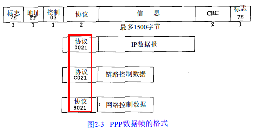


### 2.3 环回接口loopback
环回接口（Loopback Interface）允许运行在同一台主机上的客户程序和服务器程序通过 TCP/IP进行通信。 A类网络号127就是为环回接口预留的。根据惯例，大多数系统把IP地址127.0.0.1分配给这个接口，并命名为localhost。

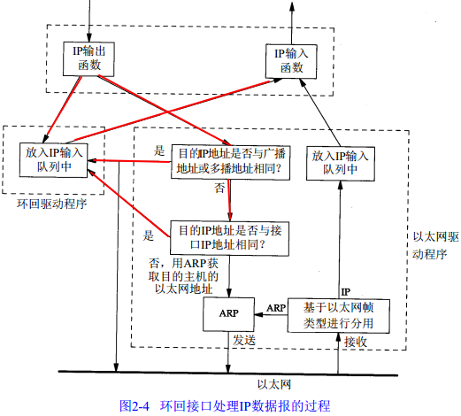


## 3 最大传输单元MTU
如果 I P层有一个数据报要传，而且数据的长度比链路层的 M T U还大，那么IP层就需要进行分片（fragmentation），把数据报分成若干片，这样每一片都小于MTU。
下面是几种常见网络的MTU值：

| 网络 | MTU字节 |
| :---: | :---: |
| 超通道 | 65535 |
| 16Mb/s 令牌环（IBM） | 17914 |
| 4Mb/s 令牌环（IEEE 802.5) | 4464 |
| FDDI | 4352 |
| 以太网 | 1500 |
| IEEE 802.3/802.2 | 1492 |
| X.25 | 576 |
| PPP低时延 | 296 |


如果两台主机之间的通信要通过多个网络，那么每个网络的链路层就可能有不同的MTU。重要的不是两台主机所在网络的MTU的值，重要的是两台通信主机路径中的最小MTU。它被称作**路径MTU**。


# 第四/五章 ARP和RARP

## 1 ARP广播过程
知道主机的IP地址并不能让内核发送一帧数据给主机。内核（如以太网驱动程序）必须知道目的端的硬件地址才能发送数据。 ARP的功能是在**32 bit的IP地址和采用不同网络技术的硬件地址**之间提供动态映射。 ,上层程序不需要关心这个过程。

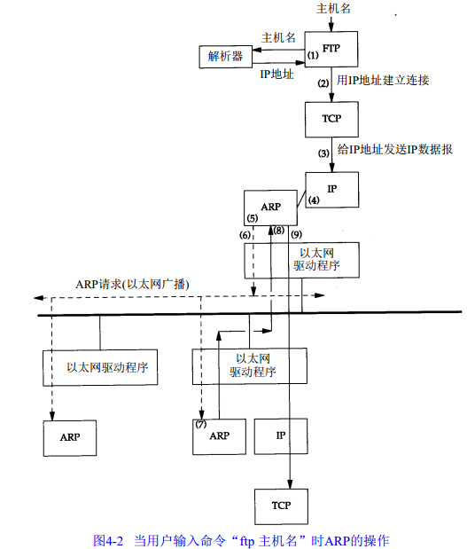
ARP高效运行的关键是由于每个主机上都有一个**ARP高速缓存**。这个高速缓存存放了最近Internet地址到硬件地址之间的映射记录。高速缓存中每一项的生存时间一般为**20分钟**。可用如下命令查看缓存：
```shell
> arp -a
? (135.252.28.130) at 2c:fa:a2:55:c7:17 [ether] on eth0
? (135.252.28.217) at 98:fa:9b:1c:05:ee [ether] on eth0
? (135.252.28.225) at 98:fa:9b:1b:fc:07 [ether] on eth0
? (135.252.28.254) at 2c:fa:a2:27:60:97 [ether] on eth0
? (135.252.28.215) at 3c:18:a0:be:de:73 [ether] on eth0
```


## 2 ARP格式
ARP请求和应答是相同的格式，如下：

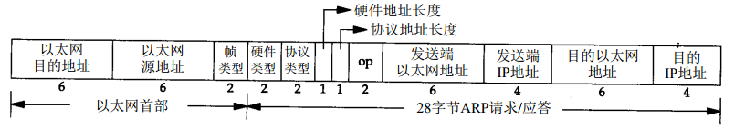

- ARP的帧类型为：**0x0806**
- 硬件类型字段表示硬件地址的类型。它的值为 1即表示以太网地址。
- 协议类型字段表示要映射的协议地址类型。它的值为0x0800即表示IP地址
- 操作字段指出四种操作类型，它们是**ARP请求（值为1）、 ARP应答（值为 2）、RARP请求（值为3）和RARP应答（值为4）**


对于一个ARP请求来说，**除目的端硬件地址外的所有其他的字段都有填充值**。当系统收到一份目的端为本机的ARP请求报文后，它就把硬件地址填进去，然后用两个目的端地址分别替换两个发送端地址，并把操作字段置为2，最后把它发送回去。
提供一个ARP服务器很简单，通常是TCP/IP在内核中实现的一部分。


## 3 ARP代理
如果ARP请求是从一个网络的主机发往另一个网络上的主机，那么连接这两个网络的路由器就可以回答该请求，这个过程称作委托ARP或ARP代理。


## 4 免费ARP
免费 ARP (gratuitous ARP)。它是指主机发送ARP查找自己的I P地址。通常，它发生在系统引导期间进行接口配置的时候。免费ARP有两个作用：

- 一个主机可以通过它来确定另一个主机是否设置了相同的 I P地址
- 如果发送免费 A R P的主机正好改变了硬件地址（很可能是主机关机了，并换了一块接口卡，然后重新启动），那么这个分组就可以使其他主机高速缓存中旧的硬件地址进行相应的更新。


## 5 RARP
RARP分组的格式与 ARP分组基本一致。它们之间主要的差别是RARP请求或应答的帧类型代码为**0x8035**，而且RARP请求的操作代码为3，应答操作代码为4。
RARP服务器的功能就由用户进程来提供，而不是作为内核的TCP/IP实现的一部分。硬件地址到I P地址的映射包含在一个磁盘文件中（在 U n i x系统中一般位于/etc/ethers目录中）。


# 第六章 ICMP控制报文协议

## 1 ICMP格式和类型
ICMP是IP层的一个组成部分。它**传递差错报文以及其他需要注意的信息**。ICMP报文通常被IP层或更高协议（TCP或UDP）使用。 ICMP是封装在IP数据包的内部，其格式如下：

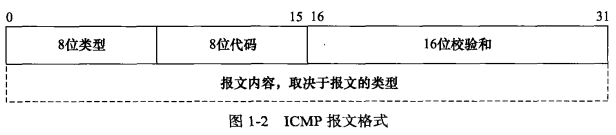

- 类型字段可以有15个不同的值，以描述特定类型的ICMP报文。某些ICMP报文还使用代码字段的值来进一步描述不同的条件


ICMP的各个类型如下表，类型由类型字段和代码字段共同决定：

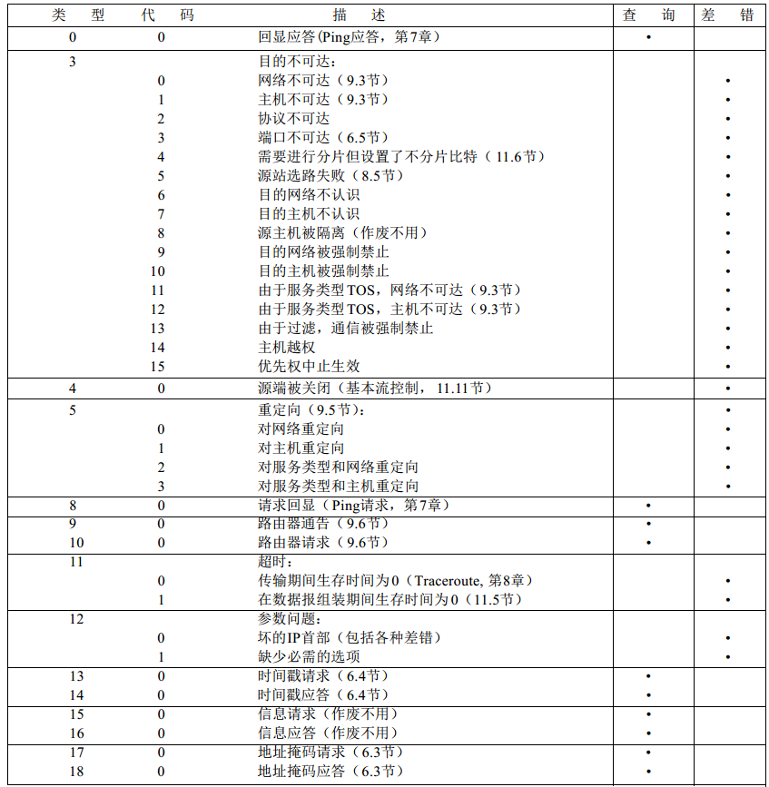


## 2 常用类型介绍

### 2.1 地址掩码请求
ICMP地址掩码请求用于无盘系统在引导过程中**获取自己的子网掩码** ，系统广播它的ICMP请求报文。该类型格式如下：

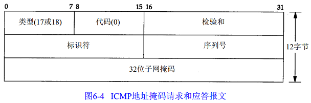


### 2.2 时间戳请求
ICMP时间戳请求允许系统向另一个系统**查询当前的时间**。返回的建议值是自午夜开始计算的毫秒数，协调的统一时间（UTC）。这种ICMP报文的好处是它提供了**毫秒级的分辨率**。格式如下：

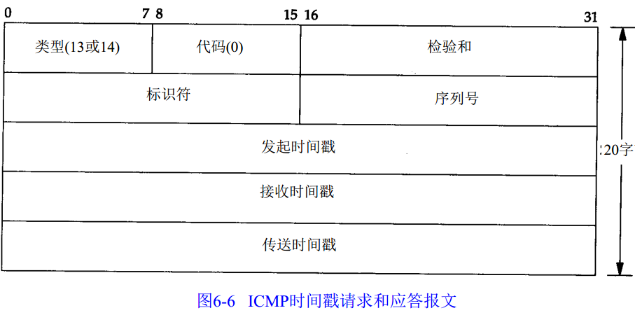
请求端填写**发起时间戳**，然后发送报文。应答系统收到请求报文时填写**接收时间戳**，在发送应答时填写**发送时间戳**。


### 2.3 端口不可达错误
ICMP的一个规则是， ICMP差错报文必须包括生成该差错报文的数据报IP首部（包含任何选项），还必须至少包括跟在该IP首部后面的前8个字节。

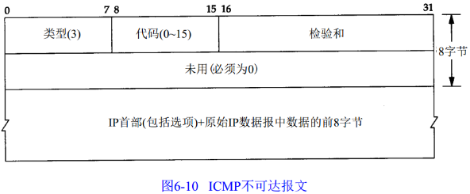


### 2.4 回显请求
回显请求和应答一般用于**ping**程序，测试一台主机是否可达，格式如下：

Unix系统在实现ping程序时是把ICMP报文中的标识符字段置成**发送进程的ID号**。这样即使在同一台主机上同时运行了多个ping程序实例， ping程序也可以识别出返回的信息。


### 2.5 超时报文
有两种不同的ICMP超时报文，它们的code字段不同（11和12），超时报文格式如下：

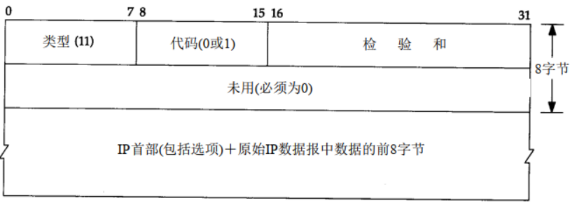


## 3 BSD系统对ICMP各类消息的处理
由于ICMP覆盖的范围很广，从致命差错到信息差错，因此即使在一个给定的系统实现中，对每个ICMP报文的处理都是不相同的。

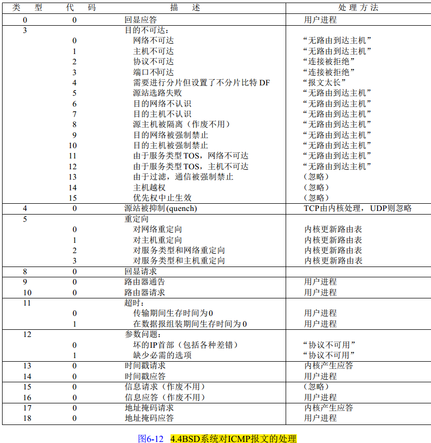


# 第七章 Ping程序

## 1 IP记录路由选项
平提供**-R**选项，以提供记录路由的功能。它使得ping程序在发送出去的IP数据报中设置**IP RR选项**（该IP数据报包含ICMP回显请求报文）。这样，每个处理该数据报的路由器都把它的IP地址放入选项字段中。当数据报到达目的端时，IP地址清单应该复制到ICMP回显应答中，这样返回途中所经过的路由器地址也被加入清单中。当ping程序收到回显应答时，它就打印出这份IP地址清单。
IP数据报中的R R选项的一般格式：

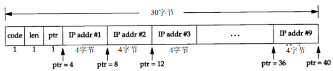

- code：指定IP选项类型，对于RR值为7
- len：RR选项字段的总长度
- ptr：指针字段，指向存放下一个IP地址的位置


## 2 IP时间戳选项
时间戳选项的代码为0x44。其他两个字段len和ptr与记录路由选项相同：选项的总长度（一般为36或40）和指向下一个可用空间的指针（ 5， 9， 1 3等）。格式如下：

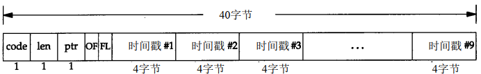
OF表示溢出字段， FL表示标志字段，有以下取值：

| 标志 | 描述 |
| --- | --- |
| 0 | 只记录时间戳 |
| 1 | 每台路由器都记录它的**IP地址和时间戳**。在选项列表中只有存放 4对地址和时间戳的空间 |
| 3 | 发送端对选项列表进行初始化，存放了 4个IP地址和4个取值为0的时间戳值。只有当列表中的下一个IP地址与当前路由器地址相匹配时，才记录它的时间戳 |


# 第八章 traceroute程序
traceroute程序可以让我们看到IP数据报从一台主机传到另一台主机所经过的路由。traceroute程序还可以让我们使用IP源路由选项。

> 当路由器收到一份IP数据报，如果其TTL字段是0或1，则路由器不转发该数据报（接收到这种数据报的目的主机可以将它交给应用程序，这是因为不需要转发该数据报。但是在通常情况下，系统不应该接收TTL字段为0的数据报）。相反，路由器将该数据报丢弃，并给信源机发一份**ICMP“超时”信息**。 **traceroute程序的关键在于包含这份ICMP信息的IP报文的信源地址是该路由器的IP地址**。


根据上面的原理，traceroute的内部原理为：发送一份TTL字段为1的I P数据报给目的主机。处理这份数据报的第一个路由器将TTL值减1，丢弃该数据报，并发回一份**超时ICMP报文**。这样就得到了该路径中的第一个路由器的地址。然后程序发送一份TTL值为2的数据报，这样我们就可以得到第二个路由器的地址...... 程序发送一份UDP数据包，选择一个不可能的值作为UDP端口，使得目的主机产生**端口不可达错误的ICMP报文**，traceroute程序所要做的就是区分接收到的ICMP报文是超时还是端口不可达，以判断什么时候结束。
traceroute命令运行格式如下：

```shell
> traceroute 172.24.213.162
traceroute to 172.24.213.162 (172.24.213.162), 30 hops max, 60 byte packets
 1  135.252.28.254 (135.252.28.254)  0.513 ms  0.475 ms  0.449 ms
 2  135.252.145.53 (135.252.145.53)  4.670 ms  4.922 ms  6.176 ms
 3  135.242.65.241 (135.242.65.241)  0.388 ms  0.691 ms  0.685 ms
 4  172.24.112.30 (172.24.112.30)  6.071 ms  6.075 ms  6.061 ms
 5  172.24.112.6 (172.24.112.6)  13.247 ms  13.239 ms  13.222 ms
 6  172.24.112.5 (172.24.112.5)  13.191 ms  16.209 ms  16.191 ms
 7  135.242.84.138 (135.242.84.138)  16.181 ms  16.159 ms  16.971 ms
 8  135.242.84.114 (135.242.84.114)  16.865 ms  16.856 ms  16.803 ms
 9  172.16.100.2 (172.16.100.2)  16.819 ms  16.786 ms  16.808 ms
10  172.24.213.162 (172.24.213.162)  16.761 ms  16.745 ms  16.729 ms
```

