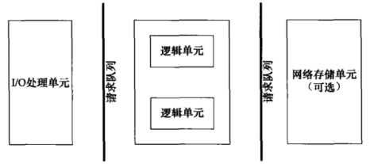
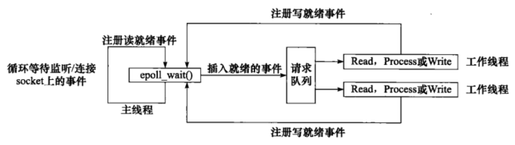
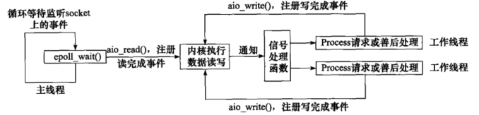
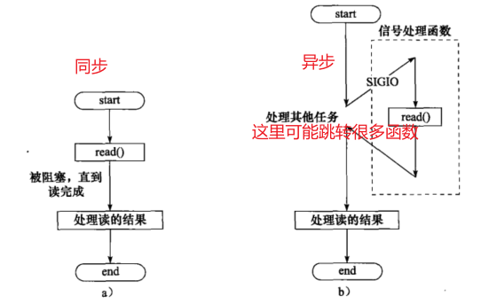
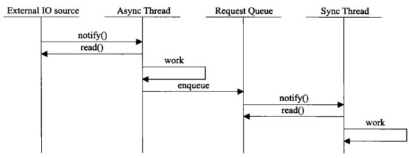
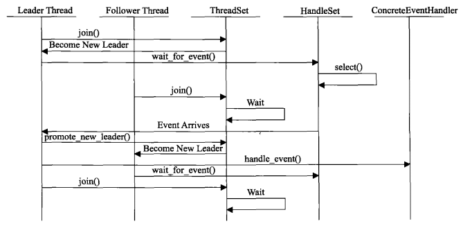

# 1 服务器基本结构
服务器基本的架构如下：

| **模块单元** | **单一服务器** | **服务器集群** |
| --- | --- | --- |
| IO处理单元 | 处理客户连接，读写网络数据 | 提供接入服务，实现负载均衡 |
| 逻辑单元 | 业务进程或线程 | 逻辑服务器 |
| 网络存储单元 | 本地数据库、文件、缓存 | 数据库服务器 |
| 请求队列 | 各单元的通信方式 | 各服务器间的永久TCP连接 |

# 2 服务器的事件处理模式
服务器需要处理三类事件：**IO事件、信号处理、定时事件**。相应的处理模式和设计模式一样被广泛使用

- Reactor反应器模式：用于同步IO模型
- Proactor主动器模式：用于异步IO模型

两个模式可以这样简单的理解：
> 家里有两个佣人,  一个叫reactor， 另一个叫proactor。
> 1.每天早午晚的饭点，reactor都会提醒你该去做饭了。
> 2.你只要告诉proactor，家里的饭桌在哪里，proactor就会在会在每天的饭点做好饭，端到你指定的饭桌上，然后通知你，可以吃饭了。

## 2.1 Reactor模式
Reactor模式要求主IO处理线程**只负责监听**文件描述符或socket上是否有事件发生，如果有立刻通知逻辑单元进行读写数据等指定的操作。**IO处理线程不做其他工作，只监听指定事件**。Reactor模式的工作流程（以epoll_wait IO 复用函数为例）如下：

- 实现相对简单，对于耗时短的处理场景处理高效；
- 操作系统可以在多个事件源上等待，并且避免了多线程编程相关的性能开销和编程复杂性；
- 事件的串行化对应用是透明的，可以顺序的同步执行而不需要加锁；
- 事务分离，将与应用无关的多路分解和分配机制和与应用相关的回调函数分离开来。

Reactor模式的缺点有：

- Reactor处理耗时长的操作（如文件I/O）会造成事件分发的阻塞，影响到后续事件的处理。这种情况使用异步IO更好。

## 2.2 Proactor模式
Proactor模式**将所有的IO操作都交给主线程和内核处理，包括监听和数据读写**。工作线程仅负责业务逻辑，不关系IO操作何时进行和如何进行。下图是Proactor模式的工作流程（以异步IO函数aio_read和aio_write函数为例）：

- Proactor性能更高，能够处理耗时长的并发场景

Proactor模式的缺点有：

- Proactor实现逻辑复杂；
- 依赖操作系统对异步的支持
   - 目前实现了纯异步操作的操作系统少，实现优秀的如windows IOCP，但由于其windows系统用于服务器的局限性，目前应用范围较小
   - Unix/Linux系统对纯异步的支持有限，**应用事件驱动的主流还是通过select/epoll来实现**；

# 3 两种高效的并发模式
我们知道，多进程和多线程是并发编程的两种方法，这里先讲并发模式，强调IO处理单元和逻辑单元间如何协调。

## 3.1 半同步/半异步模式
并发中同步是指**按照代码顺序依次执行**；异步是指**通过中断、信号等系统事件跳跃执行代码**。图示如下：

- 同步线程负责处理客户逻辑，业务逻辑一般是顺序执行的（逻辑单元）
- 异步线程负责处理IO事件，IO操作可能耗时阻塞，需要和业务逻辑分隔开（IO处理单元）。异步线程通过消息请求通知同步线程处理新来的事件

## 3.2 领导者/追随者模式
任意时刻，程序只有一个领导者线程，负责监听IO事件；其他线程作为追随者，在线程池中休眠等待成为领导者。领导者线程获得IO事件后，**先选出新的领导者，然后处理IO事件**，这样新的领导者监听IO事件，原来的领导者处理IO事件，之后变为追随者休眠。
领导者模式的状态变化图如下：

该模式的工作流程如下：

# 4 提高性能的其他建议

## 4.1 池pool
提高服务器性能的一个很直接的方法就是**以空间换时间，即“浪费”服务器的硬件资源，以换取其运行效率**。这就是池（pool)的概念。池是一组资源的集合，这组资源在服务器启动之初就被完全创建好并初始化，这称为**静态资源分配**。当服务器进入正式运行阶段，即开始处理客户请求的时候，如果它需要相关的资源，就可以直接从池中获取，无须动态分配。很显然，直接从池中取得所需资源比动态分配资源的速度要快得多，因为分配系统资源的系统调用都是很耗时的。当服务器处理完一个客户连接后，可以把相关的资源放回池中，无须执行系统调用来释放资源。从最终的效果来看，池相当于服务器管理系统资源的应用层设施，它避免了服务器对内核的频繁访问。
池可以分为多种形式：

- 内存池：用于socket的接收和发送缓存，也可以用于模块内部内存申请释放
- 进程池和线程池：并发编程常用方法，避免了动态创建进程和线程的过程消耗
- 连接池：用于服务器集群内部或与数据库之间的永久连接，用于频繁访问某个数据库或服务器，避免频繁创建关闭连接。

## 4.2 避免不必要的数据复制
**高性能服务器应该避免不必要的数据复制，尤其是当数据复制发生在用户代码和内核之间的时候**。如果内核可以直接处理从socket或者文件读入的数据，则应用程序就没必要将这些数据从内核缓冲区复制到应用程序缓冲区。比如ftp服务器，当客户请求一个文件时，服务器只需要检测日标文件是否存在，以及客户是否有读取它的权限，而绝对不会关心文件的具体内容。这样的话，ftp服务器就无须把日标文件的内容完整地读人到应用程序缓冲区中并调用send函数来发送，而是可以使用“零拷贝”函数sendfile来直接将其发送给客户端。
**用户代码内部（不访问内核）的数据复制也应该避免**。举例来说，当两个进程之间要传递大量的数据时，我们就应该考虑使用**共享内存**来在它们之间直接共享这些数据，而不是使用管道或者消息队列来传递，因为这样既浪费空间，又效率低下。

## 4.3 考虑上下文切换和锁
并发程序必须考虑**上下文切换**（context switch）的问题，即进程切换或线程切换导致的的系统开销。即使是IO密集型的服务器，也不应该使用过多的工作线程，否则线程间的切换将占用大最的CPU时问，服务器真正用于处理业务逻辑的CPU时间的比重就显得不足了。
如果有更好的解决方案（比如半同步半异步模式），尽量**避免使用锁**。如果一定要使用锁，要**考虑减小锁的粒度**，做到影响最小。
