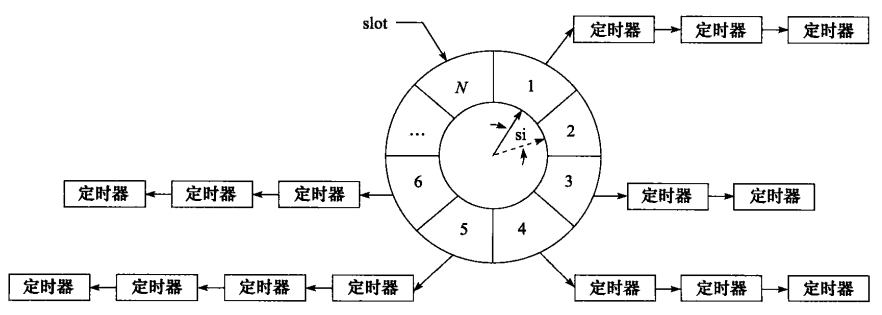

Linux提供了三种定时方法：

1. socket读写超时选项：SO_RCVTIMEO和SO_SNDTIMEO
1. IO复用API中的timeout参数
1. Linux提供的定时函数和计时函数，比如：
   1. 由alarm函数和settimer函数设置的超时闹钟，触发SIGALRM信号
   1. timefd_系列函数处理定时任务

# 1 SO_RCVTIMEO和SO_SNDTIMEO
通过setsockopt函数可以设置socket相关的API函数的收发超时时间。对于不同的API函数，超时返回的errno如下：

| 系统调用 | 有效选项 | 函数超时后的行为 |
| :--- | :--- | :--- |
| send | SO_SNDTIMEO | 返回-1，errno为EAGAIN、EWOULDBLOCK |
| sendmsg | SO_SNDTIMEO | 返回-1，errno为EAGAIN、EWOULDBLOCK |
| recv | SO_RCVTIMEO | 返回-1，errno为EAGAIN、EWOULDBLOCK |
| recvmsg | SO_RCVTIMEO | 返回-1，errno为EAGAIN、EWOULDBLOCK |
| accept | SO_RCVTIMEO | 返回-1，errno为EAGAIN、EWOULDBLOCK |
| connect | SO_SNDTIMEO | 返回-1，errno为EINPROGRESS |

在程序中，我们可以根据每个函数的返回值和errno判断是否超时。
connect超时的示例：
```c
//模拟客户端connect超时
#include <sys/types.h>
#include <sys/socket.h>
#include <netinet/in.h>
#include <arpa/inet.h>
#include <assert.h>
#include <stdio.h>
#include <unistd.h>
#include <errno.h>
#include <string.h>
#include <fcntl.h>
#include <stdlib.h>
#include <sys/epoll.h>
#include <stdbool.h>
#include <libgen.h>

int main(int argc, char *argv[])
{
    if (argc <= 2)
    {
        printf("Usage: %s ip_address port_number\n", basename(argv[0]));
        return 1;
    }
    const char *ip = argv[1];
    const int port = atoi(argv[2]);
    int ret = 0;

    struct sockaddr_in address;
    bzero(&address, sizeof(address));
    address.sin_family = AF_INET; //IPv4
    address.sin_addr.s_addr = inet_addr(ip);
    address.sin_port = htons(port);

    int listenfd = socket(PF_INET, SOCK_STREAM, 0);
    assert(listenfd >= 0);

    //设置socket选项，配置可写超时
    struct timeval timeout;
    timeout.tv_sec = 10; //10s
    timeout.tv_usec = 0;
    ret = setsockopt(listenfd, SOL_SOCKET, SO_SNDTIMEO, &timeout, sizeof(timeout));
    assert(ret >= 0);

    ret = connect(listenfd, (struct sockaddr*)&address, sizeof(address));
    if (ret == -1)
    {
        //返回-1，errno为EINPROGRESS，则表示connect超时
        if (errno = EINPROGRESS)
        {
            printf("connecting timeout, process timeout logic\n");
        }
        else
        {
            printf("error occur when connecting to server\n");
        }
    }
    close(listenfd);
    return 0;
}
```

# 2 IO复用函数的超时参数
select、poll和epoll函数都带有超时参数，所以它们也能统一处理定时事件。由于函数可能在超时之前就返回，所以需要不断的更新定时参数以反映剩余的时间，如下：
```c
#define TIMEOUT 5000
int timeout = TIMEOUT;
time_t start = time(NULL);
time_t end = time(NULL);

while(1)
{
    printf("the timeout is now %d ml-seconds\n", timeout);
    start = time(NULL);
    //指定timeout参数
    int number = epoll_wait(epollfd, events, MAX_EVENT_NUMBER, timeout);
    if (number < 0 && errno != EINTR)
    {
        printf("epoll failed\n");
        break;
    }
    if (number = 0)//返回0，说明超时时间到了，没有监听的事件发生
    {
        timeout = TIMEOUT;//重置定时时间
        continue;
    }
    end = time(NULL);
    //如果number>0，说明监听的事件发生，没有超时，需要计算剩余时间
    timeout -= (end - start) / 1000;
    if (timeout <= 0)//剩余时间不够，重置时间
    {
        timeout = TIMEOUT;
    }
    //do somethings
}
```

# 3 Linux定时函数

## 3.1 SIGALRM信号
一般而言，SIGALRM信号按照固定的频率生成，即有alarm或setitimer函数设置的定时周期T保持不变。如果某个定时任务的超时时间不是T的整数倍，那么它实际被执行的时间和预期的时间将略有偏差，因此**定时周期T反映了定时的精度**。在多线程中处理信号是很麻烦的事，所以应该**尽量避免使用触发信号的方式**。
```c
int setitimer(int which, const struct itimerval *new_value, struct itimerval *old_value);
//结构体定义如下：
struct itimerval {
	struct timeval it_interval; /* Interval for periodic timer */
	struct timeval it_value;    /* Time until next expiration */
};

unsigned int alarm(unsigned int seconds);
```

## 3.2 timefd_系列函数
陈硕在muduo的书中提到，对于定时任务，应该采取如下原则：

- 计时：只使用**gettimeofday**来获取当前时间
- 定时：只使用**timerfd_***系列函数来处理定时任务 
   - timerfd_create**把时间变成了一个文件描述符**，该“文件”在定时器超时的那一刻变得可读，这样就能很方便地融入select(2)/poll(2)框架中，用统一的方式来处理IO事件和超时事件。
   - IO复用函数自带的timeout参数精度是**毫秒**，而timerfd_setime的精度可以达到**纳秒**。

函数定义如下：
```c
int gettimeofday(struct timeval *tv, struct timezone *tz);

int timerfd_create(int clockid, int flags);
int timerfd_settime(int fd, int flags,
                    const struct itimerspec *new_value,
                    struct itimerspec *old_value);
int timerfd_gettime(int fd, struct itimerspec *curr_value);
```

# 4 两种高性能定时器设计

## 4.1 时间轮


- 实线指针指向轮子上的一个槽（slot）。它以恒定的速度顺时针转动，每转动一步就指向下一个槽（slot）。每次转动称为一个滴答（tick），一个tick时间间隔为时间轮的si（slot interval）。该时间轮共有N个槽，因此它转动一周的时间是`N*si`
- 每个槽指向一条定时器链表，每条链表上的定时器具有相同的特征：它们的定时时间相差`N*si`的整数倍。时间轮正是利用这个关系将定时器**散列**到不同的链表中
- 假如现在指针指向槽cs，我们要添加一个定时时间为ti的定时器，则该定时器将被插入槽ts（timer slot）对应的链表中：`ts=(cs + (ti / si)) % N`。


时间轮使用了**哈希表**处理冲突的思想，将定时器散列到不同的链表上。这样每条链表上的定时器数目都将明显少于原来的排序链表上的定时器数目，插入操作的效率基本不受定时器数目的影响。对于时间轮而言，**要提高精度，就要使si的值足够小; 要提高执行效率，则要求N值足够大，使定时器尽可能的分布在不同的槽**。对于时间轮，添加、删除和执行一个定时器的时间复杂度都是O(1)。**简单的一层时间轮设计示例：
```c
#ifndef TIME_WHEEL_TIMER
#define TIME_WHEEL_TIMER

#include <time.h>
#include <netinet/in.h>
#include <stdio.h>

#define BUFFER_SIZE 64
class tw_timer;
struct client_data //绑定socket和定时器
{
    sockaddr_in address;
    int sockfd;
    char buf[BUFFER_SIZE];
    tw_timer *timer;
};

class tw_timer //定时器类
{
public:
    tw_timer(int rot, int ts)
        : next(NULL), prev(NULL), rotation(rot), time_slot(ts) {}
public:
    int rotation;                   //记录该定时器在时间轮转多少圈后生效
    int time_slot;                  //记录定时器属于那个槽
    void (*cb_func)(client_data *); //定时器回调函数
    client_data *user_data;         //用户数据
    tw_timer *next;                 //指向上一个定时器
    tw_timer *prev;                 //指向下一个定时器
};

class time_wheel //事件轮管理定时器
{
public:
    time_wheel() : cur_slot(0)
    {
        for (int i = 0; i < N; ++i)
        {
            slots[i] = NULL; //每个槽的头节点初始化为空
        }
    }
    ~time_wheel()
    {
        for (int i = 0; i < N; ++i)
        {
            tw_timer *tmp = slots[i];
            while (tmp)
            {
                slots[i] = tmp->next;
                delete tmp; //遍历每个槽，销毁new分配在堆中的定时器
                tmp = slots[i];
            }
        }
    }
    tw_timer *add_timer(int timeout) //添加新的定时器，插入到合适的槽中
    {
        if (timeout < 0) //时间错误
        {
            return NULL;
        }
        int ticks = 0;
        if (timeout < TI) //小于每个槽的interval，则为1
        {
            ticks = 1;
        }
        else
        {
            ticks = timeout / TI; //相对当前位置的槽数
        }
        int rotation = ticks / N;                     //记录多少圈后生效
        int ts = (cur_slot + (ticks % N)) % N;        //确定插入槽的位置
        tw_timer *timer = new tw_timer(rotation, ts); //根据位置和圈数，插入对应的槽中
        if (!slots[ts])                               //所在槽头节点为空，直接插入
        {
            printf("add timer, rotation is %d, ts is %d, cur_slot is %d\n", rotation, ts, cur_slot);
            slots[ts] = timer;
        }
        else //头插法
        {
            timer->next = slots[ts];
            slots[ts]->prev = timer;
            slots[ts] = timer;
        }
        return timer; //返回含有时间信息和所在槽位置的定时器
    }
    void del_timer(tw_timer *timer) //从时间轮上删除定时器
    {
        if (!timer)
        {
            return;
        }
        int ts = timer->time_slot; //找到所在槽
        if (timer == slots[ts])
        {
            slots[ts] = slots[ts]->next;
            if (slots[ts])
            {
                slots[ts]->prev = NULL;
            }
            delete timer;
        }
        else
        {
            timer->prev->next = timer->next;
            if (timer->next)
            {
                timer->next->prev = timer->prev;
            }
            delete timer;
        }
    }
    void tick()
    {
        tw_timer *tmp = slots[cur_slot]; //取出当前槽的头节点
        printf("current slot is %d\n", cur_slot);
        while (tmp) //遍历
        {
            printf("tick the timer once\n");
            if (tmp->rotation > 0)
            {
                tmp->rotation--;
                tmp = tmp->next;
            }
            else
            {
                tmp->cb_func(tmp->user_data); //符合条件，调用回调函数
                if (tmp == slots[cur_slot])
                {
                    printf("delete header in cur_slot\n");
                    slots[cur_slot] = tmp->next;
                    delete tmp;
                    if (slots[cur_slot])
                    {
                        slots[cur_slot]->prev = NULL;
                    }
                    tmp = slots[cur_slot];
                }
                else
                {
                    tmp->prev->next = tmp->next;
                    if (tmp->next)
                    {
                        tmp->next->prev = tmp->prev;
                    }
                    tw_timer *tmp2 = tmp->next;
                    delete tmp;
                    tmp = tmp2;
                }
            }
        }
        cur_slot = ++cur_slot % N;
    }
private:
    static const int N = 60;
    static const int TI = 1;
    tw_timer *slots[N];
    int cur_slot;
};
#endif
```

## 4.2 时间堆
时间轮方案都是**以固定的频率调用心搏函数tick，并在其中依次检测到期的定时器，然后执行到期定时器上的回调函数**。设计定时器的另外一种思路是：将所有定时器中**超时时间最小的一个定时器的超时值作为心搏间隔**。这样，一旦心搏函数tick被调用，超时时间最小的定时器必然到期，我们就可以在tick函数中处理该定时器。然后，再次从剩余的定时器中找出超时时间最小的一个，并将这段最小时间设置为下一次心搏间隔。如此反复， 就可以使用**最小堆**（每个节点都小于等于其子节点）实现了较为精确的定时。
对于时间堆，添加一个定时器的时间复杂度为O(lgn)，删除和执行一个定时器的时间复杂度为O(1)。
实现示例：
```c
#ifndef intIME_HEAP
#define intIME_HEAP

#include <iostream>
#include <netinet/in.h>
#include <time.h>
using std::exception;

#define BUFFER_SIZE 64

class heap_timer;
struct client_data
{
    sockaddr_in address;
    int sockfd;
    char buf[BUFFER_SIZE];
    heap_timer *timer;
};

class heap_timer
{
public:
    heap_timer(int delay)
    {
        expire = time(NULL) + delay;
    }

public:
    time_t expire; //定时器生效的绝对时间
    void (*cb_func)(client_data *); //定时器回调函数
    client_data *user_data; //用户数据
};

class time_heap //时间堆类
{
public:
    time_heap(int cap) throw(std::exception)
        : capacity(cap), cur_size(0)//构造函数，初始化空堆
    {
        array = new heap_timer *[capacity];
        if (!array)
        {
            throw std::exception();
        }
        for (int i = 0; i < capacity; ++i)
        {
            array[i] = NULL;
        }
    }
    time_heap(heap_timer **init_array, int size, int capacity) throw(std::exception)
        : cur_size(size), capacity(capacity)//构造函数，有init_array初始化堆
    {
        if (capacity < size)
        {
            throw std::exception();
        }
        array = new heap_timer *[capacity];
        if (!array)
        {
            throw std::exception();
        }
        for (int i = 0; i < capacity; ++i)
        {
            array[i] = NULL;
        }
        if (size != 0)
        {
            for (int i = 0; i < size; ++i)
            {
                array[i] = init_array[i];
            }
            for (int i = (cur_size - 1) / 2; i >= 0; --i)
            {
                percolate_down(i);
            }
        }
    }
    ~time_heap()
    {
        for (int i = 0; i < cur_size; ++i)
        {
            delete array[i];
        }
        delete[] array;
    }
public:
    void add_timer(heap_timer *timer) throw(std::exception)
    {
        if (!timer)
        {
            return;
        }
        if (cur_size >= capacity)
        {
            resize();//当前堆容量不够，扩大一倍容量
        }
        int hole = cur_size++;
        int parent = 0;
        for (; hole > 0; hole = parent)
        {
            parent = (hole - 1) / 2;
            if (array[parent]->expire <= timer->expire)
            {
                break;
            }
            array[hole] = array[parent];
        }
        array[hole] = timer;
    }
    void del_timer(heap_timer *timer)
    {
        if (!timer)
        {
            return;
        }
        //设置回调函数为空，节省了真正删除定时器构成的开销，但缺点是容易使堆数组膨胀
        timer->cb_func = NULL;
    }
    heap_timer *top() const
    {
        if (empty())
        {
            return NULL;
        }
        return array[0];
    }
    void pop_timer()
    {
        if (empty())
        {
            return;
        }
        if (array[0])
        {
            delete array[0];
            array[0] = array[--cur_size];
            percolate_down(0);
        }
    }
    void tick()
    {
        heap_timer *tmp = array[0];
        time_t cur = time(NULL);
        while (!empty())
        {
            if (!tmp)
            {
                break;
            }
            if (tmp->expire > cur)
            {
                break;
            }
            if (array[0]->cb_func)//array[0]使最小的超时时间，执行其回调函数
            {
                array[0]->cb_func(array[0]->user_data);
            }
            pop_timer();//删除堆顶节点，生成新的顶节点
            tmp = array[0];
        }
    }
    bool empty() const { return cur_size == 0; }

private:
    void percolate_down(int hole)
    {
        heap_timer *temp = array[hole];
        int child = 0;
        for (; ((hole * 2 + 1) <= (cur_size - 1)); hole = child)
        {
            child = hole * 2 + 1;
            if ((child < (cur_size - 1)) && (array[child + 1]->expire < array[child]->expire))
            {
                ++child;
            }
            if (array[child]->expire < temp->expire)
            {
                array[hole] = array[child];
            }
            else
            {
                break;
            }
        }
        array[hole] = temp;
    }
    void resize() throw(std::exception)
    {
        heap_timer **temp = new heap_timer *[2 * capacity];
        for (int i = 0; i < 2 * capacity; ++i)
        {
            temp[i] = NULL;
        }
        if (!temp)
        {
            throw std::exception();
        }
        capacity = 2 * capacity;
        for (int i = 0; i < cur_size; ++i)
        {
            temp[i] = array[i];
        }
        delete[] array;
        array = temp;
    }

private:
    heap_timer **array; //堆数组
    int capacity; //堆容量
    int cur_size; //当前元素个数
};
#endif
```
