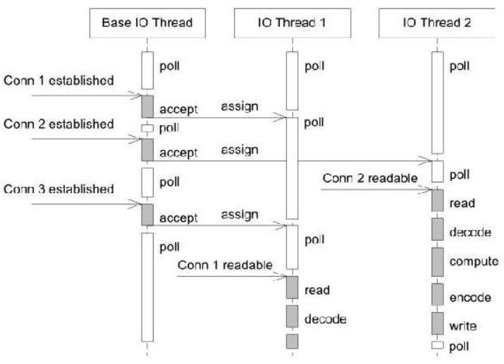
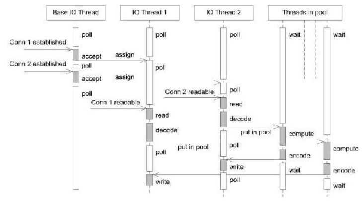

方案6是用的最多的**单线程reactor方案**，方案7和8不是使用的方案只是过渡品，**方案9和10**是需要重点了解的。比较使用的方案在下表突出表示：

| **方案** | **并发模型** | **阻塞IO** | **多进程** | **多线程** | **IO复用** | **长连接** | **并发性** | **多核** | **开销** | **互通性** | **顺序性** | **线程数** | **特点** |
| :--- | --- | --- | --- | --- | --- | --- | --- | --- | --- | --- | --- | --- | --- |
| 1 | accept + read/write | 是 | 否 | 否 | 否 | 否 | 无 | 否 | 低 | 否 | 是 | 常 | 同一时间服务一个客户 |
| 2 | accept + fork | 是 | 是 | 否 | 否 | 是 | 低 | 是 | 高 | 否 | 是 | 变 | 一个连接一个进程 |
| 3 | accept + thread | 是 | 否 | 是 | 否 | 是 | 中 | 是 | 中 | 是 | 是 | 变 | 一个连接一个线程 |
| 4 | pre fork | 是 | 是 | 否 | 否 | 是 | 低 | 是 | 高 | 否 | 是 | 变 |  |
| 5 | pre thread | 是 | 否 | 是 | 否 | 是 | 中 | 是 | 中 | 是 | 是 | 变 |  |
| 6 | select poll epoll | 否 | 否 | 否 | 是 | 是 | 高 | 否 | 低 | 是 | 是 | 常 | 单线程的reactor模式 |
| 7 | reactor + thread per task | 否 | 否 | 是 | 是 | 是 | 中 | 是 | 中 | 是 | 否 | 变 | 一个请求一个线程 |
| 8 | reactor + worker thread | 否 | 否 | 是 | 是 | 是 | 中 | 是 | 中 | 是 | 是 | 变 | 一个连接一个工作线程，主线程一个 |
| 9 | reactor + thread pool | 否 | 否 | 是 | 是 | 是 | 高 | 是 | 低 | 是 | 否 | 常 | 主线程IO，工作线程计算 |
| 10 | reactors in threads | 否 | 否 | 是 | 是 | 是 | 高 | 是 | 低 | 是 | 是 | 常 | 每个线程都有一个IO loop |
| 11 | reactors in processes | 否 | 是 | 否 | 是 | 是 | 高 | 是 | 低 | 否 | 是 | 常 | 每个进程一个IO loop，Nginx |
| 12 | reactors in threads+ thread pool | 否 | 否 | 是 | 是 | 是 | 高 | 是 | 低 | 是 | 否 | 是 | 最灵活的IO和CPU配置 |

各方案详细介绍如下：

- 方案1：这并不是并发服务器，只是一个单次单体服务器，一次只能服务一个客户，所以不适合长连接（其他客户还要连接呢）。
- 方案2：传统的Unix并发网络方案，每次有新的连接请求，就新建一个进程负责处理，适合**计算相应的工作量远大于线程创建释放的开销**（PostgreSQL使用该方式）
- 方案3：Java NIO之前的方案，仍然不适合短连接，开销也不小，并且受限于线程数，几千几万个线程会显著增加OS的调度开销。
- 方案6：基本的单线程Reactor方案，**适合IO密集，不适合CPU计算密集的场景**（计算量大，耽误下一次poll）。单线程难以发挥多核CPU的能力。处理流程见下图：

- 方案7：过渡方案，在主线程实现reactor监听IO事件，为每一个**请求**（不是连接）创建线程，在新线程中计算，可以发挥多核CPU能力。需要考虑线程的创建释放开销。
- 方案8：和方案7类似，不同的是**为每个连接创建新线程**处理该连接上的所有请求。可能性能还不如方案3
- 方案9：为弥补方案7频繁的创建销毁线程的缺点，创建固定大小的**线程池**处理计算任务（乱序响应，无法保证顺序性），仍然在主线程中监听IO事件。处理流程见下图：

- 方案10：muduo和Netty使用的并发网络方案，**每个线程都有一个reactor的循环**，主线程负责监听accept连接和分发新连接到其他线程，有新连接后在新线程中监听和处理所有请求。与方案9对比，提高了IO事件监听的效率，减少了进出线程池的开销。处理流程见下图：

- 方案11：Nginx使用的方案。如果每个连接之间不需要交互（比如聊天室那种），可以使用进程代替线程。
- 方案12：方案9和方案10的混合体，即用多个reactor线程监听IO，又用线程池处理复杂计算。

