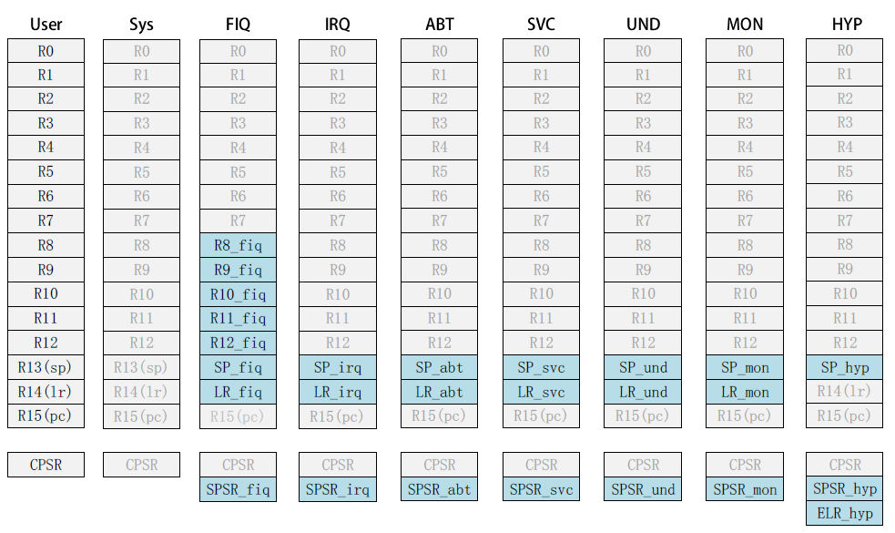
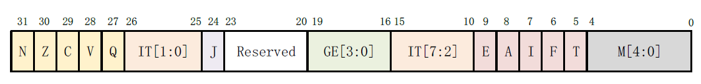

# 处理器运行模式
Cortex-A当前支持如下9种运行模式，除User模式外都是特权模式：

| **模式** | **描述** |
| --- | --- |
| User(USR) | 用户模式，非特权模式，大部分程序运行的时候就处于此模式。 |
| FIQ | 快速中断模式，进入FIQ中断异常 |
| IRQ | 一般中断模式。 |
| Supervisor(SVC) | 超级管理员模式，特权模式，供操作系统使用。 |
| Monitor(MON) | 监视模式？这个模式用于安全扩展模式。 |
| Abort(ABT) | 数据访问终止模式，用于虚拟存储以及存储保护。 |
| Hyp(HYP) | 超级监视模式？用于虚拟化扩展。 |
| Undef(UND) | 未定义指令终止模式。 |
| System(SYS) | 系统模式，用于运行特权级的操作系统任务 |

当中断或者异常发生以后，处理器就会进入到相应的异常模式种，**每一种模式都有一组寄存器**供异常处理程序使用，这样的目的是为了保证在进入异常模式以后，用户模式下的寄存器不会被破坏。

# Cortex-A内核寄存器组
ARM架构提供了18种**32位**的寄存器供使用：

- **通用寄存器** (R0~R15)
   - 前 15个 (R0~R14)可以用作**通用的数据存储**
      - R0~R7：未备份寄存器，在不同模式下数据会被破坏，临时数据
      - R8~R14：备份寄存器，不同模式下对应不同物理寄存器，作用不同
   - R15是程序计数器 PC，用来保存**将要执行的指令**。
      - `R15 (PC)值 = 当前执行的程序位置 + 8 个字节`，因为ARM3级流水线（取址--译码--执行，前两个4字节用于取址和译码的指令）
- CPSR：**当前程序状态**寄存器
- SPSR：一个**备份程序状态**寄存器。SPSR寄存器就是CPSR备份

- 灰色为各模式共用的同一物理寄存器
- 蓝色为模式独有的寄存器，含义也不一样
- 例如R14，同一寄存器在不同模式下可能对应不同的物理寄存器

# 程序状态寄存器
SPSR和CPSR的寄存器结构相同，格式如下：

- N(bit31)：当两个补码表示的 有符号整数运算的时候，N=1 表示运算对的结果为负数，N=0表示结果为正数。
- Z(bit30)：Z=1 表示运算结果为零，Z=0 表示运算结果不为零，对于CMP 指令，Z=1 表示进行比较的两个数大小相等。
- C(bit29)： 
   - 在加法指令中，当结果产生了进位，则C=1，表示无符号数运算发生上溢，其它情况下C=0。
   - 在减法指令中，当运算中发生借位，则C=0，表示无符号数运算发生下溢，其它情况下C=1。
   - 对于包含移位操作的非加/减法运算指令，C 中包含最后一次溢出的位的数值，对于其它非加/减运算指令，C 位的值通常不受影响。
- V(bit28)：对于加/减法运算指令，当操作数和运算结果表示为二进制的补码表示的带符号数时，V=1 表示符号位溢出，通常其他位不影响V 位。
- Q(bit27)：仅ARM v5TE_J 架构支持，表示饱和状态，Q=1 表示累积饱和，Q=0 表示累积不饱和。
- IT[1:0]()：和IT[7:2]()一起组成IT[7:0]，作为IF-THEN 指令执行状态。
- J(bit24)：仅ARM_v5TE-J 架构支持，J=1 表示处于Jazelle 状态，此位通常和T(bit5)位一起表示**当前所使用的指令集**
- GE[3:0](bit19): SIMD指令有效，大于或等于。
- IT[7:2](bit15): 参考 IT[1:0]。
- E(bit9)： **大小端控制位**， E=1表示大端模式， E=0表示小端模式。
- A(bit8)： 禁止异步中断位， A=1表示禁止异步中断。
- I((bit7) I=1禁止 IRQ I=0使能 IRQ。
- F((bit6) F=1禁止 FIQ F=0使能 FIQ。
- T((bit5) 控制指令执行状态，**表明本指令是 ARM指令还是 Thumb指令**，通常和 J(bit24)一起表明指令类型，参考 J(bit24)位。
- M[4:0]: **处理器运行模式**控制位
