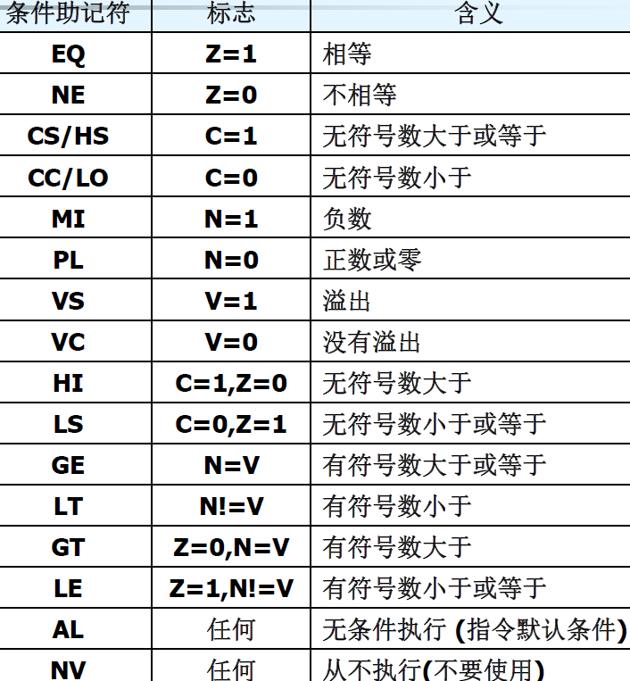
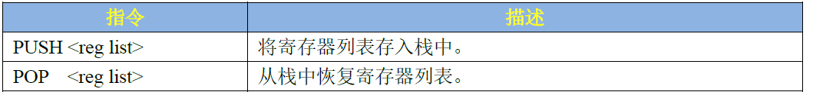
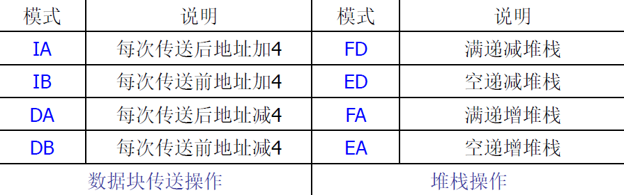
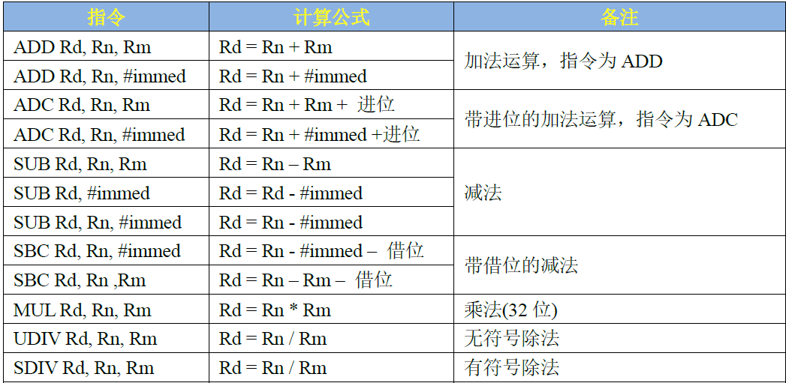
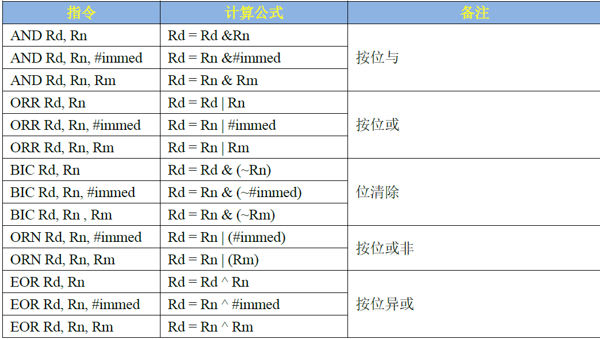
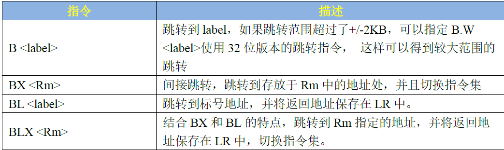

# 指令格式
```
<opcode> {<cond>} {S}	<Rd>,<Rn>{,<operand2>}
```
<  >项为必须项，{  }为可选项 

| `opcode` | 指令助记符 |
| --- | --- |
| `cond` | 执行条件 |
| `S` | 是否影响CPSR寄存器的值 |
| `Rd` | 目标寄存器 |
| `Rn` | 第一个操作数的寄存器 |
| `operand2` | 第二操作数 |


## 条件码
使用条件码可以实现高效的逻辑操作，提高代码效率。所有的ARM指令都可条件执行，而Thumb指令只有跳转指令 `B` 具有条件执行功能。**如果指令不标明条件代码，默认为无条件执行（ **`**AL**`** ）**

示例：
```c
if(a > b)
    a++;
else
    b++;
//对应汇编为
CMP			R0,R1		    ;R0与R1比较
ADDHI		R0,R0,#1		;若R0>R1，则R0=R0+1
ADDLS		R1,R1,#1		;若R0<=R1，则R1=R1+1
```

## 第二操作数
`operand2`为第二操作数，一般有如下几种形式

- `#n`：常数，该常数必须对应8位bitmap
   - 判断一个常数是否合法：该常数是否小于8位，左移偶数位是否能放入低8位
- `Rx`：指定寄存器，操作数即为寄存器数值
- `Rx,shift`：寄存器+移位，将寄存器数值的移位结果作为操作数，但Rx值保持不变（如果需要改变，使用！刷新）
| **移位操作码** | **说明** |
| --- | --- |
| `ASR #n`  | 算术右移n位，首位复制空位补充 |
| `LSL #n` | 逻辑左移n位，0位补充 |
| `LSR #n` | 逻辑右移n位，0位补充 |
| `ROR #n`  | 循环右移n位，溢出位空位补充 |
| `RRX`  | 带扩展位的循环右移1位 |
| `Type Rs`  | Type为移位的类型，Rs为偏移量寄存器，低8位有效 |


# 汇编指令

## 压栈出栈指令
PUSH和POP是多存储多加载指令，**可以一次操作多个寄存器数据**，利用栈指针SP获取当前栈地址。

## 交换指令
` SWP{cond}{B}  Rd,Rm,[Rn]` 

| **符号** | **说明** |
| --- | --- |
| B | 可选，交换字节，否则交换字 |
| Rd,Rm,Rn | Rn指向地址的数存到Rd，Rm的数存入Rn指向的地址 |
| 若Rm=Rd | 将Rd中的数与Rn指向的地址的数交换 |


## 存储器访问指令
RISC处理器，对存储器的访问只能使用加载和存储指令。所以ARM不能直接访问存储器，**需要将数据线放入Rx通用寄存器中，再借助存储器访问指令将Rx中数据写入寄存器。**分单寄存器操作指令和多寄存器操作指令

### 单寄存器存取
**单寄存器加载**

| **助记符** | **说明** | **条件码位置** |
| --- | --- | --- |
| `LDR`  | 加载字数据 | `LDR{cond}`  |
| `LDRB`  | 加载无符号字节数据 | `LDR{cond}B`  |
| `LDRT`  | 以用户模式加载字数据 | `LDR{cond}T`  |
| `LDRBT`  | 以用户模式加载无符号字节数据 | `LDR{cond}BT`  |
| `LDRH`  | 加载无符号半字数据 | `LDR{cond}H`  |
| `LDRSB`  | 加载有符号字节数据 | `LDR{cond}SB`  |
| `LDRSH`  | 加载有符号半字数据 | `LDR{cond}SH`  |

**​**

**单寄存器存储**

| **助记符** | **说明** | **条件码位置** |
| --- | --- | --- |
| `STR`  | 存储字数据 | `STR{cond}`  |
| `STRB`  | 存储字节数据 | `STR{cond}B`  |
| `STRT`  | 以用户模式存储字数据 | `STR{cond}T`  |
| `STRBT`  | 以用户模式存储字节数据 | `STR{cond}BT`  |
| `STRH`  | 存储半字数据 | `STR{cond}H`  |


### 多寄存器存取
`LDM{cond}< 模式 >  Rn{!},reglist{^} ` `STM{cond}< 模式 >  Rn{!},reglist{^} ` 


| **符号** | **说明** |
| --- | --- |
| cond | 执行条件 |
| 模式 | 地址增长模式 |
| ! | 操作结束后，地址回写 |
| reglist | 寄存器列表 |
| ^ | 加载/存储用户模式下的寄存器 |



## 数据处理指令
数据处理指令只能对寄存器的内容操作，而不能对内存中的数据操作。所有数据处理指令都可选择使用 `S` 后缀，影响状态标志

### 算术运算

```
MOV{cond}{S}    Rd,operand2     	数据传送 
MVN{cond}{S}    Rd,operand2     	数据非传送
RSB{cond}{S}    Rd,Rn,operand2    逆向减法指令
RSC{cond}{S}    Rd,Rn,operand2    逆向带进位减法指令
//带进位指令一般用于32位加减法向64位扩展

MUL{cond}{S}    Rd,Rm,Rs					32位乘法指令
MLA{cond}{S}    Rd,Rm,Rs,Rn     	32位乘加指令
UMULL{cond}{S}	RdLo,RdHi,Rm,Rs		64位无符号乘法指令
UMLAL{cond}{S}	RdLo,RdHi,Rm,Rs		64位无符号乘加指令
SMULL{cond}{S}	RdLo,RdHi,Rm,Rs		64位有符号乘法指令
SMLAL{cond}{S}	RdLo,RdHi,Rm,Rs		64位有符号乘加指令
```

### 逻辑运算


### 比较指令
```css
CMP{cond}    Rd,operand2     比较指令指令 
CMN{cond}    Rd,operand2     负数比较指令
TST{cond}    Rd,operand2     位测试指令
TEQ{cond}    Rd,operand2     相等测试指令
```

- 实质上是减法，逻辑与，异或等运算
- 与原运算相比的区别是，比较指令不保存计算结果，而将比较结果自动保存在CPSR中

## 跳转指令
跳转操作有两种方式：

- 直接向**PC寄存器**写入数据，下一跳的地址
- 使用如下跳转指令


```basic
push {r0, r1}            @保存r0,r1
cps #0x13                @进入SVC模式，允许其他中断再次进去

bl system_irqhandler     @加载C语言中断处理函数到r2寄存器中

cps #0x12                @进入IRQ模式
pop {r0, r1}
str r0, [r1, #0X10]       @中断执行完成，写EOIR
```

## 杂项指令

### 软中断指令
```css
SWI{cond}	immed_24	产生软中断，从其他模式切换到管理模式，实现用户程序调用操作系统的系统服务
```

- SWI
   - 根据SWI指令传递的参数SWI异常处理程序可以做出相应的处理
   - 传递参数的方法有两种
   - 1.指令中的24位立即数指定了用户请求的服务类型
   - 2.指令中的24位立即数被忽略，用户请求的服务类型由寄存器R0的值决定，参数通过其它通用寄存器传递

### 状态寄存器指令
```css
MRS{cond} Rd,psr
MSR{cond} psr_fields,#immed_8r
MSR{cond} psr_fields,Rm
```

- MRS   
   - 仅有MRS指令可以对CPSR和SPSR进行读操作，了解当前处理器的工作状态
- MSR
   - 仅有MSR指令可以对CPSR和SPSR进行写操作，用于切换处理器，允许禁止中断等


| **field** | **含义** |
| --- | --- |
| c | 控制域屏蔽字节（psr[7-0]） |
| x | 扩展域屏蔽字节（psr[15-8]） |
| s | 状态域屏蔽字节（psr[23-16]） |
| f | 标志域屏蔽字节（psr[31-24]） |


## 伪指令
伪指令不属于ARM指令，为了方便编程而定义，编译时被等效为正常指令

### 小范围地址读取
```css
ADR{cond} Rm,label
```

- 将程序标号label的地址存入寄存器Rm
- 编译时等效为pc的偏移地址存入Rm
- 只能用一条ADD或SUB指令实现该伪指令功能，如果不能实现则产生错误，编译失败

### 中等范围地址读取
```css
ADRL{cond} Rm,label
```

- 比ADR伪指令更大的范围的地址
- 编译时被替换为两条合适的指令

### 大范围地址读取
```css
LDR{cond} Rm,=label
LDR{cond} Rm,=#immed_8r
```

- 将程序标号label或立即数到指定寄存器
- 与ARM的基础指令相比，第二个参数要有=号

### 空操作指令
用于延时
```css
NOP
```

