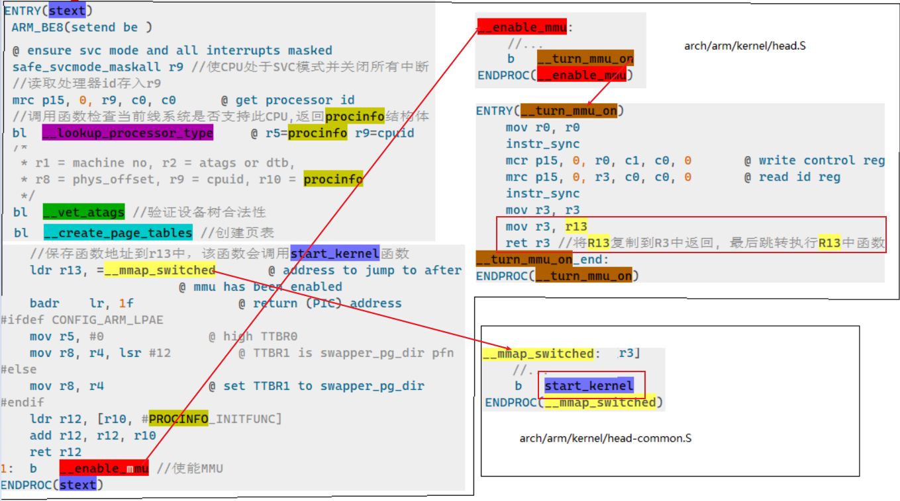
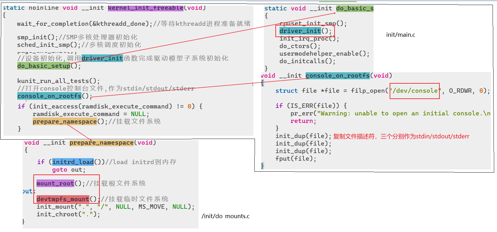
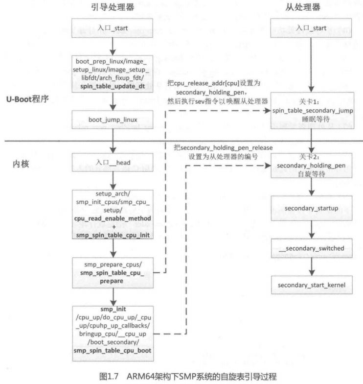

# 寻找程序入口
和uboot一样，分析启动流程需要**先分析链接脚本文件lds找到程序的入口**。对应uboot.lds，linux的链接脚本路径为`arch/arm/kernel/vmlinux.lds`。分析该文件，我们可以看到Linux内核的入口程序为**stext**。

```basic
OUTPUT_ARCH(arm)
ENTRY(stext) //entry指定了入口程序
jiffies = jiffies_64;
SECTIONS
{
    //...
}
```

# stext入口程序
`stext`是linux内核的入口函数，位于`arch/arm/kernel/head.S`中。其主要调用关系如下：

# start_kernel
`start_kernel`位于`init/main.`c中，由一系列子函数完成Linux启动之前的初始化工作。下面列举了比较重要的函数：
```c
asmlinkage __visible void __init __no_sanitize_address start_kernel(void)
{
	//...
    //设置任务栈结束魔术数，用于栈溢出检测
	set_task_stack_end_magic(&init_task);
    //设置多核处理器ID
	smp_setup_processor_id();
    //debug相关的初始化
	debug_objects_early_init();
    //cgroup初始化,用于控制系统资源
	cgroup_init_early();
    //关闭CPU中断
	local_irq_disable();
    
	//...
	boot_cpu_init();//CPU初始化
	page_address_init();//页地址初始化
	pr_notice("%s", linux_banner);//打印Linux版本号,编译时间等信息

	//...
    //架构相关初始化,解析传进来的设备树.
    //会根据dtb里model和compatible查找linux是否支持这个板卡.
    //获取dtb中chosen节点的bootargs参数(uboot),保存到command_line
	setup_arch(&command_line);
	setup_boot_config(command_line);
    //存储命令行参数
	setup_command_line(command_line);
	setup_nr_cpu_ids();//如果是多核cpu,获取cpu核心数量
	setup_per_cpu_areas();//多核环境,设置每个cpu的per-cpu数据
	
    //...
	boot_cpu_hotplug_init();
    //建立系统内存页区链表
	build_all_zonelists(NULL);
	page_alloc_init();//处理用于热插拔cpu的页
    //打印命令行参数
	pr_notice("Kernel command line: %s\n", saved_command_line);
    parse_early_param();//解析命令行中console参数
    
    //...
    setup_log_buf(0);//设置log使用的buffer
    //预先初始化虚拟文件系统(目录项和索引节点缓存)
	vfs_caches_init_early();
	sort_main_extable();//定义内核异常列表
	trap_init();//初始化系统保留中断向量
	mm_init();//内存管理初始化
    
    //...
    sched_init();//初始化调度器,主要是一些结构体
    preempt_disable();//关闭优先级抢占
    radix_tree_init();//基数树相关数据结构初始化
    
    //...
    rcu_init();//初始化RCU,即read copy update
	trace_init();//跟踪调试相关的初始化
    
    //...
    //初始中断初始化,主要是注册irq_desc结构体(用于描述一个中断)
	early_irq_init();
	init_IRQ();//中断初始化
	tick_init();//tick初始化
	rcu_init_nohz();
	init_timers();//初始化定时器
	hrtimers_init();//初始化高精度定时器
	softirq_init();//软中断初始化
    
    //...
	boot_init_stack_canary();//栈溢出检测初始化
	time_init();//初始化系统时间
    
    //...
    local_irq_enable();//enable中断
	kmem_cache_init_late();//初始化linux内存分配器slab
    //初始化控制台,初始化之后printk的信息才能打印出来
	console_init();
    lockdep_init();//死锁检测模块，初始化两个哈希表
    locking_selftest();//锁自测
    
    //...
    calibrate_delay();//测定BogoMIPS值,值越大,CPU性能越好
	anon_vma_init();//生成anon_vma slab缓存
    fork_init();//初始化结构体以支持fork函数
	proc_caches_init();//给各种资源管理结构分配缓存
	uts_ns_init();
	buffer_init();//初始化缓冲缓存
	key_init();//初始化密钥
	security_init();//安全相关初始化
	dbg_late_init();
	vfs_caches_init();//为虚拟文件系统创建缓存
	pagecache_init();
	signals_init();//初始化信号
	seq_file_init();
	proc_root_init();//注册并挂载proc文件系统
	nsfs_init();
    //初始化cpuset,cpuset是将cpu和内存资源以逻辑性和层次性集成的一种机制
	cpuset_init();
	cgroup_init();//初始化cgroup
	taskstats_init_early();//进程状态初始化
	delayacct_init();

	poking_init();
	check_bugs();//检查写缓冲一致性
    
    //...
    arch_call_rest_init();//内部调用rest_init函数
}
```
在函数最后，调用了rest_init函数，接下来看看这个函数的作用。

## rest_init
该函数还在`init/main.c`文件中，主要内容如下

1. 创建1号线程，即 `init `线程，线程函数是`kernel_init` ​
1. 创建 2 号线程，即 `ktbreadd `线程，负责创建内核线程 
1. 0 号线程最终变成空闲线程  
```c
noinline void __ref rest_init(void)
{
    //...
    rcu_scheduler_starting();//启动RCU锁调度器
    //创建大名鼎鼎的init内核进程,pid=1
	pid = kernel_thread(kernel_init, NULL, CLONE_FS);
    
    //...
    //创建kthreadd内核进程,负责所有内核新城的调度和管理,pid=2
	pid = kernel_thread(kthreadd, NULL, CLONE_FS | CLONE_FILES);
    
    //...
    //该函数调用cpi_idle_loop进入idle进程.pid=0,也叫空闲进程,有本函数执行的主进程演变而来
	cpu_startup_entry(CPUHP_ONLINE);
}   
```
之后CPU将主要用于init内核进程的执行，下面看看init进程在干些什么。

## init进程
init进程由`kernel_init`函数生成，该函数还在`init/main.c`中。其主要任务是找到linux文件系统（先挂载文件系统）中的`init`程序并运行：

### kernel_init_freeable
上面提到需要**先挂载文件系统**，不然后面没法找到init或shell程序的位置。挂载文件系统和其他一些初始化工作都是在`kernel_init_freeable`中执行的：

### 运行init用户进程
```c
static int __ref kernel_init(void *unused)
{
    int ret;

    kernel_init_freeable();//挂载FS等其他初始化工作
    async_synchronize_full();//等待所有的异步调用执行完成
    
    //...
    free_initmem();//释放init段内存
    system_state = SYSTEM_RUNNING;//标记系统处于正在运行状态
    
    //查找init程序位置,运行成功则返回,否则继续查找
    if (ramdisk_execute_command) {
        //全局变量,值为/init,即执行根目录init程序
        ret = run_init_process(ramdisk_execute_command);
        if (!ret)
            return 0;
        pr_err("Failed to execute %s (error %d)\n",
               ramdisk_execute_command, ret);
    }
    
    if (execute_command) {
        //上面变量为空,则尝试执行本变量,直到找到可运行的init程序为止
        ret = run_init_process(execute_command);
        if (!ret)
            return 0;
        panic("Requested init %s failed (error %d).",
              execute_command, ret);
    }
    
    //...
    if (!try_to_run_init_process("/sbin/init") ||
        !try_to_run_init_process("/etc/init") ||
        !try_to_run_init_process("/bin/init") ||
        !try_to_run_init_process("/bin/sh"))
        return 0;
}
```
**如果最后init和备用的shell程序都运行失败，则Linux内核启动失败。**

# SMP系统的引导
对称多处理器 ( Symmetric Multi-Processor, SMP ) 系统包含多个处理器，并且每个处理器的地位平等。在启动过程中（`start_kernel`阶段），处理器的地位不是平等的，0号处理器称为引导处理器，负责执行引导程序和初始化内核；其他处理器称为从处理器，等待引导处理器完成初始化。引导处理器初始化内核以后，启动从处理器：
