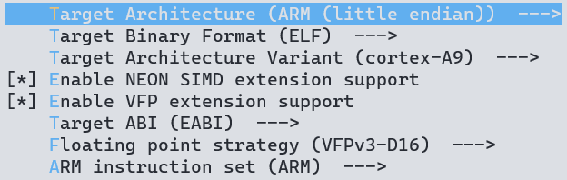
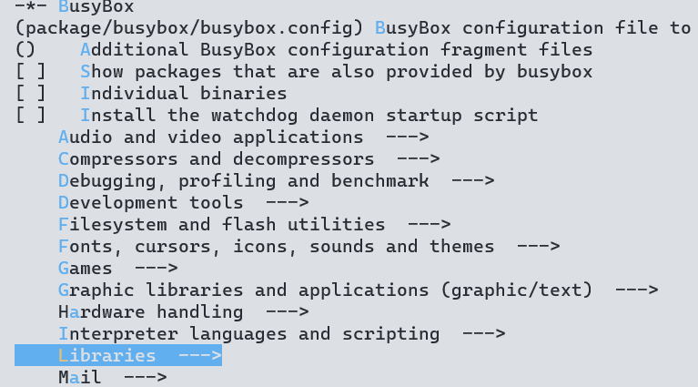
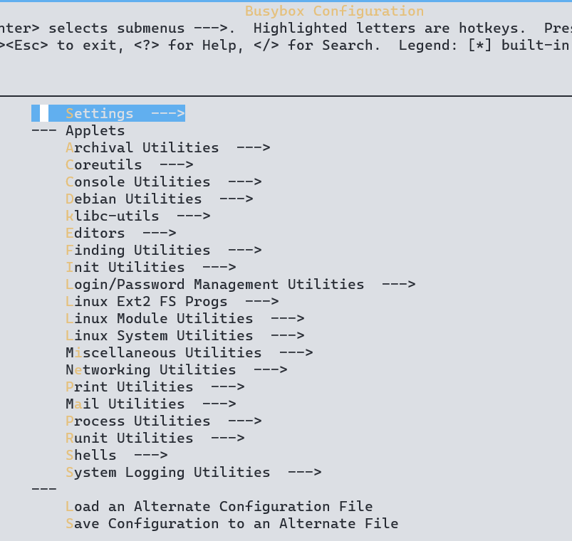

busybox 构建的根文件系统不齐全，很多东西需要我们自行添加，比如 lib 库文件。在驱动开发中很多第三方软件也需要我们自己去移植，这些第三方软件有很多又依赖其他的库文件，导致移植过程非常的繁琐。 ​

buildroot相较于busybox更实用（本人公司就是用的buildroot）。buildroot 不仅集成了 busybox，而且**还集成了各种常见的第三方库和软件**，需要什么就选择什么。 

# buildroot编译
和busybox编译方式一样，先指定架构，使用现有的配置文件生成`.config`，再进行自定义
```bash
export ARCH=arm
export CROSS_COMPILE=arm-linux-gnueabi-

make qemu_arm_vexpress_defconfig
make menuconfig

sudo make
```
下面是详细的配置，需要在menuconfig中进行配置：

## target option
设置架构相关，如果提前设置`ARCH=arm`，会默认采用arm架构：

## toolchain配置
buildroot可以自己下载交叉编译器再编译，如果系统已经安装了交叉编译器（ubuntu上apt下载的与buildroot冲突，需要单独下载编译好的交叉编译器），可以设置为custom toolchain：单独arm gcc编译器下载地址：[https://developer.arm.com/tools-and-software/open-source-software/developer-tools/gnu-toolchain](https://developer.arm.com/tools-and-software/open-source-software/developer-tools/gnu-toolchain)
```
Toolchain
-> Toolchain type = External toolchain
-> Toolchain = Custom toolchain //用户自己的交叉编译器
-> Toolchain origin = Pre-installed toolchain //预装的编译器
-> Toolchain path =/usr/ //绝对路径
-> Toolchain prefix = $(ARCH)-linux-gnueabihf //前缀
-> External toolchain gcc version = 9.x
-> External toolchain kernel headers series = 5.4.x
-> External toolchain C library = glibc/eglibc
-> [*] Toolchain has SSP support? (NEW) //选中
-> [*] Toolchain has RPC support? (NEW) //选中
-> [*] Toolchain has C++ support? //选中
-> [*] Enable MMU support (NEW) //选中
```

## system config
设置一些系统配置，如下：
```
System configuration
-> System hostname = barret-board //平台名字，自行设置
-> System banner = Welcome to barret board //欢迎语
-> Init system = BusyBox //使用 busybox
-> /dev management = Dynamic using devtmpfs + mdev //使用 mdev
-> [*] Enable root login with password         //使能登录密码
-> Root password = 123456 //登录密码为 123456
```

## filesystem image
设置生成根文件系统的格式
```
-> Filesystem images
-> [*] ext2/3/4 root filesystem //如果是 EMMC 或 SD 卡的话就用 ext3/ext4
		-> ext2/3/4 variant = ext4 //选择 ext4 格式
-> [*] ubi image containing an ubifs root filesystem //如果使用 NAND 的话就用 ubifs
```

## 禁止内核和uboot编译
buildroot 不仅仅能构建根文件系统，也可以编译 linux 内核和 uboot。buildroot 就会自动下载最新的 linux 内核和 uboot 源码并编译。但是我们一般都不会使用 buildroot 下载的 linux 内核和 uboot，因为 buildroot 下载的 linux 和 uboot官方源码，里面会缺少很多驱动文件，而且最新的 linux 内核和 uboot 会对编译器版本号有要求，可能导致编译失败。因此我们需要配置 buildroot，关闭 linux 内核和 uboot 的编译，只使用buildroot 来构建根文件系统：
```
-> Kernel
-> [ ] Linux Kernel //不要选择编译 Linux Kernel 选项！

-> Bootloaders
-> [ ] U-Boot //不要选择编译 U-Boot 选项！
```

## 配置第三方库和软件
在Target packages中选择lib或软件即可

## 配置buildroot中的busybox
buildroot 会自动下载 busybox 压缩包， buildroot 下载的源码压缩包都存放在/dl 目录下，在 dl 目录下就有一个叫做“busybox”的文件夹。输入`sudo make busybox-menuconfig`可以打开配置界面，用于配置busybox功能：

# 测试结果
等待编译完成，编译完成以后就会在`output/images`下生成根文件系统。

