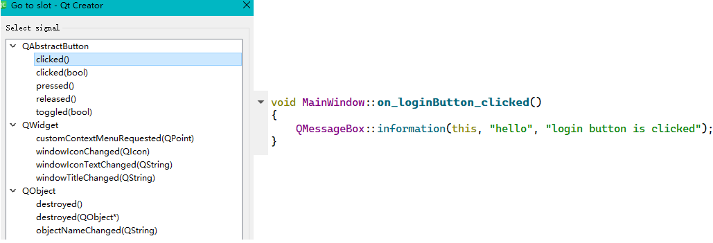
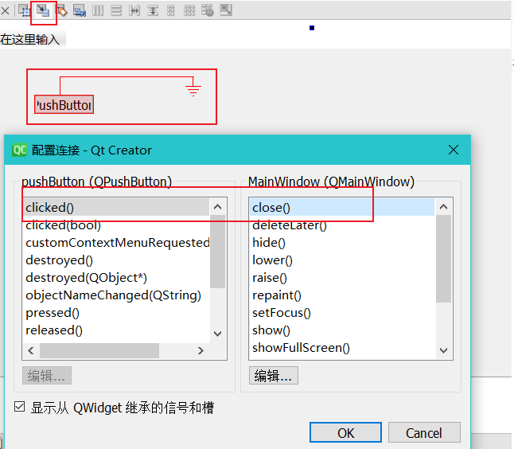

# 1 信号与槽连接方法

## go to slot
在Designer界面右键点击相应的控件，选择**Go to Slot**，可以选择相应的事件处理函数，IDE会自动添加该函数到MainWindow类并跳转到函数实现，允许添加具体的C++实现函数。其中**选择框中列出的都是信号，跳转的函数称为反应槽**。两者之间的交互是**异步调用**的。

## edit signal/slot按钮
顶部工具栏使用signal/slot按钮，可以在界面中指定组件的事件并设置自动关联哪个组件的什么事件。**会在ui文件中添加关联，默认不会在cpp文件生成函数**，使用组件默认的行为。当然可以在关联组件的头文件中重写该slot函数，自定义逻辑。slot函数需要包含在`public slots:`下。

# 2 自定义信号槽
我们可以自己新建一个Class来实现我们自定义的事件和相应的处理函数，用于应对内建不支持的事件。

## 2.1 添加信号和槽定义
基本方法如下；

1. 创建一个C++ class，继承QObject基类，**在类中添加slot槽函数**
```cpp
#ifndef MYCLASS_H
#define MYCLASS_H
#include <QObject>
#include <QMessageBox>

class MyClass : public QObject
{
    Q_OBJECT
public:
    explicit MyClass(QObject* parent = nullptr);

signals:
public slots:
    void doSomething()//添加自定义的slot函数，用于处理事件
    {
        QMessageBox::information(nullptr, "Hello", "MyClass slot function is called");
    }
};

#endif // MYCLASS_H
```

2. 在主窗体MainWindow类中添加一个新的信号signal
```cpp
class MainWindow : public QMainWindow
{
	...
signals:
    void doNow();//添加一个新的signal信号,不需要实现函数体内容
}
```

3. 现在信号和槽都有了，接下来需要将两者进行绑定。在MainWindow构造函数中进行绑定：
```cpp
//将mainwindow新添加的signal与自定义类的slot函数绑定
MyClass* myclass = new MyClass;
connect(this, &MainWindow::doNow, myclass, &MyClass::doSomething);
```

4. 最后我们新加了信号和槽，也进行了绑定。然后我们只需要触发信号，槽函数就能自动执行了
```cpp
emit doNow();//触发doNow signal，emit只是一个宏，修饰doNow，表示发出信号
```
从上面流程可以看出，实际上我们是**创建了两个函数，其中一个作为信号，另一个作为反应槽，将两者用conenct进行绑定之后，就可以用信号触发槽函数了**。

## 2.2 使用lambda
上面继承QObject创建类太复杂了，我们可以用简单的lambda更简单的绑定信号，不需要创建类了，举例如下：
```cpp
connect(this, &MainWindow::doNow, []()
{
	QMessageBox::information(nullptr, "Hello", "MyClass slot function is called");
});
```

# 3 callback函数
QT5的控件有很多内置的callback函数，我们可以重载这些函数的内部实现。不需要添加signal和绑定，当特定的事件触发时，这些callback函数就会被自动调用。比如常见的**键盘输入、窗口大小重绘、鼠标移动，点按等等。**我们可以重载callback函数，达到和信号槽相同的效果比如QWidget中常见的callback：

- void resizeEvent(QResizeEvent *event);
- void keyPressEvent(QKeyEvent *event);
- void keyReleaseEvent(QKeyEvent *event);
- void mouseMoveEvent(QMouseEvent *event);
- void mousePressEvent(QMouseEvent *event);
- void mouseReleaseEvent(QMouseEvent *event);


比如我们可以像实现普通C++函数一样重载callback，不用管它是什么信号触发：
```cpp
//添加成员函数用于函数调用
void mouseMoveEvent(QMouseEvent* event);

void MainWindow::mouseMoveEvent(QMouseEvent* event)
{
    qDebug() << " mouse position" << event->pos();
}
```

# 4 信号与槽机制解析
**信号（Signal）**就是在特定情况下被发射的事件，例如PushButton 最常见的信号就是鼠标单击时发射的 clicked() 信号，一个 ComboBox 最常见的信号是选择的列表项变化时发射的 CurrentIndexChanged() 信号。GUI 程序设计的主要内容就是对界面上各组件的信号的响应，只需要知道什么情况下发射哪些信号，合理地去响应和处理这些信号就可以了。​

**槽（Slot）**就是对信号响应的函数。**槽就是一个函数**，与一般的[C++](http://c.biancheng.net/cplus/)函数是一样的，可以定义在类的任何部分（public、private 或 protected），可以具有任何参数，也可以被直接调用。槽函数与一般的函数不同的是：**槽函数可以与一个信号关联**，当信号被发射时，关联的槽函数被自动执行。

## 4.1 信号与槽关联
信号与槽关联是用 QObject::connect() 函数实现的，其基本格式是：
```cpp
QObject::connect(sender, SIGNAL(signal()), receiver, SLOT(slot()));
//或 QObject 是所有 Qt 类的基类，在实际调用时可以忽略前面的限定符
connect(sender, SIGNAL(signal()), receiver, SLOT(slot()));
```

- sender 是发射信号的对象的名称
- signal() 是信号名称
- receiver 是接收信号的对象名称
- slot() 是槽函数的名称，需要带括号，有参数时还需要指明参数

## 4.2 需要注意

- **一个信号可以连接多个槽**，例如：当一个对象 spinNum 的数值发生变化时，所在窗体有两个槽进行响应，一个 addFun()用于计算，一个 updateStatus() 用于更新状态。
```cpp
connect(spinNum, SIGNAL(valueChanged(int)), this, SLOT(addFun(int));
connect(spinNum, SIGNAL(valueChanged(int)), this, SLOT(updateStatus(int));
```

   - 当一个信号与多个槽函数关联时，槽函数按照建立连接时的顺序依次执行。
   - 当信号和槽函数带有参数时，在 connect()函数里，要写明参数的类型，但可以不写参数名称。


- **多个信号可以连接同一个槽**，例如让三个选择颜色的 RadioButton的clicked() 信号关联到相同的一个自定义槽函数 setTextFontColor()。这样，当任何一个 RadioButton 被单击时，都会执行 setTextFontColor() 函数。
```cpp
connect(ui->rBtnBlue,SIGNAL(clicked()),this,SLOT(setTextFontColor()));
connect(ui->rBtnRed,SIGNAL(clicked()),this,SLOT(setTextFontColor()));
connect(ui->rBtnBlack,SIGNAL(clicked()),this,SLOT(setTextFontColor()));
```


- **一个信号可以连接另外一个信号**，例如：`connect(spinNum, SIGNAL(valueChanged(int)), this, SIGNAL (refreshInfo(int));`。这样，当一个信号发射时，也会发射另外一个信号，实现某些特殊的功能。
- 严格的情况下，**信号与槽的参数个数和类型需要一致**，至少信号的参数不能少于槽的参数。如果不匹配，会出现编译错误或运行错误。
- 在使用信号与槽的类中，**必须在类的定义中加入宏 Q_OBJECT**。
- 当一个信号被发射时，与其关联的槽函数通常被立即执行，就像正常调用一个函数一样。只有当信号关联的所有槽函数执行完毕后，才会执行发射信号处后面的代码。

## 4.3 信号槽断开
函数定义如下:
```cpp
bool QObject::disconnect(const QObject *sender, const char *signal, const QObject *receiver, const char *method);
```
可以使用如下几种特殊形式:
```cpp
//1 断开一切与 myObject 连接的信号或槽。
disconnect(myObject, 0, 0, 0);
相当于调用：
myObject->disconnect();

//2 断开所有连接到特定信号的东西。
disconnect(myObject, SIGNAL(mySignal()), 0, 0);
相当于调用：
myObject->disconnect(SIGNAL(mySignal()));

//3 与指定的接收者断开连接
disconnect(myObject, 0, myReceiver, 0);
相当于调用：
myObject->disconnect(myReceiver);
```
