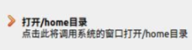
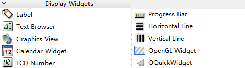
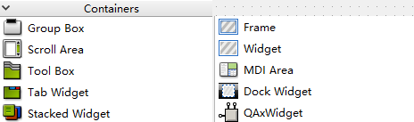
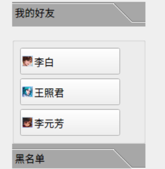
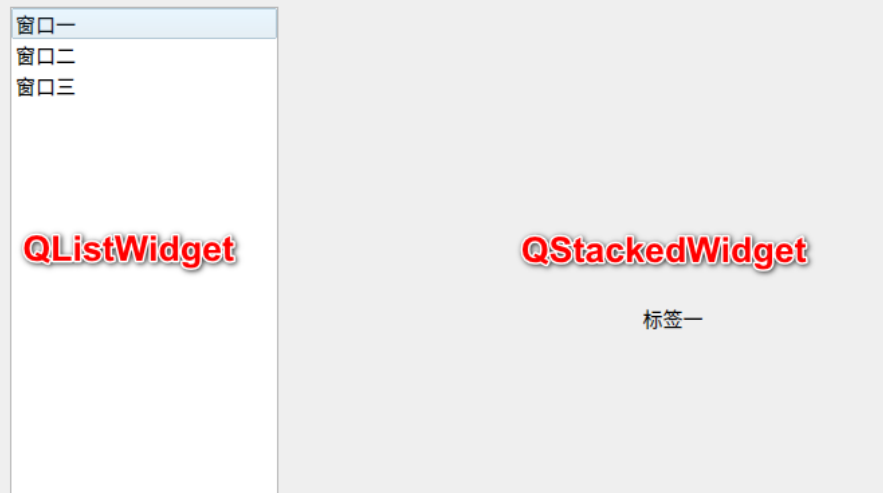
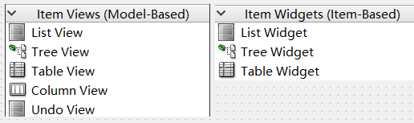
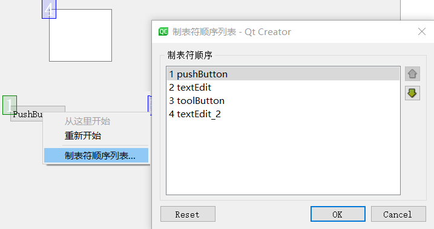

# 按钮组件
QT Widgets支持如下6种按钮：


1. QPushButton：下压按钮，通常用于执行命令或触发事件
1. QToolButton：工具按钮，通常在 ToolBar 里面。工具按钮通常显示的是图标，而不是文本标签 
1.  QRadioButton：单选按钮，通常成组出现，用于提供两个或多个互斥选项
1. QCheckBox：多选按钮，与 RadioButton 的区别是选择模式，单选按钮提供多选一，复选按钮提供多选多 
1. QCommandLinkButton：命令链接按钮，也用于在互斥选项中选择一项 ，默认情况下，它也将携带一个箭头图标，表明按下按钮将打开另一个窗口或页面。样式如下：



6. QDialogButtonBox：对话框按钮，常用于对话框里自定义按钮，比如“确定”和“取消” 按钮等。可以在构造函数种指定如下enum类型生成特定的按钮：
```cpp
enum StandardButton {
    NoButton           = 0x00000000,
    Ok                 = 0x00000400,
    Save               = 0x00000800,
    SaveAll            = 0x00001000,
    Open               = 0x00002000,
    Yes                = 0x00004000,
    YesToAll           = 0x00008000,
    No                 = 0x00010000,
    NoToAll            = 0x00020000,
    Abort              = 0x00040000,
    Retry              = 0x00080000,
    Ignore             = 0x00100000,
    Close              = 0x00200000,
    Cancel             = 0x00400000,
    Discard            = 0x00800000,
    Help               = 0x01000000,
    Apply              = 0x02000000,
    Reset              = 0x04000000,
    RestoreDefaults    = 0x08000000,

#ifndef Q_MOC_RUN
    FirstButton        = Ok,
    LastButton         = RestoreDefaults
#endif
};
```

# 文本输入


1. Comb Box：选项框，通常用于显示选项列表
1. Font Comb Box：字体选项框，允许用户选择字体（自动读取系统字体）。常用于工具栏，与 ComboBox 一起用于控制字体大小，并与两个 ToolButtons 一起用于粗体和斜体
1. Line Edit：单行编辑框
1. Text Edit：文本编辑框，用于段落和字符，还可以显示图像，列表和表格。如果文本太大而无法在文本编辑的视图中查看，视图中则会出现滚动条
1. Plain Text Edit：纯文本编辑框
1. Spin Box：数字旋转框，允许用户通过单击上/下按钮或按下键盘上的上/下按钮来选择一个值，也可以手动输入值
1. Double Spin Box：双精度数字旋转框，用于浮点数，比Spin box精度更高
1. Time Edit：时间编辑框
1. Date Edit：日期编辑框
1. Date/Time Edit：日期时间编辑框，允许用户使用键盘或箭头键编辑日期，以增加或减少日期和时间值
1. Dial：数字拨盘框，提供了一个圆形范围控制(如速度计或电位器)
1. Horizontal Scroll Bar：水平滚动条
1. Vertical Scroll Bar：垂直滚动条
1. Horizontal Slider：水平滑动条
1. Vertical Slider：垂直滑动条
1. Key sequence Edit：按键序列编辑框，当小部件接收到焦点并在用户释放最后一个键后一秒结束时，将启动记录，通常用于**记录快捷键**。

# 内容显示


1. Label：标签，用于文本或图像显示
1. Text Browser：文本浏览器，提供了一个具有超文本链接导航的文本浏览器
1. Graphics View：图形视图，提供了基于图元的模型/视图编程，用于浏览图片和显示不同样式（缩放，旋转等）
1. Calendar Widget：日历，提供了一个基于月的日历小部件，允许用户选择日期
1. LCD Number：液晶数字，显示一个类似于 lcd 的数字，可以显示十进制、十六进制、八进制或二进制数字
1. Progress Bar：进度条
1. Horizontal Line：水平线
1. Vertial Line：垂直线
1. OpenGL Widget：开放式图形库工具
1. QQuick Widget：嵌入式 QML 工具

# 布局组件
Qt 为界面设计提供了丰富的布局管理功能，在 UI 设计器中，组件面板里有 Layouts 和 Spacers 两个组件面板，提供了如下组件：

| 布局组件 | 功能 |
| --- | --- |
| Vertical Layout | 垂直方向布局，组件自动在垂直方向上分布 |
| Horizontal Layout | 水平方向布局，组件自动在水平方向上分布 |
| Grid Layout | 网格状布局，网状布局大小改变时，每个网格的大小都改变 |
| Form Layout | 窗体布局，以两列的形式布局其子类。左列由标签组成，右列由“字段”小部件(QLineEdit(行编辑器)、 QSpinBox(旋转框等))组成。比如登录窗口的布局 |
| Horizontal Spacer | 一个用于水平分隔的空格 |
| Vertical Spacer | 一个用于垂直分隔的空格 |


# 容器组件


1. Group Box：分组框，通常带一个边框和标题栏，使用水平或垂直布局
1. Scroll Area：滚动区域，如果内容超过容器大小，会自动出现滚动条
1. Tool Box：工具箱，类似抽屉，提供一种列状的层叠窗口，每个窗口显示一列选项卡，多列重叠。比如：



4. Tab Widget：选项卡多标签页，用于分页显示，每页一个界面
4. Stacked WIdget：小部件堆栈，一次只能看到一个组件。常与 QListWidget 搭配使用，效果如下：



6. Frame：是**所有框架的窗口部件的基类**，它绘制框架并且调用一个虚函数 drawContents()来填充这个框架。Frame绘制属性：
```cpp
//形状
enum Shape {
    NoFrame  = 0, //无形状
    Box = 0x0001, // 矩形框
    Panel = 0x0002, //使内容看起来凸起或凹陷的框
    WinPanel = 0x0003, // 类似panel，绘制windows效果
    HLine = 0x0004, // 水平线
    VLine = 0x0005, // 垂直线
    StyledPanel = 0x0006 //调用QS太远了：：drwaPanel绘制
};
//阴影效果
enum Shadow {
    Plain = 0x0010, //使用前景色，五三维效果
    Raised = 0x0020, //三维凸起线
    Sunken = 0x0030 //三维凹陷线
};
```

6. Widget：**所有用户界面组件的基类**，是最基本元素，一般用于容纳其他widget窗口
6. MDI Area：MDI区域，显示MDI框架
6. Dock Widget：停靠窗体部件，可以停靠在main window，也可以作为桌面的顶级窗口浮动

# view显示组件


## 基于模型的view组件

1. List View：清单视图，使用内部模型来管理列表项，需要自己管理数据。下面的也类似
1. Tree View：树形视图
1. Table View：表视图
1. Column View：列表视图，比如用于省市区的选择
1. Undo View：撤销列表视图，显示撤销堆栈上的命令列表，对战发生变化时，视图自动更新


如下QT现成的数据模型，可以用在上面的组件中：

- **QStringListModel** 用于存储简单的 QString 列表
- **QStandardItemModel** 管理复杂的树型结构数据项，每项都可以包含任意数据
- **QDirModel** 提供本地文件系统中的文件与目录信息。
- **QSqlQueryModel**, **QSqlTableModel**,**QSqlRelationTableModel** 用来访问数据库。

使用示例：
```cpp
/* 实例化 */
listView = new QListView(this);
/* 将 listView 居中 */
setCentralWidget(listView);

QStringList strList;
strList<<"高三（1）班"<<"高三（2）班"<<"高三（3）班";

/* 实例化字符串模型 */
stringListModel = new QStringListModel(strList);

/* 设置数据模型，向表中插入一段数据 */
listView->setModel(stringListModel);
/* 设置为视图为图标模式 */
listView->setViewMode(QListView::IconMode);
```

## 基于项的view组件

1. list widget：提供一个基于项的列表，比list view先进，已经有数据存储模型，可以直接`additem`
1. tree widget：使用预定义的树模型显示列表项，也已经有数据模型了
1. table Widget：提供基于项的数据表格，也有默认数据模型


# 其他设置

## 伙伴关系
单击“Edit Buddies”按钮可以进入伙伴关系编辑状态，按住鼠标左键，然后拖向一个组件，就建立了 Label 和组件之间的伙伴关系。伙伴关系（Buddy）是指界面上一个 Label 和一个组件相关联，是为了在程序运行时，在窗体上用快捷键快速将输入焦点切换到某个组件上。​

比如下面界面中，设定“姓名”标签的 Text 属性为“姓名(&N)”，其中符号“&”用来指定快捷字符，界面上并不显示“&”，这里指定快捷字母为 N。那么程序运行时，用户按下 `Alt+N`，输入焦点就会快速切换到“姓名”关联的输入框内。


## Tab顺序
Tab 顺序是指在程序运行时，按下键盘上的 Tab 键时输入焦点的移动顺序。一个好的用户界面，在按 Tab 键时，焦点应该以合理的顺序在界面上移动，而不是随意地移动。单击“Edit Tab Order”按钮进入Tab 顺序编辑状态。进入 Tab 顺序编辑状态后，在界面上会显示具有 Tab 顺序组件的编号，依次按希望的顺序单击组件，就可以重排 Tab 顺序了。没有输入焦点的组件是没有 Tab 顺序的，如 Label 组件。

