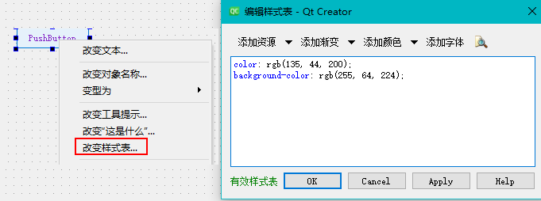
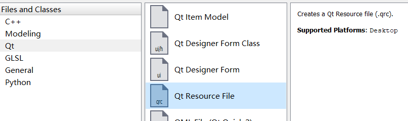
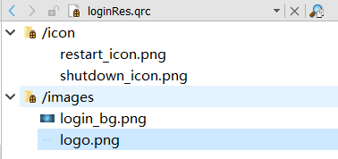
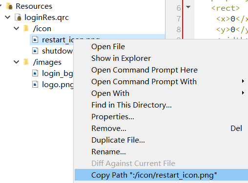

# 1 Qt Style Sheets
Qt Style Sheets是QT4和之前版本上设置控件样式的方式，语法和CSS类似。Qt Widgets支持的控件和每个控件可以修改的样式参考：[https://doc.qt.io/qt-5/stylesheet-reference.html](https://doc.qt.io/qt-5/stylesheet-reference.html)有两种配置方式：

## 1.1 UI文件中配置
最简单的方式是在Qt deisgner中右键点击控件，**选择更改样式表**，然后填写具体的样式，确定后新加的样式会自动添加到.ui文件中（当然你也可以直接编辑.ui文件）。这种方式适合默认的在运行时不会修改的样式。

## 1.2 C++代码中控制样式
如果要在运行时动态的修改控件样式，就需要调用`setStyleSheet`函数。UI界面上所有的空间在源代码中都是MainWindow类中变量ui的内部对象，所以要修改某个控件，需要添加如下示例的代码：
```cpp
ui->myPushButton->setStyleSheet("color : blue");
```
或者直接调用MainWindow类，设置内部控件样式：
```cpp
qApp->setStyleSheet("myPushButton { color: white }");
```

## 1.3 伪选择器
伪选择器（pseudo-states）可以让程序根据控件不同的状态条件设置不同的style。除了通用的**active、disabled、enabled**，每个控件的状态大都不同。比如我们为pushbutton设置不同状态的style：
```css
QPushButton {/*默认样式*/
  color: white;
  background-color: #27a9e3;
  border-width: 0px;
  border-radius: 3px;
}
QPushButton:hover {/*鼠标在上方时的样式*/
  color: white;
  background-color: #66c011;
  border-width: 0px;
  border-radius: 3px;
}
QPushButton:pressed {/*鼠标点击时的样式*/
  color: white;
  background-color: yellow;
  border-width: 0px;
  border-radius: 3px;
}
```

## 1.4 setProperty()与property()
除了上面默认存在的伪选择器，我们也可以像给CSS动态添加属性一样（CSS中的类或name等可以在JavaScript中动态添加），动态的修改控件样式。两个函数分别为：

- QObject::setProperty()：给控件添加属性，并设置值
- QObject::property()：获取属性的值


使用示例如下：样式表中设置某个属性下的样式：
```css
QPushButton[pagematches=true] {/*只有当pagematches的值为true时，下面的样式才起作用*/
color: white;
background-color: red;
border-width: 0px;
border-radius: 3px;
}
```
为了给button添加pagematches这个属性，在cpp代码中需要如下调用：
```cpp
//为控件新加属性，并设置值，类似JS设置CSS
ui->button1->setProperty("pagematches", true);
//refresh the button style
ui->button1->style()->polish(ui->button1);
```

## 1.5 子控件样式设置
类似CSS的语法，我们可以指定某个控件内部子控件的样式，比如下面样式将只应用于spinBOx的down button
```css
QSpinBox::down-button {
  image: url(:/images/spindown.png);
  subcontrol-origin: padding;
  subcontrol-position: right bottom;
}
```

# 2 添加资源文件

1. 为项目创建资源文件qrc，保存需要的资源



2. 在qrc文件中划分不同类型的资源，并为每种类型添加具体的文件（类似树形结构），**文件要和qrc文件在同一目录或子目录下。**



3. 设置控件的icon或pixmap属性（**根据不同的控件不一样**），选择资源文件中的资源，之后可以设置iconSize修改资源的大小


4. 除了在designer中通过对话框设置，也可以直接设置CSS属性，例如设置全局背景：
```css
#centralWidget {
	background: rgba(32, 80, 96, 100);
	border-image: url(:/images/login_bg.png);
}
```
资源的url路径可以通过IDE直接获取：


qrc资源文件本质上是XML文件，格式如下：

```xml
<RCC>
    <qresource prefix="/icon">
        <file>restart_icon.png</file>
        <file>shutdown_icon.png</file>
    </qresource>
    <qresource prefix="/images">
        <file>login_bg.png</file>
        <file>logo.png</file>
    </qresource>
</RCC>
```

# 3 设置控件的图形效果
每一个控件和UI图形都可以设置图形效果（graphis effect），通过setGraphicsEffect函数设置具体的效果。注意，**一个控件智能设置一种效果。**QT支持如下的图形效果：

- **QGraphicsBlurEffect**：模糊效果，主要函数setBlurRadius控制模糊度
- **QGraphicsDropShadowEffect**：着色功能，主要函数是setColor(QColor)和setStrength (qreal strength)，指定了着色和着色强度
- **QGraphicsColorizeEffect**：阴影效果，用于增加立体感。主要设置函数有3个，
   - setColor()用于设定阴影的颜色
   - setBlurRadius()用于设定阴影的模糊度
   - setOffset (qreal dx,qreal dy)用于设定在哪个方向产生阴影效果，如果dx为负数，则阴影在图形元素的左边
- **QGraphicsOpacityEffect**：透明效果，主要函数是setOpacity(qreal opacity)，用于设置透明度


使用示例：
```cpp
//设置logo的图形效果
QGraphicsBlurEffect* blur = new QGraphicsBlurEffect();
blur->setBlurRadius(8);
ui->logo->setGraphicsEffect(blur);
```

# 4 QT属性系统

## 4.1 属性定义
在 QObject 的子类中，用宏 **Q_PROPERTY() **定义属性，其使用格式如下：
```
Q_PROPERTY(type name (READ getFunction [WRITE setFunction] | MEMBER meznberName [(READ getFunction | WRITE setFunction)])
    [RESET resetFunction]
    [NOTIFY notifySignal]
    [REVISION int]
    [DESIGNABLE bool]
    [SCRIPTABLE bool]
    [STORED bool]
    [USER bool]
    [CONSTANT]
    [FINAL])
```
Q_PROPERTY 宏定义一个返回值类型为 type，名称为 name 的属性，用 READ、WRITE 关键字定义属性的读取、写入函数，还有其他的一些关键字定义属性的一些操作特性。属性的类型可以是 QVariant 支持的任何类型，也可以用户自定义类型。Q_PROPERTY 宏定义属性的一些主要关键字的意义如下：

- READ 指定一个读取属性值的函数，没有 MEMBER 关键字时必须设置 READ。
- WRITE 指定一个设定属性值的函数，只读属性没有 WRITE 设置。
- MEMBER 指定一个成员变量与属性关联，成为可读可写的属性，无需再设置 READ 和 WRITE。
- RESET 是可选的，用于指定一个设置属性缺省值的函数。
- NOTIFY 是可选的，用于设置一个信号，当属性值变化时发射此信号。
- DESIGNABLE 表示属性是否在 Qt Designer 里可见，缺省为 true。
- CONSTANT 表示属性值是一个常数，对于一个对象实例，READ 指定的函数返回值是常数，但是每个实例的返回值可以不一样。具有 CONSTANT 关键字的属性不能有 WRITE 和 NOTIFY 关键字。
- FINAL 表示所定义的属性不能被子类重载。

## 4.2 类附加信息
属性系统还有一个宏** Q_CLASSINFO**()，可以为类的元对象定义“key-value”信息，如：
```cpp
class QMyClass:public QObject {
    Q_OBJECT
    Q_CLASSINFO("author", "Wang")
    Q_CLASSINFO ("company", "UPC")
    Q_CLASSINFO("version ", "3.0.1")
public:
    //...
};
```
用 Q_CLASSINFO() 宏定义附加类信息后，可以通过元对象的一些函数获取类的附加信息，如 classlnfo(int) 获取某个附加信息，函数原型定义如下：`QMetaClassInfo QMetaObject::classInfo(int index) const`。返回值是 QMetaClassInfo 类型，有 name() 和 value() 两个函数，可获得类附加信息的名称和值。
