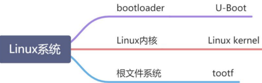
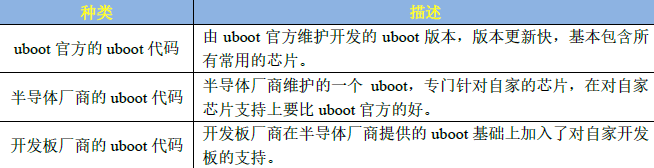

# 一种bootloader

uboot的全称是Universal Boot Loader，是一个遵循GPL协议的开源软件，是一个裸机代码，主要任务是**初始化硬件和外设，复制Linux内核文件到内存种并启动内核**。
官方网站[http://www.denx.de/wiki/U-Boot/](http://www.denx.de/wiki/U-Boot/)。一共有三个版本uboot

# 编译

 [基于QEMU的ARM仿真.md](..\基于QEMU的ARM仿真.md) 

# 烧录
uboot.bin文件烧录到SD卡中，设置开发板芯片从SD卡中启动，便可启动uboot并加载内核。

