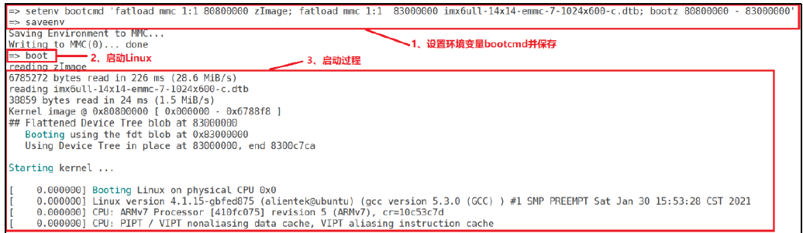
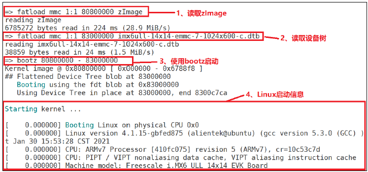

在uboot启动显示“Hit any key to stop auto boot"时，敲击回车，会停止启动linux内核，进入命令模式。常用的命令如下：

# 查询命令
```c
bdinfo		查看板子信息
printenv	输出环境变量信息
version		查看uboot版本
```

# 环境变量

## 修改环境变量
当要修改的环境变量中有多组值时，值与值之间用逗号分开，且**被单引号括住环境变量都是字符串变量**。创建环境变量也是相同的命令。
```basic
setenv key value		设置某个环境变量的值为value
saveenv					 保存设置好的环境变量

#变量值有空格时，用单引号包围
setenv boottargs 'console=ttymxc0,115200 root=/dev/mmcblklp2 rootwait rw'
saveenv
```

## 删除环境变量
给环境变量赋空值即删除
```basic
setenv key
saveenv
```

# 内存操作

## 显示内存数据
```basic
md[.b/.w/.l] address [#of objects]
#.b : byte  1字节
#.w : word  2字节
#.l : long  4字节

#address : 查看的内存起始位置

#[#of objects]要查看的数据个数（16进制）
```

## 修改内存值
```basic
nm[.b/.w/.l] address
# 在？后输入想要保存的数值。q退出

mm[.b/.w/.l] address
#连续修改一片地址，修改时address会自增，q退出

mw[.b/.w/.l] address value [count]
#使用一个指定的数据填充一段内存

cp[.b/.w/.l] source_address target_address count
# 数据拷贝

cmp[.b/.w/.l] addr1 addr2 count
#比较两段内存的数据是否相等
```

# 网络操作

## 设置变量
需要将开发板的网口与电脑或路由器连接，相关的**环境变量**：

| 环境变量 | 说明 |
| --- | --- |
| ipaddr | 开发板ip地址，可以不设置，使用dhcp命令从路由器获取IP地址 |
| ethaddr | 开发板的MAC地址，一定要设置 |
| gatawayip | 网关地址 |
| netmask | 子网掩码 |
| serverip | 服务器IP地址，也就是Ubuntu主机地址，用于调试代码 |

设置举例：
```basic
setenv ipaddr 192.168.1.50
setenv ethaddr 00:04:9f:04:d2:35
setenv gatewayip 192.168.1.1
setenv netmask 255.255.255.0
setenv serverip 192.168.1.250
saveenv
```

## 接通验证
```c
ping 服务器IP地址
```
注意！只能在 uboot 中 ping 其他的机器，**其他机器不能 ping uboot，因为 uboot 不支持ping命令**

## tftp传输文件到uboot
uboot中的tftp命令格式
```bash
tftpboot [loadAddress] [[hostIPaddr:]bootfilename]
```
如果出现错误，一般是未给予文件相应的权限


# EMMC/SD卡操作
两者可以认为是一个东西，uboot认定为MMC设备

- mmc info        输出MMC设备信息
- mmc read        读取MMC中的数据到DRAM
   - mmc read addr blk# cnt    addr为DRAM的地址，blk从EMMC的第几块开始，cnt读取块数
- mmc write        从DRAM向MMC中写数据
   - mmc write addr blk# cnt    可以用来升级U-boot，通过tftp下载u-boot.bin到DRAM，然后写到MMC
- mmc rescan        扫描MMC设备
- mmc part        列出MMC设备的分区
- mmc dev            切换MMC设备
   - mmc dev 0 0  切换到 SD 卡（0为SD卡，1为eMMC）分区 0
- mmc list        列出当前所有有效的MMC设备
- mmc hwpartition    设置MMC设备的分区
- mmc bootbus        设置指定MMC设备的BOOT_BUS_WIDTH域的值
- mmc bootpart     设置指定MMC设备的boot和RPMB分区的大小
- mmc partconf    设置指定MMC设备的PARTITION_CONFG域的值
- mmc rst            复位MMC设备
- mmc setdsr        设置DSR寄存器的值

# 文件系统操作
在uboot中对SD卡或EMMC中存储的FAT文件系统操作：

- fatinfo <interface> [<dev[:part]>]    查询指定MMC设置指定分区的文件系统信息 interface 表示接口，比如mmc
   - dev是查询的设备号
   - part 是要查询的分区
   - exp: fatinfo mmc 1:1
- fatls <interface> [<dev[:part]>] [directory]    查询FAT格式设备的目录和文件信息
- fstype <interface> <dev>:<part>    用于查看MMC设备某个分区的文件系统格式   
- fatload <interface> [<dev[:part]> [<addr> [<filename> [bytes [pos]]]]]    用于将指定的文件读取到DRAM中
   - 举例: fatload mmc 1:1 80800000 zImage
- fatwrite <interface> <dev[:part]> <addr> <filename> <bytes>    用于将 DRAM 的数据写入到 MMC 设备中


> **注意，EXT格式命令含义和作用和上面的FAT命令一样，只是前缀时ext2或ext4**


# Nand Flash操作
输入`? nand`可以查看nand相关的命令，主要有：

- nand info：查看Nand flash信息
- nand device：如果板卡上有多个flash，该命令可以设置当前使用的flash
- nand erase：擦除flash写入区域
   - nand erase [.spread][clean] off size：从off开始，擦除size大小的区域
   - nand erase .part [clean] partition：擦除指定分区
   - nand erase .chip [clean]：整个flasg擦除
- nand write addr off size：向指定地址写入数据
- nand read addr off size：从指定地址读取指定大小数据

# 启动内核命令
uboot的本质工作是引导和启动内核

## boot
boot命令没有参数，会直接读取**环境变量bootcmd**来启动内核。该环境环境变量中保存着引导命令集合。举例如下：

## bootz
bootz用于启动**zImage**镜像文件，格式如下：`bootz [addr [initrd[:size]] [fdt]]`

- addr：镜像文件的位置
- initrd：initrd文件的位置，不使用initrd可以用‘-’代替
- fdt：设备树文件的位置


举例如下：

## bootm
bootm和bootz命令的格式完全一致，但bootm是用于启动**uImage**镜像文件，其他initrd和设备树文件都是一样的。
