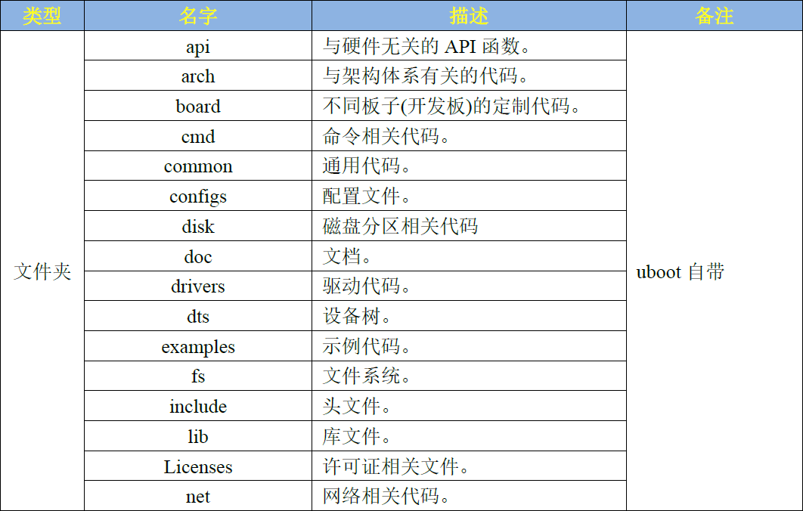
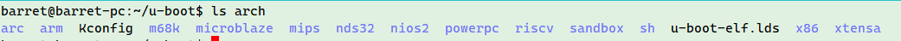
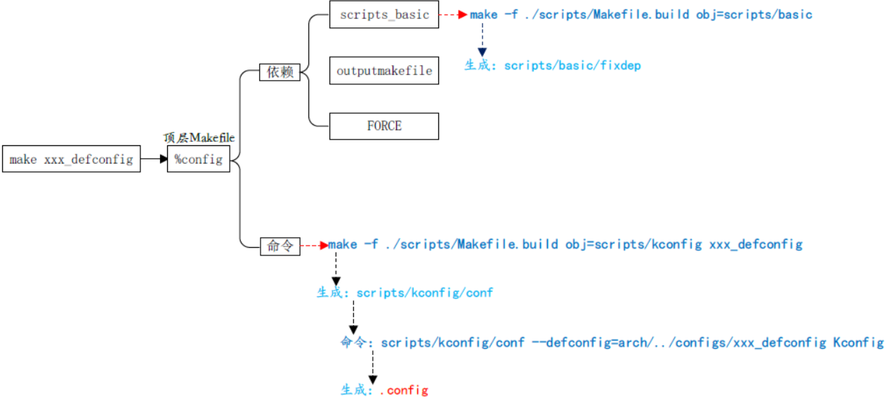
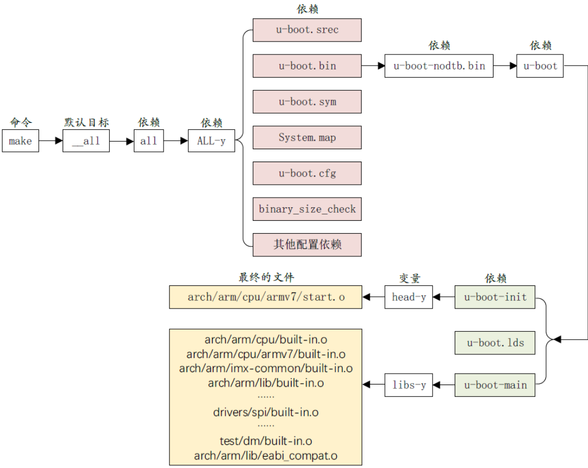

# 源码目录分析

## 文件夹及含义


## arch文件夹
和架构有关

## configs文件夹
此文件夹为 uboot配置文件， uboot是可配置的，但是你要是自己从头开始一个一个项目的配置，那就太麻烦了，因此**一般半导体或者开发板厂商都会制作好一个配置文件**，我们可以在这个做好的配置文件基础上来添加自己想要的功能。这些半导体厂商或者开发板厂商制作好的配置文件统一 命名为**“xxx_defconfig xxx”**表示开发板名字，这些 defconfig文件都存放在 configs文件夹：
编译时，使用`make xxx_defconfig`命令即可配置 uboot。

## .config文件
使用`make xxx_defconfig`命令之后会自动生成，内容如下（文件很大，截取一部分）：
```
#
# Automatically generated file; DO NOT EDIT.
# U-Boot 2021.04 Configuration
#

#
# Compiler: arm-linux-gnueabi-gcc (Ubuntu 9.3.0-17ubuntu1~20.04) 9.3.0
#
CONFIG_CREATE_ARCH_SYMLINK=y
CONFIG_LINKER_LIST_ALIGN=4
# CONFIG_ARC is not set
CONFIG_ARM=y
# CONFIG_M68K is not set
# CONFIG_MICROBLAZE is not set
# CONFIG_MIPS is not set
# CONFIG_NDS32 is not set
# CONFIG_NIOS2 is not set
# CONFIG_PPC is not set
# CONFIG_RISCV is not set
# CONFIG_SANDBOX is not set
# CONFIG_SH is not set
# CONFIG_X86 is not set
# CONFIG_XTENSA is not set
CONFIG_SYS_ARCH="arm"
CONFIG_SYS_CPU="armv7"
CONFIG_SYS_VENDOR="armltd"
CONFIG_SYS_BOARD="vexpress"
CONFIG_SYS_CONFIG_NAME="vexpress_ca9x4"
...
#
# Boot commands
#
# CONFIG_CMD_BOOTD is not set
CONFIG_CMD_BOOTM=y
CONFIG_CMD_BOOTZ=y
CONFIG_BOOTM_LINUX=y
CONFIG_BOOTM_NETBSD=y
# CONFIG_BOOTM_OPENRTOS is not set
# CONFIG_BOOTM_OSE is not set
CONFIG_BOOTM_PLAN9=y
CONFIG_BOOTM_RTEMS=y
CONFIG_BOOTM_VXWORKS=y
CONFIG_CMD_BOOTEFI=y
CONFIG_CMD_BOOTEFI_HELLO_COMPILE=y
```
可以看出 .config文件中都是以“ CONFIG_”开始的配置项，这些配置项对应Makefile中的变量，为 y的变量一般用于控制某项功能使能。举例：CONFIG_CMD_BOOTM在.config中设置为y，根据cmd/makefile中的设置：
```makefile
obj-y += boot.o
obj-$(CONFIG_CMD_BOOTM) += bootm.o
```
会生成`obj-y +=bootm.o`，然后obj-y会被加入到链接过程中。否则，生成其他name的.o文件，不会被链接到。

## u-boot.xxx文件

- u-boot：编译出来的 ELF格式的 uboot镜像文件。
- u-boot.bin：编译出来的二进制格式的 uboot可执行镜像文件。
- u-boot.cfg： uboot的另外一种配置文件。
- u-boot.imx： u-boot.bin添加头部信息以后的文件， NXP的 CPU专用文件。
- u-boot.lds：链接脚本。
- u-boot.map： uboot映射文件，通过查看此文件可以知道某个函数被链接到了哪个地址上。
- u-boot.srec： S-Record格式的镜像文件。
- u-boot.sym： uboot符号文件。
- u-boot-nodtb.bin：和 u-boot.bin一样， u-boot.bin就是 u-boot-nodtb.bin的复制文件。
- **.u-boot.xxx.cmd**：命令文件，用于生成上面的文件

# Makefile分析

## 编译信息的打印控制
uboot中有三种打印编译过程信息的方式，分别是：

1. 不打印任何信息：`make -s`
1. 打印简化信息：默认配置
1. 打印全部信息：`make V=1`


在makefile中可以看到这部分makefile逻辑
```makefile
# Use 'make V=1' to see the full commands

# 获取变量V的获取处，检查是不是命令行
ifeq ("$(origin V)", "command line")
  KBUILD_VERBOSE = $(V) #是命令行则获取值
endif
ifndef KBUILD_VERBOSE
  KBUILD_VERBOSE = 0
endif

ifeq ($(KBUILD_VERBOSE),1)
# quiet和Q为空，表示打印全部编译信息
  quiet =
  Q =
else
# quiet_表示显示简化版本的编译信息
  quiet=quiet_
# @表示不输出命令内容
  Q = @
endif

# If the user is running make -s (silent mode), suppress echoing of
# commands

ifneq ($(filter 4.%,$(MAKE_VERSION)),)	# make-4
# 下面俩函数，表示从MAKEFLAGS中获取第一个单词，并用正则检查是否是-s
ifneq ($(filter %s ,$(firstword x$(MAKEFLAGS))),)
# silent_表示什么都不输出
  quiet=silent_
endif
else					# make-3.8x
ifneq ($(filter s% -s%,$(MAKEFLAGS)),)
  quiet=silent_
endif
endif
```

## 生成文件的保存目录
uboot可以用如下方式设置编译生成文件的保存目录，分别是

- 设置makefile全局变量：`export KBUILD_OUTPUT=output/files/; make`
- 设置O参数：`make O=output/files`

相关makefile逻辑如下：
```makefile
ifeq ($(KBUILD_SRC),)
ifeq ("$(origin O)", "command line")
  KBUILD_OUTPUT := $(O) #从命令行获取目录路径，保存到变量
endif

# That's our default target when none is given on the command line
PHONY := _all
_all:

# Cancel implicit rules on top Makefile
$(CURDIR)/Makefile Makefile: ;

ifneq ($(KBUILD_OUTPUT),)
saved-output := $(KBUILD_OUTPUT)
# 使用shell命令生成目录
KBUILD_OUTPUT := $(shell mkdir -p $(KBUILD_OUTPUT) && cd $(KBUILD_OUTPUT) \
								&& /bin/pwd)
$(if $(KBUILD_OUTPUT),, \
     $(error failed to create output directory "$(saved-output)"))

PHONY += $(MAKECMDGOALS) sub-make

$(filter-out _all sub-make $(CURDIR)/Makefile, $(MAKECMDGOALS)) _all: sub-make
	@:

# 使用make的-C选项，设置当前工作目录为设置的路径
sub-make: FORCE
	$(Q)$(MAKE) -C $(KBUILD_OUTPUT) KBUILD_SRC=$(CURDIR) \
	-f $(CURDIR)/Makefile $(filter-out _all sub-make,$(MAKECMDGOALS))

# Leave processing to above invocation of make
skip-makefile := 1
endif # ifneq ($(KBUILD_OUTPUT),)
endif # ifeq ($(KBUILD_SRC),)
```

## 获取本机OS和架构信息
通过调用shell命令uname，获取相关信息：
```makefile
HOSTARCH := $(shell uname -m | \
	sed -e s/i.86/x86/ \
	    -e s/sun4u/sparc64/ \
	    -e s/arm.*/arm/ \
	    -e s/sa110/arm/ \
	    -e s/ppc64/powerpc/ \
	    -e s/ppc/powerpc/ \
	    -e s/macppc/powerpc/\
	    -e s/sh.*/sh/)

HOSTOS := $(shell uname -s | tr '[:upper:]' '[:lower:]' | \
	    sed -e 's/\(cygwin\).*/cygwin/')

export	HOSTARCH HOSTOS
```

## 设置目标架构和配置文件
从命令行获取，直接赋值给变量：
```makefile
ifeq ($(HOSTARCH),$(ARCH))
CROSS_COMPILE ?=
endif

KCONFIG_CONFIG	?= .config
export KCONFIG_CONFIG
```
makefile后面通过CROSS_COMPILE变量值再指定具体的工具：
```makefile
AS		= $(CROSS_COMPILE)as
# Always use GNU ld
ifneq ($(shell $(CROSS_COMPILE)ld.bfd -v 2> /dev/null),)
LD		= $(CROSS_COMPILE)ld.bfd
else
LD		= $(CROSS_COMPILE)ld
endif
CC		= $(CROSS_COMPILE)gcc
CPP		= $(CC) -E
AR		= $(CROSS_COMPILE)ar
NM		= $(CROSS_COMPILE)nm
LDR		= $(CROSS_COMPILE)ldr
STRIP		= $(CROSS_COMPILE)strip
OBJCOPY		= $(CROSS_COMPILE)objcopy
OBJDUMP		= $(CROSS_COMPILE)objdump
LEX		= flex
YACC		= bison
AWK		= awk
PERL		= perl
PYTHON		?= python
PYTHON2		= python2
PYTHON3		?= python3
```

## make xx_defconfig的流程


## make流程
从makefile看，如果没有指定目录，默认编译全部目标：
```makefile
PHONY += all
ifeq ($(KBUILD_EXTMOD),)
_all: all
else
_all: modules
endif
```
而all的定义为：
```makefile
PHONY += inputs
inputs: $(INPUTS-y)

#all依赖inputs中指定为y的目标
all: .binman_stamp inputs

INPUTS-y += u-boot.srec u-boot.bin u-boot.sym System.map binary_size_check
```
上面是默认一定会编译的目标，其他的需要在.config中配置为y，才会添加到all中：
```makefile
INPUTS-$(CONFIG_ONENAND_U_BOOT) += u-boot-onenand.bin
...
```
完整的编译过程如下：
