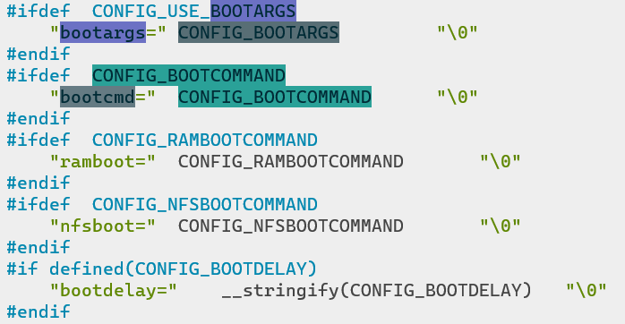

uboot移植的一般流程：

1. 在 uboot中找到参考的开发平台，一般是原厂的开发板。
1. 参考原厂开发板移植修改uboot到我们所使用的开发板上。

那么如何**添加一个新的板卡配置并进行自定义的配置**呢？下面将开始这些步骤。

# 添加新板卡编译配置

## 1 添加defconfig配置文件
在configs目录下，基于某个现有的配置文件，复制并修改需要的内容：

```bash
barret@barret-pc:~/u-boot/configs$ cp vexpress_ca9x4_defconfig vexpress_barret_defconfig
barret@barret-pc:~/u-boot/configs$ vi vexpress_barret_defconfig
barret@barret-pc:~/u-boot/configs$ head vexpress_barret_defconfig
CONFIG_ARM=y
CONFIG_TARGET_VEXPRESS_barret=y   #这个一定要改,不能与现有的重名
CONFIG_SYS_TEXT_BASE=0x60800000
CONFIG_NR_DRAM_BANKS=2
CONFIG_ENV_SIZE=0x40000
CONFIG_ENV_SECT_SIZE=0x40000
CONFIG_DISTRO_DEFAULTS=y
CONFIG_BOOTCOMMAND="run distro_bootcmd; run bootflash"
CONFIG_DEFAULT_FDT_FILE="vexpress-v2p-ca9.dtb"
# CONFIG_DISPLAY_CPUINFO is not set
```

## 2 添加板卡头文件
在目录include/configs添加新板卡对应的头文件，可以根据当前已有头文件复制并修改：
```bash
barret@barret-pc:~/u-boot/include/configs$ cp vexpress_common.h vexpress_barret.h
barret@barret-pc:~/u-boot/include/configs$ vi vexpress_barret.h
```
头文件里面有很多宏定义，这些宏定义（**以CONFIG_为前缀**）用于配置和裁剪 uboot，让我们可以使能或者禁止 uboot的某些功能。

## 3 添加板级目录
Uboot中每个板子都有一个对应的目录来存放板级文件，比如开发板上外设驱动文件等，路径为`board/freescale`。
```bash
# 复制目录
barret@barret-PC:~/u-boot/board/freescale$ cp -r ~/u-boot/board/armltd/vexpress vexpress_barret
barret@barret-PC:~/u-boot/board/freescale$ cd vexpress_barret/
barret@barret-PC:~/u-boot/board/freescale/vexpress_barret$ mv vexpress_common.c vexpress_barret.c

# 修改makefile
barret@barret-PC:~/u-boot/board/freescale/vexpress_barret$ vi Makefile
barret@barret-PC:~/u-boot/board/freescale/vexpress_barret$ cat Makefile
# SPDX-License-Identifier: GPL-2.0+
#
# (C) Copyright 2000-2004
# Wolfgang Denk, DENX Software Engineering, wd@denx.de.
obj-y   := vexpress_barret.o

# 修改imximage.cfg，将pulgin目录修改正确
/*PLUGIN    plugin-binary-file    IRAM_FREE_START_ADDR*/
PLUGIN  board/freescale/vexpress_barret/plugin.bin 0x00907000

# 修改本目录Kconfig
barret@barret-PC:~/u-boot/board/freescale/vexpress_barret$ vi Kconfig
barret@barret-PC:~/u-boot/board/freescale/vexpress_barret$ cat Kconfig
if TARGET_VEXPRESS_BARRET

config SYS_BOARD
        default "vexpress_barret"

config SYS_VENDOR
        default "freescale"

config SYS_CONFIG_NAME
        default "vexpress_barret"

endif

# 修改MAINTAINERS
barret@barret-PC:~/u-boot/board/freescale/vexpress_barret$ vi MAINTAINERS
barret@barret-PC:~/u-boot/board/freescale/vexpress_barret$ cat MAINTAINERS
VERSATILE EXPRESS BOARDS
M:      Barret Ren <barret.ren@outlook.com>
S:      Maintained
F:      board/freescale/vexpress_barret/
F:      include/configs/vexpress_barret.h
F:      configs/vexpress_barret_defconfig
```
经过上面步骤，板级目录就创建好了。

## 4 修改Kconfig
为了可以在图形配置中配置我们新家的板卡，需要修改Kconfig。板级目录底下的Kconfig已经在上一步修改了，接下来需要将该Kconfig包含在总的Kconfig中：在`arch/arm/Kconfig`中添加如下内容：
```
config TARGET_VEXPRESS_BARRET
     bool "Support vexpress_barret"
     select CPU_V7A
     select PL011_SERIAL
 
source "board/freescale/vexpress_barret/Kconfig"
```

## 5 环境变量默认值
环境变量的默认值对应板卡头文件中的宏定义，定义关系在`include/env_default.h`中。比如：

## 6 编译新板卡
和正常编译uboot一样：
```bash
barret@barret-PC:~/u-boot$ make ARCH=arm CROSS_COMPILE=arm-linux-gnueabi- distclean
  CLEAN   scripts/basic
  CLEAN   scripts/kconfig
  CLEAN   include/config include/generated
  CLEAN   .config .config.old include/autoconf.mk include/autoconf.mk.dep include/config.h GPATH GTAGS GRTAGS
barret@barret-PC:~/u-boot$ make ARCH=arm CROSS_COMPILE=arm-linux-gnueabi- vexpress_barret_defconfig
#
# configuration written to .config
#
barret@barret-PC:~/u-boot$ make ARCH=arm CROSS_COMPILE=arm-linux-gnueabi- -j 8
```

