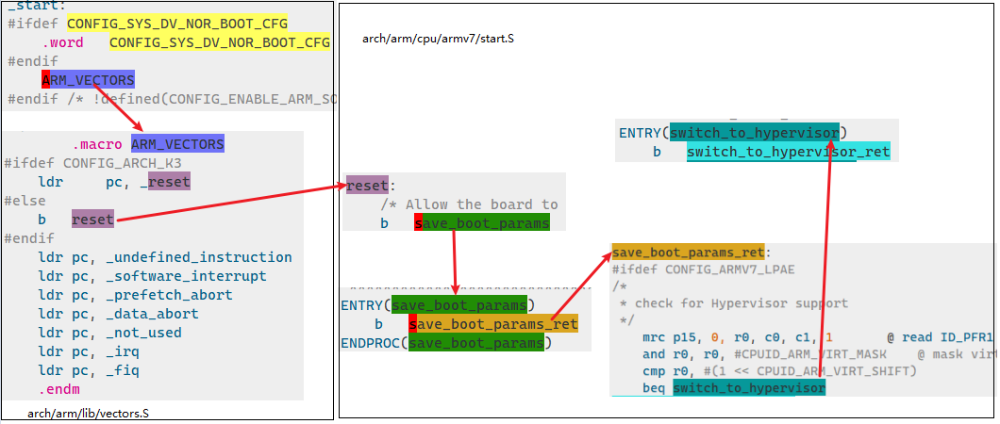
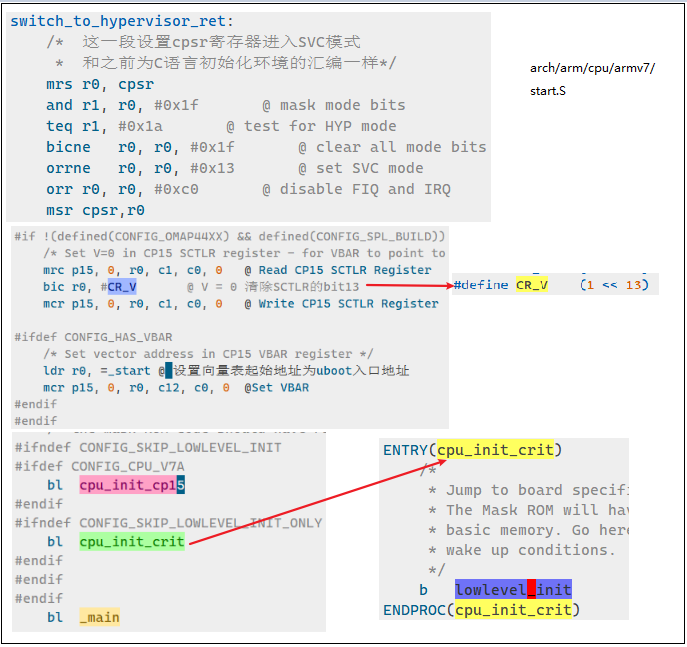
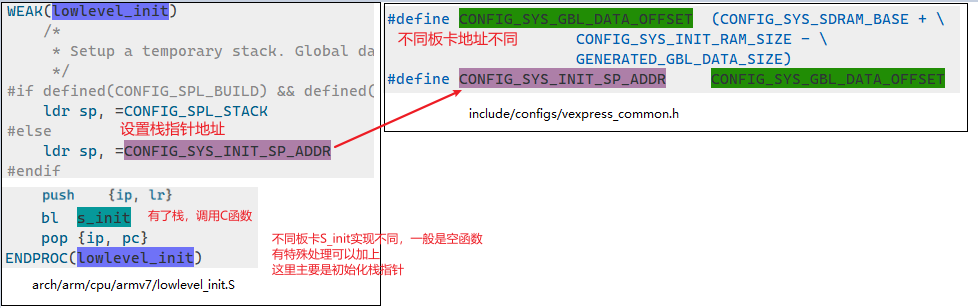
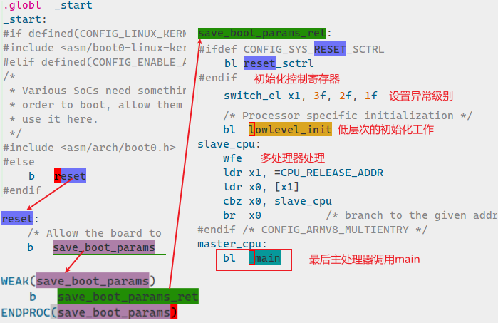
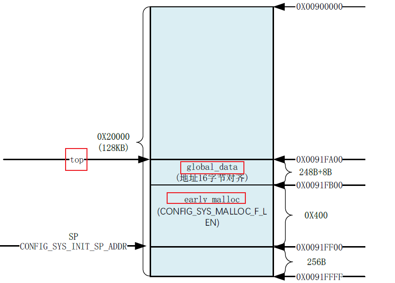
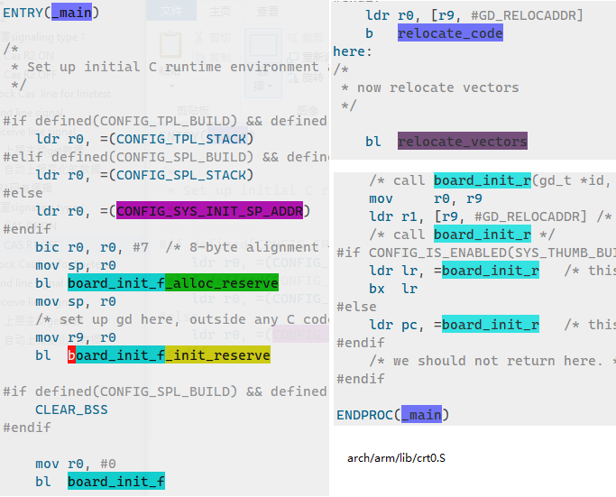
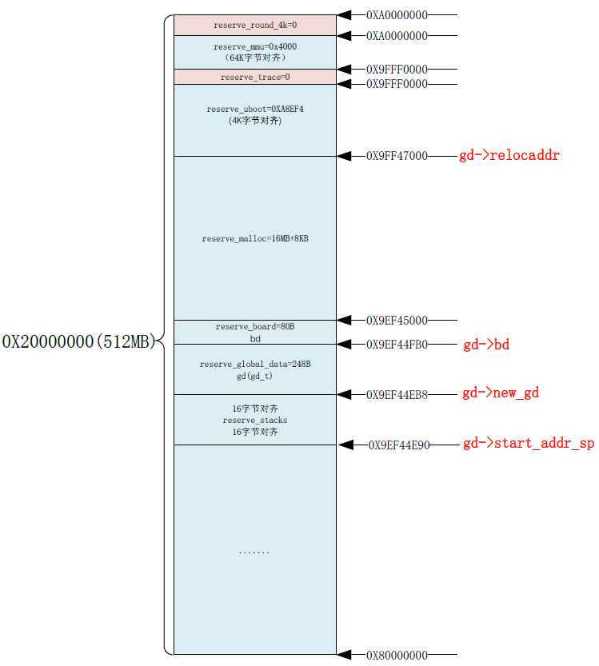
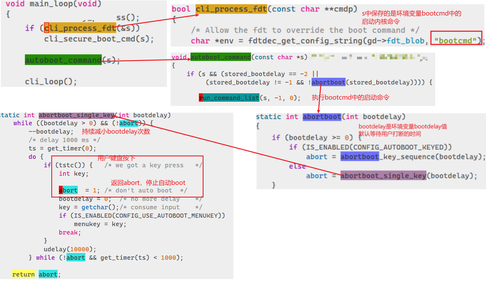
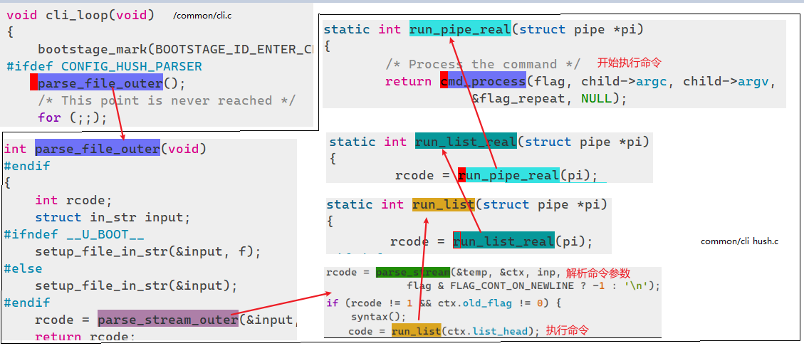
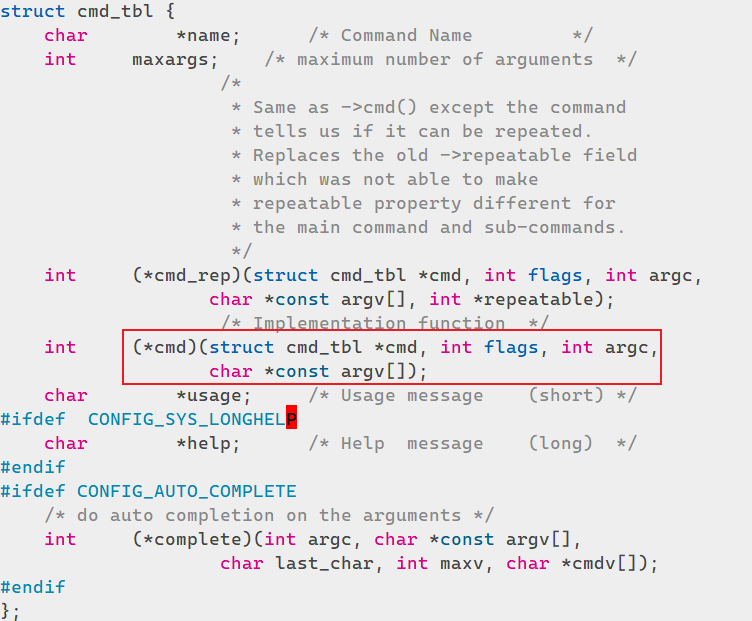

# 启动入口
从链接脚本`u-boot.lds`（每种arch有自己的lds文件）可以看到，u-boot程序的入口是汇编函数`_start`：
```basic
OUTPUT_FORMAT("elf32-littlearm", "elf32-littlearm", "elf32-littlearm")
OUTPUT_ARCH(arm) #这里是arm 32bit
ENTRY(_start) #链接程序会根据这一句指定程序入口
```


# ARM 32bit流程

## _start
`_start`定义在arch/arm/lib/vectors.S文件中，中间跳转过程如下：

## switch_to_hypervisor_ret


## lowlevel_init
该函数主要是调用`s_init`做一些低层次的初始化工作。基本步骤是：**初始化栈指针SP，之后就可以调用C语言函数**了：

# Arm 64bit流程
从`/arch/arm/cpu/armv8/u-boot.lds`可以看到，64bit架构的启动入口也是`_start`，不同实现位置不同：

## _start
函数定义在`arch/arm/cpu/armv8/start.S`，其中`lowlevel_init`和上面的操作基本一样（可以根据不同CPU进行修改）。最后调用`_main`，和arm32流程汇合了。

# _main
进入main函数，32/64 bit不同架构的路程就基本统一了：`arch/arm/lib/crt0.S`，`arch/arm/lib/crt0_64.S`。和`lowlevel_init`类似，先初始化SP指针，然后调用如下C语言函数：

- **board_init_f_alloc_reserve**：主要是留出早期的 malloc内存区域和 global data内存区域，返回新的top值。示例如下：



- **board_init_f_init_reserve**：初始化global data内存
- **board_init_f**：初始化 DDR，定时器等外设，完成代码拷贝等
- **relocate_code**：代码重定位，也就是代码重定位函数，此函数负责将 uboot拷贝到新的地方
- **relocate_vectors**：对中断向量表做重定位
- **board_init_r**：board_init_f并没有初始化所有的外设，还需要做一些后续工作



## **board_init_f**
uboot会将自己重定位到 DRAM最后面的地址区域，也就是**将自己拷贝到 DRAM最后面的内存区域**中。这么做的目的是给 Linux腾出空间，防止 Linux kernel覆盖掉 uboot，将 DRAM前面的区域完整的空出来。在拷贝之前肯定要给 uboot各部分分配好内存位置和大小，为重定向做好准备。
board_init_f函数主要有两个工作：

1. 初始化一系列外设，比如串口、定时器，或者打印一些消息等。
1. 初始化 gd的各个成员变量


代码具体逻辑是，`board_init_f`内依次运行数组里的一系列静态函数，完成初始化工作：
```c
// u-boot/common/board_f.c
void board_init_f(ulong boot_flags)
{
	gd->flags = boot_flags;
	gd->have_console = 0;

	if (initcall_run_list(init_sequence_f)) //一系列的函数组成的数组
		hang();
//...
}
```
`init_sequence_f`里的函数不在这里列举了，各有功能，其中有很多打印函数，可以在uboot启动时输出信息到屏幕上。我们会遇到很多跟数值有关的设置，如果直接看代码分析的话就太费时间 了，可以修改 uboot代码，直接将这些值在函数内打印出来。
最终，函数执行完后，内存分布变为如下所示：

## **relocate_code**
复制代码段到新的地址：
```basic
/u-boot/arch/arm/lib/relocate.S
ENTRY(relocate_code)
//=========================复制代码段=======================
		ldr r1, =__image_copy_start /* 拷贝目标首地址 */
    subs    r4, r0, r1      /* r4 <- relocation offset */
    beq relocate_done       /* skip relocation */
ldr r2, =__image_copy_end   /* 拷贝目标结束地址 */

copy_loop:
		ldmia   r1!, {r10-r11}      /* 从源地址读取数据*/
		stmia   r0!, {r10-r11}      /* 复制到目标地址*/
		cmp r1, r2          /* 比较当前地址与结束地址是否相同，是否退出循环*/
    blo copy_loop
```
uboot在链接时会通过**位置无关码**（**ld -pie**)，使用`-pie`选项后会生成**.rel.dyn**段，用于解决地址重定位问题。因此，在uboot代码段被复制之后，相应的.rel.dyn段也要进行重定向：
```basic
//======================重定位链接地址=======================
ldr r2, =__rel_dyn_start    /* .rel.dyn段起始地址*/
ldr r3, =__rel_dyn_end  /* .rel.dyn段结束地址*/
fixloop:
		ldmia   r2!, {r0-r1}        /* 复制数据到r0-r1寄存器 */
		and r1, r1, #0xff /* 计算数据的高8bit */
		cmp r1, #R_ARM_RELATIVE /*判断是否是label */
		bne fixnext /* 不是跳转到下一函数 */

    add r0, r0, r4
    ldr r1, [r0]
    add r1, r1, r4
		str r1, [r0]   /* 将重定位后的地址写入重定位后的label */
fixnext:
		cmp r2, r3 /* 判断是否需要结束函数 */
    blo fixloop
```

## **relocate_vectors**
重定位向量表，主要是两句代码：
```basic
ldr r0, [r9, #GD_RELOCADDR] /* 复制重定位地址到r0寄存器 */
/* 将r0的值写入到 CP15的 VBAR寄存器中，也就是将新的向量表首地址写入到寄存器VBAR中，设置向量表偏移。*/
mcr     p15, 0, r0, c12, c0, 0
```

## **board_init_r**
**该函数和**`**board_init_f**`一样，也是执行一系列的静态函数。函数都定义在`init_sequence_r`中，主要是一些软件层面的后期初始化函数：
```c
//u-boot/common/board_r.c
#ifdef CONFIG_NEEDS_MANUAL_RELOC
    for (i = 0; i < ARRAY_SIZE(init_sequence_r); i++)
        init_sequence_r[i] += gd->reloc_off;
#endif

    if (initcall_run_list(init_sequence_r))
        hang();
```
在初始化函数执行完后，**最后会执行**`**run_main_loop**`**函数（实际调用main_loop函数），用于等待用户主动进入命令模式，或自动引导LInux内核**。其中调用的主要函数有：

- `bootstage_mark_name`：打印启动进度
- `cli_init`：初始化shell相关变量
- `run_preboot_environment_command`：获取preboot环境变量内容
- `autoboot_command`：检查等待倒计时是否结束，并**决定是否自动启动linux内核**
- `cli_loop`：命令模式下输入命令的处理

# 是否自动启动内核
main_loop中会根据uboot**环境变量bootcmd**中的命令启动linux内核。在此之前会根据**环境变量bootdelay**的值循环等待用户中断autoboot。如果在定义时间内没有按键输入，则根据命令启动linux内核：



# 命令模式
 主要分为两步：解析命令行形成结构体，执行命令。调用流程如下：

## cmd_process
uboot使用宏 `U_BOOT_CMD`来定义命令，宏 U_BOOT_CMD定义在文件`include/command.h`。最终的目的就是为了定义一个**cmd_tbl_t类型的变量**，并初始化这个变量的各个成员。 uboot中的每个命令都存储在** .u_boot_list段**中，每个命令都有一个**名为 do_xxx的函数**就是具体的命令处理函数。​

处理函数**do_xxx**对应中`**struct cmd_tbl**`的cmd函数指针:

在`cmd_process`中，主要任务事根据用户输入的命令name找到对应的结构体对象，然后调用其`cmd`函数：
```c
//common/command.c
enum command_ret_t cmd_process(int flag, int argc, char *const argv[],
			       int *repeatable, ulong *ticks)
{
	struct cmd_tbl *cmdtp;
    //...
    cmdtp = find_cmd(argv[0]); //在预定义的命令表中根据name找到命令
    //...
    if (!rc) {
     	rc = cmd_call(cmdtp, flag, argc, argv, &newrep); //执行该命令   
    }
    if (rc == CMD_RET_USAGE)
		rc = cmd_usage(cmdtp); //检查返回值，输出该命令的用法描述
	}
}

static int cmd_call(struct cmd_tbl *cmdtp, int flag, int argc,
		    char *const argv[], int *repeatable)
{
    //调用结构体中的处理函数
    result = cmdtp->cmd_rep(cmdtp, flag, argc, argv, repeatable);
}
```
