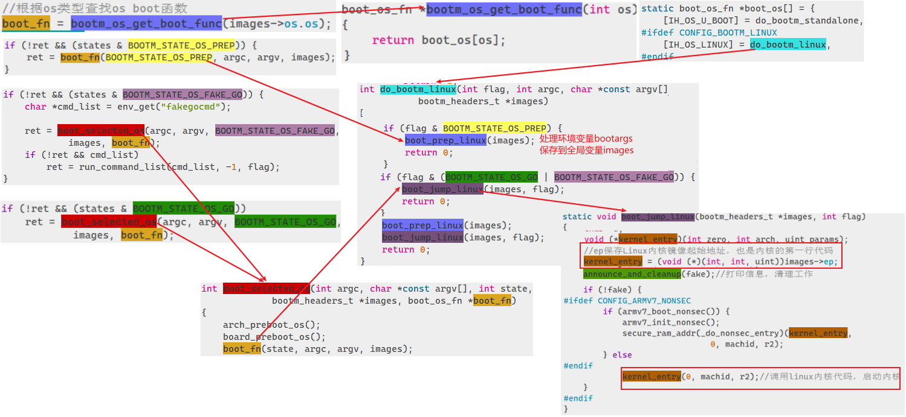
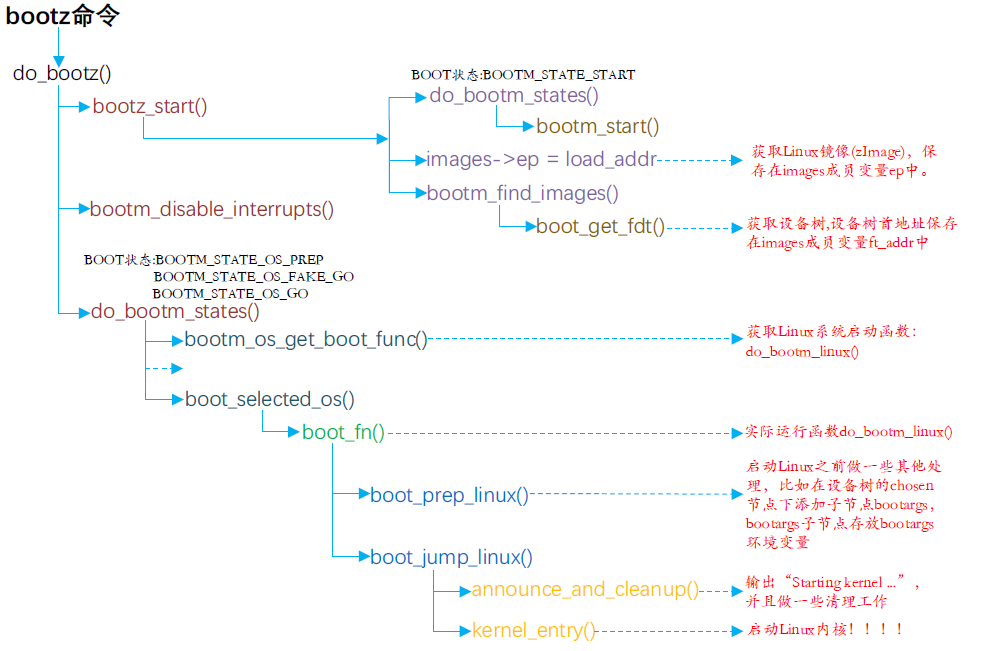

# 全局变量images
上一节讲到，autoboot_command中会默认执行环境变量**bootcmd**中的启动命令，而基本的boot、bootm、bootz命令都会用一个全局变量**images**来保存系统镜像的信息。全局变量images是一个结构体（common/bootm.c），结构主体内容如下：
```c
//common/bootm.c
bootm_headers_t images;     /* 指向系统镜像结构体的全局变量 */

//include/image.h
typedef struct bootm_headers {
    //...
#ifndef USE_HOSTCC
	image_info_t	os;		/* OS镜像信息*/
	ulong		ep;		/* OS入口点*/

	ulong		rd_start, rd_end;/* ramdisk开始和结束位置*/

	char		*ft_addr;	/* 设备树地址 */
	ulong		ft_len;		/* 设备树长度 */

	ulong		initrd_start; //initrd开始地址
	ulong		initrd_end;   //initrd结束地址
	ulong		cmdline_start;//cmdline开始位置
	ulong		cmdline_end;  //cndline结束位置
	struct bd_info		*kbd;
#endif
    //...
#define	BOOTM_STATE_START	(0x00000001)
#define	BOOTM_STATE_FINDOS	(0x00000002)
#define	BOOTM_STATE_FINDOTHER	(0x00000004)
#define	BOOTM_STATE_LOADOS	(0x00000008)
#define	BOOTM_STATE_RAMDISK	(0x00000010)
#define	BOOTM_STATE_FDT		(0x00000020)
#define	BOOTM_STATE_OS_CMDLINE	(0x00000040)
#define	BOOTM_STATE_OS_BD_T	(0x00000080)
#define	BOOTM_STATE_OS_PREP	(0x00000100)
#define	BOOTM_STATE_OS_FAKE_GO	(0x00000200)	/* 'Almost' run the OS */
#define	BOOTM_STATE_OS_GO	(0x00000400)
	int		state;   //boot启动的不同阶段状态，具体状态为上面的宏定义
    //...
}} bootm_headers_t;

typedef struct image_info {
	ulong		start, end;		/* blob开始和结束位置 */
	ulong		image_start, image_len; /* 镜像起始地址(包括blob)和长度 */
	ulong		load;			/* 系统镜像加载地址 */
	uint8_t		comp, type, os;		/* 镜像压缩、类型，OS类型 */
	uint8_t		arch;			/* CPU架构 */
} image_info_t;
```

# bootz命令引导过程
我们以bootz命令引导linux内核的过程为例，看看uboot如何引导加载linux系统。其他boot命令流程大体相同。

## do_bootz
bootz命令对应的处理函数为`do_bootz`，位于`cmd/bootz.c`文件中：主要有两个函数：

- **bootz_start**：初始化全局变量**images**的成员变量，用于后面使用
- **do_bootm_states**：根据不同的BOOT状态执行不同的代码段，通过如下代码来判断BOOT状态：`states & BOOTM_STATE_XXX`
```c
//cmd/bootz.c
int do_bootz(struct cmd_tbl *cmdtp, int flag, int argc, char *const argv[])
{
	//...
	if (bootz_start(cmdtp, flag, argc, argv, &images))
		return 1;

	bootm_disable_interrupts(); //关闭中断

	images.os.os = IH_OS_LINUX; //设置系统类型，用于选择具体启动函数
    
    //执行多个boot阶段,用宏指定
	ret = do_bootm_states(cmdtp, flag, argc, argv,
#ifdef CONFIG_SYS_BOOT_RAMDISK_HIGH
			      BOOTM_STATE_RAMDISK |
#endif
			      BOOTM_STATE_OS_PREP | BOOTM_STATE_OS_FAKE_GO |
			      BOOTM_STATE_OS_GO,
			      &images, 1); //全局变量images

	return ret;
}
```

## bootz_start
该函数主要功能是查找系统镜像文件和设备树相关信息，填充到image全局变量中：
```c
//cmd/bootz.c
static int bootz_start(struct cmd_tbl *cmdtp, int flag, int argc,
		       char *const argv[], bootm_headers_t *images)
{
   //...
	ret = do_bootm_states(cmdtp, flag, argc, argv, BOOTM_STATE_START,
		images, 1); //执行BOOTM_STATE_START阶段，调用bootm_start清空image
    //...
	if (!argc) {
		images->ep = image_load_addr; //设置系统镜像存储位置
	} else {
		images->ep = simple_strtoul(argv[0], NULL, 16);
	}
    //判断当前images是否是linux镜像,是则返回起始和结束地址
	ret = bootz_setup(images->ep, &zi_start, &zi_end);
    //...
    //查找ramdisk和设备树文件,并保存地址
	if (bootm_find_images(flag, argc, argv, images->ep, zi_end - zi_start))
		return 1;
    
    return 0;
}
```

## **do_bootm_states**
函数 do_bootm_states根据不同的 BOOT状态执行不同的代码段。从`do_bootz`中我们可以知道，需要按照如下三个标识开始boot内核。`**BOOTM_STATE_OS_PREP | BOOTM_STATE_OS_FAKE_GO | BOOTM_STATE_OS_GO**`所以我们带着这三个标识看看`do_bootm_state`的执行流程：

# 总结流程图

