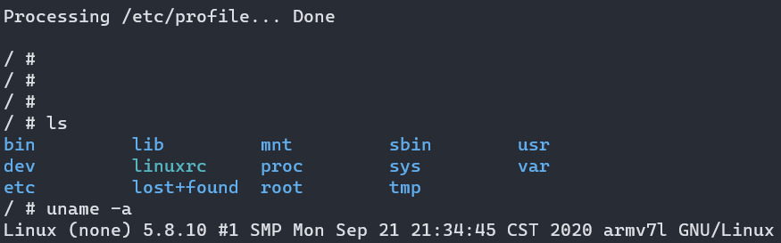

# 1 QEMU 介绍
Qemu 是纯软件实现的虚拟化模拟器，几乎可以模拟任何硬件设备，我们最熟悉的就是能够模拟一台能够独立运行操作系统的虚拟机，虚拟机认为自己和硬件打交道，但其实是和 Qemu 模拟出来的硬件打交道，Qemu 将这些指令转译给真正的硬件。正因为 Qemu 是纯软件实现的，所有的指令都要经 Qemu 过一手，性能非常低，所以，在生产环境中，大多数的做法都是配合 KVM 来完成虚拟化工作，因为 KVM 是硬件辅助的虚拟化技术，主要负责 比较繁琐的 CPU 和内存虚拟化，而 Qemu 则负责 I/O 虚拟化，两者合作各自发挥自身的优势，相得益彰。QEMU 同时也是一个非常简单的虚拟机，给它一个硬盘镜像就可以启动一个虚拟机，如果想定制这个虚拟机的配置，比如用什么样的 CPU 啊、什么样的显卡啊、什么样的网络配置啊，指定相应的命令行参数就可以了。它支持许多格式的磁盘镜像，包括 VirtualBox 创建的磁盘镜像文件。它同时也提供一个创建和管理磁盘镜像的工具 qemu-img。QEMU 及其工具所使用的命令行参数，直接查看其文档即可。

## 1.1 安装qemu
apt安装的QEMU版本比较老，建议下载源码自己安装。
```shell
#安装ninja构建工具
sudo apt install re2c
git clone https://gitee.com/mirrors/ninja.git
./configure.py --bootstrap
sudo cp ninja /usr/bin/
ninja --version  # 查看安装版本

#安装编译相关的环境
sudo apt-get install build-essential pkg-config zlib1g-dev libglib2.0-0 libglib2.0-dev libsdl1.2-dev libpixman-1-dev libfdt-dev autoconf automake libtool librbd-dev libaio-dev flex bison -y

#下载源代码编译
git clone https://gitee.com/mirrors/qemu.git
cd qemu
./configure --prefix=/usr/local/qemu --target-list=arm-softmmu --audio-drv-list=
sudo make && sudo make install
sudo ln -s /usr/local/qemu/bin/* /usr/local/bin/
#--target-list：选择目标机器的架构。默认是将所有的架构都编译，但为了更快的完成编译，指定需要的架构即可。

#查看qemu版本信息
qemu-img -V
# 查看qemu支持模拟的开发板
qemu-system-arm -M help
```

## 1.2 qemu运行命令
```shell
#指定模拟参数，运行
qemu-system-arm -M vexpress-a9 \
-m 512M \
-kernel arch/arm/boot/zImage \
-dtb arch/arm/boot/dts/vexpress-v2p-ca9.dtb \
-nographic \
-append "console=ttyAMA0"
```
输入Ctrl + A + X，退出QEMU运行。命令中各项参数的含义：

- -M：模拟vexpress-a9单板，你能够使用-M ?參数来获取该qemu版本号支持的全部单板
- -m 512M： 单板执行物理内存512M
- -kernel：告诉qemu单板执行**内核镜像**路径
- -dtb：告诉qemu单板的**设备树**（必须加入）
- -nographic：不使用图形化界面，仅仅使用串口
- -append "console=ttyAMA0"：内核启动參数。这里告诉内核vexpress单板执行。串口设备是哪个tty

# 2 安装arm交叉编辑工具
> 在apt源里这两个交叉编译器的定义如下:gcc-arm-linux-**gnueabi **– The GNU C compiler for armel architecturegcc-arm-linux-**gnueabihf **– The GNU C compiler for armhf architecture这两个交叉编译器适用于armel和armhf两个不同的架构, armel和armhf这两种架构在对待浮点运算采取了不同的策略(有fpu的arm才能支持这两种浮点运算策略)
> **其实这两个交叉编译器只不过是gcc的选项-mfloat-abi的默认值不同**。gcc的选项-mfloat-abi有三种值(其中后两者都要求arm里有fpu浮点运算单元,soft与后两者是兼容的，但softfp和hard两种模式互不兼容)：**soft**: 不用fpu进行浮点计算，即使有fpu浮点运算单元也不用,而是使用软件模式。**softfp** : armel架构(对应的编译器为gcc-arm-linux-gnueabi)采用的默认值，用fpu计算，但是传参数用普通寄存器传，这样中断的时候，只需要保存普通寄存器，中断负荷小，但是参数需要转换成浮点的再计算。

> **hard**: armhf架构(对应的编译器gcc-arm-linux-gnueabihf)采用的默认值，用fpu计算，传参数也用fpu中的浮点寄存器传，省去了转换, 性能最好，但是中断负荷高。


```shell
sudo apt update
sudo apt install gcc-arm-linux-gnueabi
```

安装完后可用以下命令查看是否安装成功
```shell
barret@barret-PC:~$ arm-linux-gnueabi-gcc -v
Using built-in specs.
COLLECT_GCC=arm-linux-gnueabi-gcc
COLLECT_LTO_WRAPPER=/usr/lib/gcc-cross/arm-linux-gnueabi/9/lto-wrapper
Target: arm-linux-gnueabi
Configured with: ../src/configure -v --with-pkgversion='Ubuntu 9.3.0-17ubuntu1~20.04' --with-bugurl=file:///usr/share/doc/gcc-9/README.Bugs --enable-languages=c,ada,c++,go,d,fortran,objc,obj-c++,gm2 --prefix=/usr --with-gcc-major-version-only --program-suffix=-9 --enable-shared --enable-linker-build-id --libexecdir=/usr/lib --without-included-gettext --enable-threads=posix --libdir=/usr/lib --enable-nls --with-sysroot=/ --enable-clocale=gnu --enable-libstdcxx-debug --enable-libstdcxx-time=yes --with-default-libstdcxx-abi=new --enable-gnu-unique-object --disable-libitm --disable-libquadmath --disable-libquadmath-support --enable-plugin --with-system-zlib --without-target-system-zlib --enable-libpth-m2 --enable-multiarch --enable-multilib --disable-sjlj-exceptions --with-specs='%{mfloat-abi=hard:-march=armv7-a -mcpu=generic-armv7-a -mfloat-abi=hard}' --with-arch=armv5t --with-float=soft --disable-werror --enable-multilib --enable-checking=release --build=x86_64-linux-gnu --host=x86_64-linux-gnu --target=arm-linux-gnueabi --program-prefix=arm-linux-gnueabi- --includedir=/usr/arm-linux-gnueabi/include
Thread model: posix
gcc version 9.3.0 (Ubuntu 9.3.0-17ubuntu1~20.04)
```


# 3 编译uboot并模拟
```shell
git clone https://gitee.com/mirrors/u-boot.git

cd u-boot
export ARCH=arm 
export CROSS_COMPILE=arm-linux-gnueabi-       #会用arm-linux-gnueabi-gcc编译
make clean && make vexpress_ca9x4_defconfig
make -j 4

#生成的uboot为可执行裸机文件，uboot.bin是二进制文件，加上头信息就可以在实际板卡上运行
#模拟u-boot运行
qemu-system-arm -M vexpress-a9 -m 256 -kernel u-boot -nographic
```
u-boot执行的结果如下：
```shell
U-Boot 2021.04 (Jun 02 2021 - 22:43:26 +0800)

DRAM:  256 MiB
WARNING: Caches not enabled
Flash: 128 MiB
MMC:   MMC: 0
*** Warning - bad CRC, using default environment

In:    serial
Out:   serial
Err:   serial
Net:   smc911x-0
Hit any key to stop autoboot:  0
=>
```

# 4 编译Linux kernel并模拟
查看与当前Linux系统匹配的内核版本，并下载：
```shell
$ sudo apt-cache search linux-source
linux-source - Linux kernel source with Ubuntu patches
linux-source-4.15.0 - Linux kernel source for version 4.15.0 with Ubuntu patches
linux-source-4.18.0 - Linux kernel source for version 4.18.0 with Ubuntu patches
linux-source-5.0.0 - Linux kernel source for version 5.0.0 with Ubuntu patches

$ sudo apt install linux-source-5.0.0
```
下载之后在/usr/src可以看到内核代码。**也可以直接去**[**https://www.kernel.org/**](https://www.kernel.org)**下载最新的压缩包**解压到home目录。
使用下面shell命令在linux源码目录编译arm vexpress开发板需要的镜像文件和设备树文件，生成的zImage和dtb文件在~/extra目录里：
```shell
export ARCH=arm
export CROSS_COMPILE=arm-linux-gnueabi-

make clean
make vexpress_defconfig
make menuconfig 
# 在配置中找到并去掉 Enable the L2x0 outer cache controller 取消，会导致仿真失败起不来
#    System Type-> Enable the L2x0 outer cache controller ，或搜索 CACHE_L2X0

make -j 8

# 模拟运行linux kernel
qemu-system-arm -M vexpress-a9 -m 512M -kernel arch/arm/boot/zImage \
-dtb arch/arm/boot/dts/vexpress-v2p-ca9.dtb -nographic -append "console=ttyAMA0"
```
由于我们只编译了linux内核，所以qemu会在文件系统那里停住，因为没有添加文件系统无法加载根目录
```shell
Booting Linux on physical CPU 0x0
Linux version 5.8.10 (barret@Barret-PC) (arm-linux-gnueabi-gcc (Ubuntu 9.3.0-10ubuntu1) 9.3.0, GNU ld (GNU Binutils for Ubuntu) 2.34) #1 SMP Mon Sep 21 21:34:45 CST 2020
CPU: ARMv7 Processor [410fc090] revision 0 (ARMv7), cr=10c5387d
CPU: PIPT / VIPT nonaliasing data cache, VIPT nonaliasing instruction cache
OF: fdt: Machine model: V2P-CA9
...
---[ end Kernel panic - not syncing: VFS: Unable to mount root fs on unknown-block(0,0) ]---
```

# 5. 添加根文件系统

## 5.1 安装busybox
```shell
git clone git://busybox.net/busybox.git && cd busybox
export ARCH=arm
export CROSS_COMPILE=arm-linux-gnueabi-

make defconfig
make menuconfig
#   勾选 Setting-> Build Options-> [*] Build static binary (no shared libs)
# 因为模拟环境下无法使用动态库方式

make -j 4
make install
```

## 5.2 制作文件系统
```shell
# 本脚本用于生成文件系统，需要在busybox目录下执行
#!/bin/sh
base=`pwd`
tmpfs=/_tmpfs

sudo rm -rf rootfs
sudo rm -rf ${tmpfs}
sudo rm -f a9rootfs.ext3
sudo mkdir rootfs
sudo cp _install/*  rootfs/ -raf

#sudo mkdir -p rootfs/{lib,proc,sys,tmp,root,var,mnt}
cd rootfs && sudo mkdir -p lib proc sys tmp root var mnt && cd ${base}

# 根据自己的实际路径, 拷贝 arm-gcc 中的 libc中的所有.so 库
sudo cp -arf /usr/arm-linux-gnueabi/lib/*so*  rootfs/lib

sudo cp app rootfs
sudo cp examples/bootfloppy/etc rootfs/ -arf
sudo sed -r  "/askfirst/ s/.*/::respawn:-\/bin\/sh/" rootfs/etc/inittab -i
sudo mkdir -p rootfs/dev/
sudo mknod rootfs/dev/tty1 c 4 1
sudo mknod rootfs/dev/tty2 c 4 2pro
sudo mknod rootfs/dev/tty3 c 4 3
sudo mknod rootfs/dev/tty4 c 4 4
sudo mknod rootfs/dev/console c 5 1
sudo mknod rootfs/dev/null c 1 3
sudo dd if=/dev/zero of=a9rootfs.ext3 bs=1M count=64
# 如果提示 "No space left on device" 证明 dd 命令中 count 的大小不够

sudo mkfs.ext3 a9rootfs.ext3
sudo mkdir -p ${tmpfs}
sudo chmod 777 ${tmpfs}
sudo mount -t ext3 a9rootfs.ext3 ${tmpfs}/ -o loop
sudo cp -r rootfs/*  ${tmpfs}/
sudo umount ${tmpfs}
```
使用上面的脚本在busybox的源文件目录运行得到文件系统*.ext3，然后在qemu运行时指定
```shell
qemu-system-arm -M vexpress-a9 -m 512M -kernel arch/arm/boot/zImage \
-dtb arch/arm/boot/dts/vexpress-v2p-ca9.dtb -nographic \
-append "root=/dev/mmcblk0 rw console=ttyAMA0" -sd ~/a9rootfs.ext3
```
由于有了文件系统，qemu可以正常的运行了，启动之后可以看到进入了shell环境：
