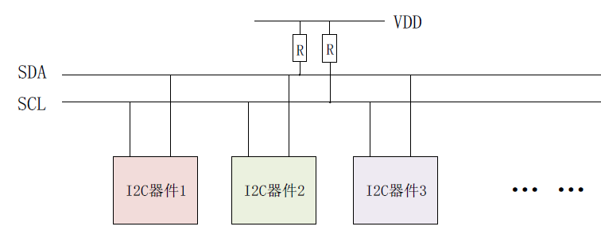
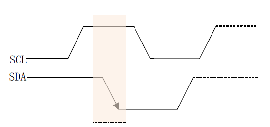
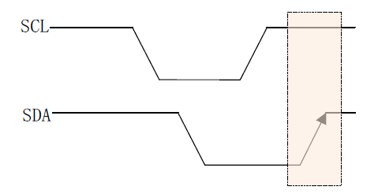
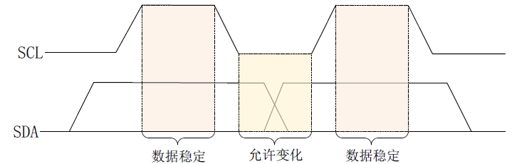
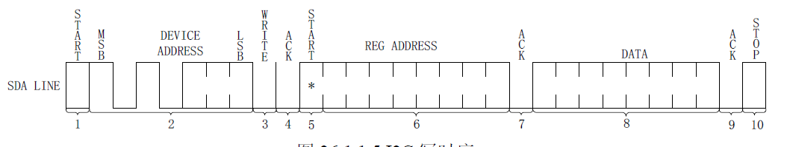
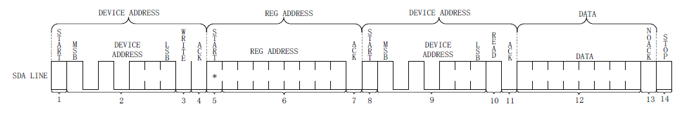

**I2C是最常用的通信接口**，众多的传感器都会提供 I2C接口来和主控相连，比如陀螺仪、加速度计、触摸屏等等。所以 I2C是做嵌入式开发必须掌握的。

# 硬件结构
I2C 是很常见的一种总线协议，I2C 是NXP 公司设计的，I2C 使用两条线在主控制器和从机之间进行数据通信：

- SCL(串行时钟线)
- SDA(串行数据线)

这两条数据线需要接上拉电阻，总线空闲的时候SCL 和SDA 处于高电平，结构图下：

# I2C协议
以下是I2C协议的基本概念：

## 起始位
I2C 通信起始标志，通过这个起始位就可以告诉I2C 从机，“我”要开始进行I2C 通信了。在SCL 为高电平的时候，SDA 出现下降沿就表示为起始位：

## 停止位
停止位就是停止I2C 通信的标志位，和起始位的功能相反。在SCL 位高电平的时候，SDA出现上升沿就表示为停止位：

## 数据传输
I2C 总线在数据传输的时候要保证在SCL 高电平期间，SDA 上的数据稳定，因此SDA 上
r />

## 应答信号
SDA设置为输入状态，等待I2C 从机应答**，也就是
等到I2C 从机告诉主机它接收到数据了。应答信号是由从机发出的，主机需要提供应答信号所
需的时钟，**主机发送完8位数据以后紧跟着的一个时钟信号就是给应答信号使用的**。从机通过
将SDA 拉低来表示发出应答信号，表示通信成功，否则表示通信失败。

## 单字节写时序

1. 开始信号。
1. 
   **发送I2C设备地址，每个I2C器件都有一个设备地址，通过发送具体的设备地址来决定访问哪个I2C器件**。
   1. 这是一个8位的数据，其中高7位是设备地址，最后1位是读写位，为1的话表示这是一个读操作，为0的话表示这是一个写操作。
3. I2C 器件地址后面跟着一个读写位，为0 表示写操作，为1 表示读操作。
3. 从机发送的ACK 应答信号。
3. 重新发送开始信号。

3. 从机发送的ACK 应答信号
3. 发送要写入寄存器的数据。
3. 从机发送的ACK 应答信号。
3. 停止信号

## 单字节读时序

1. 主机发送起始信号。
1. 主机发送要读取的I2C 从设备地址。
1. 读写控制位，因为是向I2C 从设备发送数据，因此是写信号。
1. 从机发送的ACK 应答信号。
1. 重新发送START 信号。
1. 主机发送要读取的寄存器地址。
1. 从机发送的ACK 应答信号。
1. 重新发送START 信号。
1. 重新发送要读取的I2C 从设备地址。
1. 读写控制位，这里是读信号，表示接下来是从I2C 从设备里面读取数据。
1. 从机发送的ACK 应答信号。
1. 从I2C 器件里面读取到的数据。
1. 主机发出NO ACK 信号，表示读取完成，不需要从机再发送ACK 信号了。
1. 主机发出STOP 信号，停止I2C 通信。

