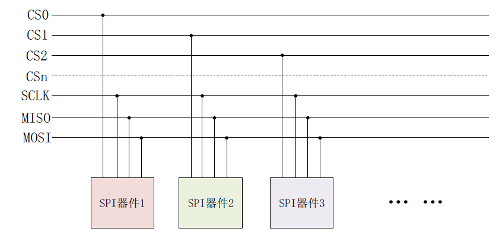
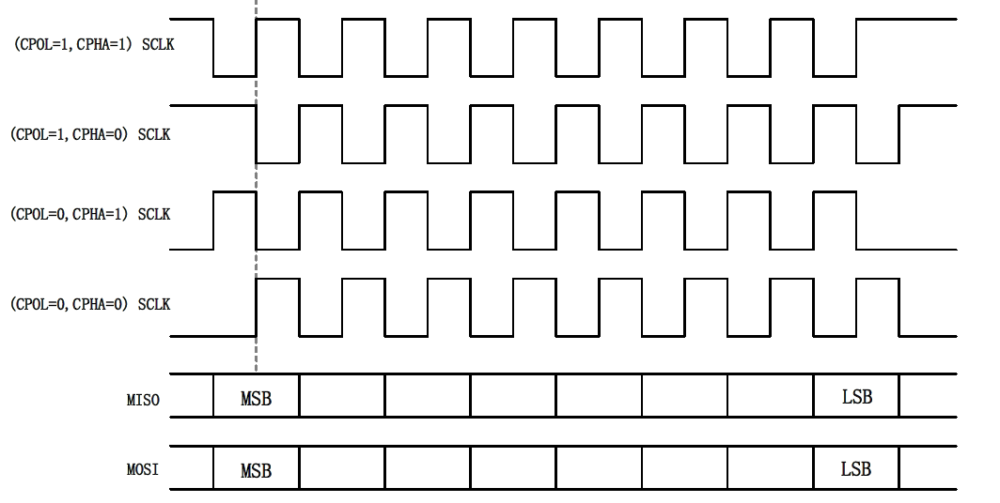
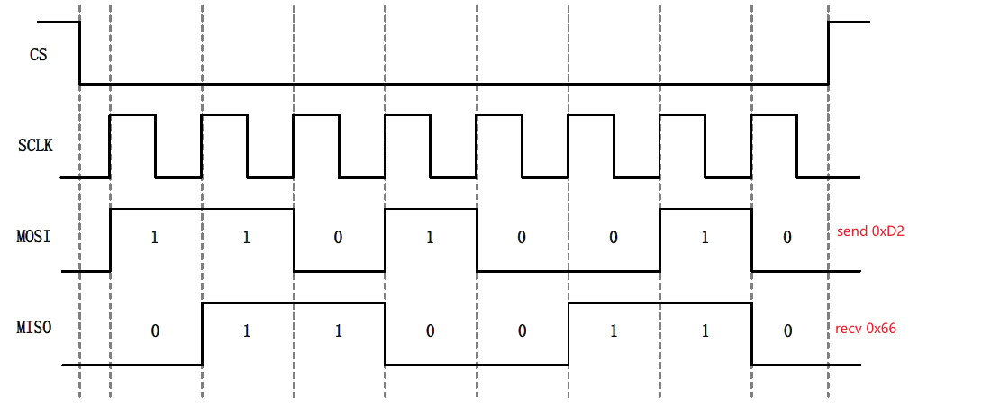

同 I2C一样， SPI是很常用的通信接口，**也可以通过 SPI来连接众多的传感器**。相比 I2C接
最多400KHz，但是 SPI可以到达几十MHz。SPI，SPI 全称是Serial
Perripheral Interface，也就是**串行外围设备接口**。SPI 是Motorola 公司推出的一种同步串行接口
技术，是一种高速、全双工的同步通信总线。

# 硬件结构
标准SPI需要4根线：

1. **CS/SS**，Slave Select/Chip Select，这个是片选信号线，用于选择需要进行通信的从设备。I2C 主机是通过发送从机设备地址来选择需要进行通信的从机设备的，SPI 主机不需要发送从机设备，直接将相应的从机设备片选信号拉低即可。
1. 
**SCK**，Serial Clock，串行时钟，和I2C 的SCL 一样，为SPI 通信提供时钟。
er Out Slave In/Serial Data Output，简称主出从入信号线，这根数据线
只能用于主机向从机发送数据，也就是主机输出，从机输入。
1. **MISO/SDI**，Master In Slave Out/Serial Data Input，简称主入从出信号线，这根数据线只能用户从机向主机发送数据，也就是主机输入，从机输出

# 4种工作模式
SPI有四种工作模式，通过串行时钟极性(CPOL)和相位(CPHA)的搭配来得到四种工作模式：

1. CPOL=0，串行时钟空闲状态为低电平。
电平，此时可以通过配置时钟相位(CPHA)来选择具
体的传输协议。
1. CPHA=0，串行时钟的第一个跳变沿(上升沿或下降沿)采集数据。
1. CPHA=1，串行时钟的第二个跳变沿(上升沿或下降沿)采集数据

# 读写时序
SPI 也是有时序图的，以CPOL=0，CPHA=0 这个工作模式为例，SPI 进行全
双工通信的时序如下：
为SPI 是全双工的，所以读写时序可以一起完成。上图中：

- CS 片选信号先拉低，选中要
通信的从设备
- 然后通过MOSI 和MISO 这两根数据线进行收发数据，
   - MOSI 数据线发出了
   0XD2 这个数据给从设备
   - 同时从设备也通过MISO 线给主设备返回了0X66 这个数据。
