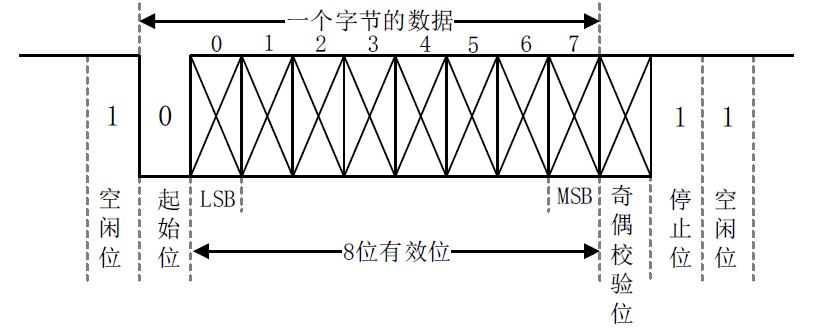
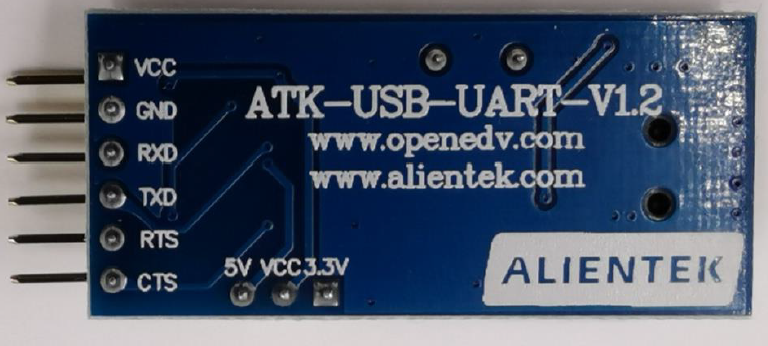
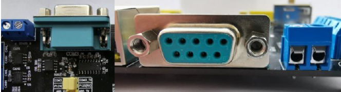

# 串口
串口全称叫做串行接口，通常也叫做COM 接口，串行接口指的是数据一bit一bite的顺序传输，通信线路简单。使用两条线即可实现双向通信，一条用于发送，一条用于接收。串口通信距离远，但是速度相对会低。

# UART
UART 全称是Universal Asynchronous Receiver/Trasmitter，也就是**异步串行收发器**，是串口的一种。工作原理也是将数据一位一位的进行传输，发送和接收各用一条线，因此通过UART 接口与外界相连最少只需要三条线：**TXD(发送)、RXD(接收)和GND(地线)。**

## 通信格式
UART的通信格式如下：

- 空闲位：数据线在空闲状态的时候为逻辑“1”状态，也就是高电平，表示没有数据线空闲，没有数据传输。
- **起始位**：当要传输数据的时候先传输一个逻辑“0”，也就是将数据线拉低，表示开始数据传输。
- **数据位**：数据位就是实际要传输的数据，**数据位数可选择5~8 位，我们一般都是按照字节传输数据的**，一个字节8 位，因此数据位通常是8 位的。低位在前先传输，高位最后传输。
- **奇偶校验位**：这是对数据中“1”的位数进行奇偶校验用的，可以不使用奇偶校验功能。
- **停止位**：数据传输完成标志位，停止位的位数可以选择1 位、1.5 位或2 位高电平，一般都选择1 位停止位。
- 波特率：波特率就是UART 数据传输的速率，也就是每秒传输的数据位数，一般选择9600、19200、115200 等。

## 接口标准
UART一般的接口电平有 TTL和 RS-232：

- TTL电平：一般开发板上都有 TXD和 RXD这样的引脚，这些引脚**低电平表示逻辑 0，高电平表示逻辑 1**。接口样式如下：

**

- RS-232电平：采用差分线， **-3~-15V表示逻辑 1，，+3~+15V表示逻辑 0**。接口样式如下：

