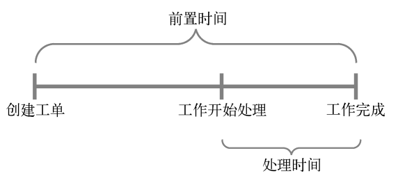
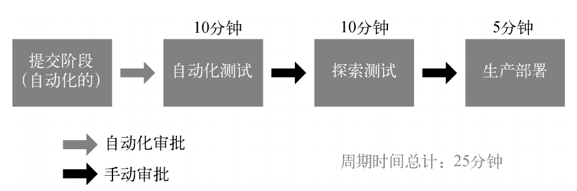
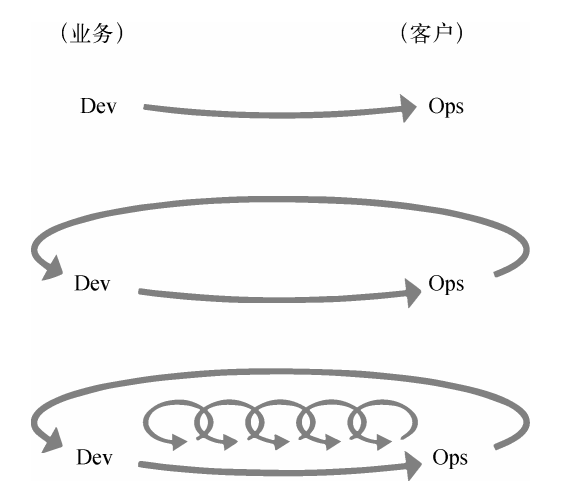
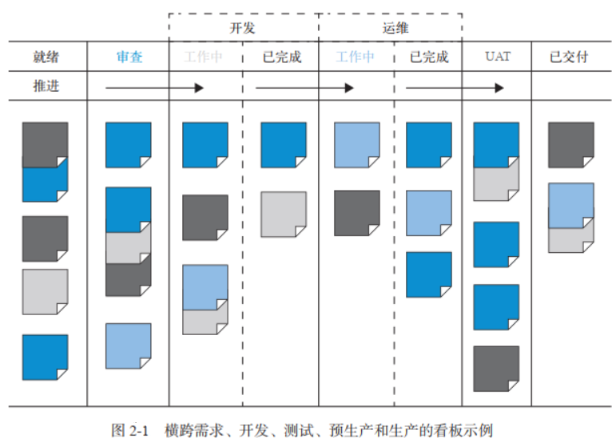
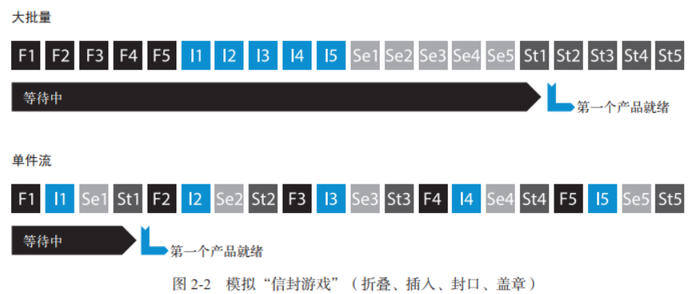
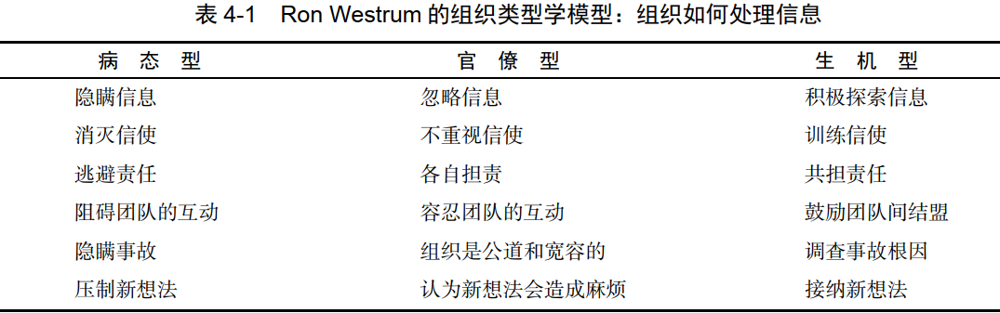

# 1 关于DevOps的常见误区
1. **DevOps不只适用于创业公司**：传统企业和大型公司遇到的问题和创业公司一样，DevOps同样可以帮助解决这些问题
1. **DevOps将取代敏捷**：DevOps的原则和实践与敏捷一致，敏捷是DevOps的保障，DevOps是敏捷的延续
1. **DevOps与ITIL不兼容**：ITIL（IT基础架构库）与DevOps并不冲突
1. **DevOps与信息安全及合规活动不兼容**：DevOps把这些职责的控制集成到了软件开发的每一项日常工作中，控制更精准。比项目结束后的安全审查更有效
1. **DevOps抑制着消除IT运维**：IT运维需要部署自动化平台和开发环境，并不会消失
1. **DevOps只是基础设施即代码或自动化**：DevOps需要自动化，但也需要文化规范和架构。
1. **DevOps仅适用于开源软件**：DevOps与使用的技术无关

# 2 根本的长期的冲突
开发部门通常负责对市场变化做出响应，以最快的速度将新功能或者变更上线；运维和服务则要以为客户提供稳定、可靠和安全的IT服务为已任，让任何人都很难甚至无法引入可能会危害生产环境的变更。制造业管理运动的发起者之一 Eliyahu M. Goldratt 博士称这种配置为“**根本的、长期的冲突**” ——公司对不同部门的考核和激励不同，阻碍了公司全局目标的实现。
困于这种恶性循环中多年，特别是那些处于开发下游的人，**经常感觉被困在一个注定失败的系统中，无力改变结果**。伴随这种无力感的是倦怠感，还有疲劳、愤世嫉俗，甚至是无助和绝望。

# 3 DevOps的准则：总有更好的办法
> **Note：横线部分是我在NOKIA公司工作深有体会的的准则，而且在读这本书的时候才发现NOKIA在DevOps应用上已经深入到基本的文化之中。**

**

- 在流程中的每一个步骤创建**快速反馈回路**，每个人都可以立即看到工作效果。只要代码变更提交到了版本控制系统，就会在类生产环境中运行快速的自动测试（比如Jenkins任务），这持续地保证了代码和环境符合设计预期，并且总是处在安全的可部署状态。
- **自动化测试**使技术债务不再积累，问题在发现之后就立即被修复了。
- 在我们的代码和生产环境中无处不在的**遥测技术**，保证了问题能被迅速地发现并纠正，确保一切都能按照预定的方式进行。各种问题都能在其规模小、修复容易且成本低的时候发现并修复。
- **长期的团队责任制**：在一般的项目团队中，每次软件发布以后开发人员就被打散并重新分配了，他们没有机会得到自己工作的反馈；我们则保持团队的完整性，这样团队可以进行迭代和改进，用团队各成员所学到的经验来更好地实现目标。
- 在出现问题时，我们进行**不指责的事后分析**，这并不是要惩罚某人，而是为了更好地理解导致事故的原因，以及如何防止事故再次发生。这个方法强化了我们的学习文化。
- 坚信自己的工作很重要，并为公司的目标出了一份力，**低压力的工作环境**以及公司在市场上的成功足以证明这一切。
- **小型开发团队**能够快速、安全、 独立地开发、集成、 测试和部署变更到生产环境，具有像创业公司一般惊人的生产力”。

---

# 4 技术价值流
> 技术价值流定义：把业务构想转化为向客户交付价值的、由技术驱动的服务所需要的流程。

价值流始于工程师（包括开发、 QA、 IT 运维和信息安全人员）向版本控制系统中提交了一个变更，止于变更成功地在生产环境中运行，为客户提供价值，并生成有效的反馈和监控信息。我们的目标是采用**测试和运维**与**设计和开发**同步的模式，从而产生更快的价值流和更高的质量。只有当工作任务是**小批量的**，并将质量内建到价值流的每个部分时，这种同步的模式才能实现。

## 4.1 价值流的三个常用指标

- **前置时间**：在工单创建后开始计时，到工作完成时结束（**用户体验到的时间，所以重点是缩短前置时间**）
- **处理时间**：从实际开始处理这个工作时才开始计时，它不包含这个工作在队列中排队等待的时间

- **返工指标%C/A**：完成时间和精确的总花费时间的百分比（ %C/A）。该指标反映了价值流中的每个步骤的输出质量

DevOps 的理想情况：开发人员能快速、持续地获得工作反馈，能快速和独立地开发、集成和验证代码，并能将代码部署到生产环境中（自己部署或者他人部署）。

## 4.2 分钟级别的部署前置时间
**

# 5 三步工作法

## 5.1 第一步：流动原则
实现开发到运维的工作快速地从左向右流动，缩短满足内部或者外部客户需求所需的前置时间，尤其是缩短代码部署到生产环境所需的时间，使企业具有更强的外部竞争力。

### 可视化看板
可视化工作板是一种较好的工作方式，如在看板或 Sprint 计划板上，使用纸质或电子卡片将各项工作展示出来。工作通常从左侧发起（从待办事项中拉取），然后从一个工作中心拉取到下一个工作中心（用列表示），最后到达工作板的最右侧，而这一列也通常被标记为“完成”或“已上线”。

### 限制多任务出现
当使用看板管理工作时，可以**限制多任务的出现**，例如对看板的每一列或每个工作中心设置在制品数量的限制，并把卡片数量的上限标记在每一列上。避免优先级冲突问题。

### 小批量模式和单件流
为了缩短前置时间和提高交付物质量，应当持续不断地追求小批量模式。理论上，最小的批量是单件流，也就是每次操作只执行一个单位功能的处理。这就要求每个User Story需要是end to end的，不能是横向分割的。

下面邮寄宣传册的例子展示了单件流和大批量的巨大差异：

### 识别和改善约束点

- 识别系统的约束点，比如，环境搭建，代码部署，测试执行
- 决定如何利用这个系统约束点
- 基于上述决定，考虑全局工作
- 改善系统的约束点
- 如果约束点已经突破了，请回到第一步，但要杜绝惯性导致的系统约束

## 5.2 第二步：反馈原则
在从右向左的每个阶段中，应用持续、快速的工作反馈机制，从源头控制质量，及时发现和控制问题。通过在整个价值流和组织中建立快速、频繁、高质量的信息流，包括反馈和前馈回路，可以让系统更安全。我们应该**把失败和事故的发生视为宝贵的学习机会，而不是惩罚和责备的理由**。

### 发现问题
我们的目标应该是在技术价值流的每个阶段（包括产品管理、开发、 QA、信息安全和运维），在所有工作执行的过程中，**建立快速的反馈和前馈回路**。这包括创建自动化的构建、集成和测试过程，以便尽早检测出那些可能导致缺陷的代码变更。

### 群策群力，战胜问题
目的是遏制住问题，防止蔓延，然后定位和处理问题，避免复发。我们不应绕开问题，也不应该用“有更多时间时再解决”来搪塞，而要立刻群策群力修复问题。阻止开展新工作有助于实现持续集成和部署，这就是技术价值流中的单件流。能通过持续构建和集成测试的所有变更都可以部署到生产环境中，任何导致测试失败的变更都会触发安灯绳，并且会将大家聚集起来解决问题。

### 在源头保证质量
质量控制无效的例子（横线部分在Nokia工作中深有体会）：

- 需要**其他团队帮忙**完成一系列乏味、易出错和手动执行的任务，这些任务本应该由需求方自己采用自动化方式完成
- 需要那些远离实际工作场所且公务繁忙的人批准，迫使他们在不了解工作情况和潜在影响的情况下做出决策，或者仅仅是例行公事式地盖章批准
- 编写大量含有可疑细节，且在写后不久就过时了的文档（FA/Feature sumary)
- 将大量工作推给运维团队和专家委员去审批和处理，然后等待回复

根据同行评审来评定所提出的变更，确保这些变更会按照设计运行（code review)。尽可能多用自动化方式执行通常由 QA 和信息安全人员来进行的质量检查。按需执行自动化测试，而无需开发人员向测试团队请求或发起测试工作。这样，开发人员能够快速地测试自己的代码，甚至把代码的变更部署到生产环境中。
当有人因为 6个月前开发人员所造成的事故而对着他们咆哮时，开发人员其实学不到任何东西。

## 5.3 第三步：持续学习
建立具有创意和高可信度的企业文化，支持动态的、严格的、科学的实验，积累经验。

### 建立学习型组织
当某些意外影响到客户时，我们努力追本溯源，但根本原因通常会被认定为人为错误，而管理层的做法往往是点名、责备，甚至羞辱责任人。 而且，管理者还会暗示，犯错的人应当受到惩罚。管理层对事故责任人进行惩罚不但会引起恐惧感，还会导致问题和故障的隐瞒不报，直到下一个灾难性事故的发生。
组织类型分类：

### 把局部发现转化为全局优化
一旦在局部范围内取得了成果，就应当把它**分享给组织里的其他人，让更多的人从中获益**。当单个团队或个人获得了独有的专业知识或经验时，我们的目标是把这些隐性知识（即很难通过文档或沟通的方式传递的知识）转换为显性知识，从而帮助其他人吸取这些专业知识并在实践中应用。

在技术价值流中，我们也应该通过类似的机制**建立全局知识库**。例如，把所有事故报告转化成可搜索的知识库，让有需要的团队更加方便地使用它去解决类似问题。

### 领导层强化学习文化
**更卓越的领导力其实是为团队创造条件，让团队能在日常工作中感受到这种卓越**。换句话说，这需要领导者和员工们共同的努力，每个人都相互依存，缺一不可。领导者可以使用下列问题来帮助和辅导员工：

- 上一步做了什么？发生了什么？
- 你从中学到了什么？
- 现状如何？
- 下一个目标条件是什么？
- 当前工作有什么阻碍？
- 下一步做什么？
- 期望的结果是什么？
- 什么时候能进行复查？

