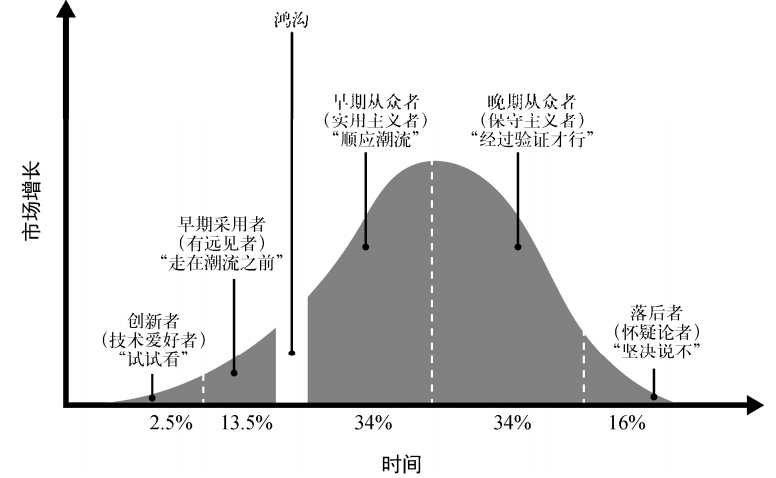
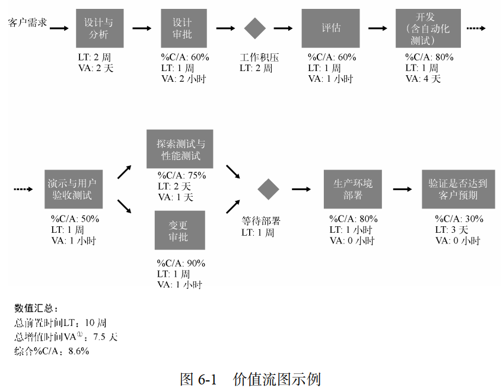
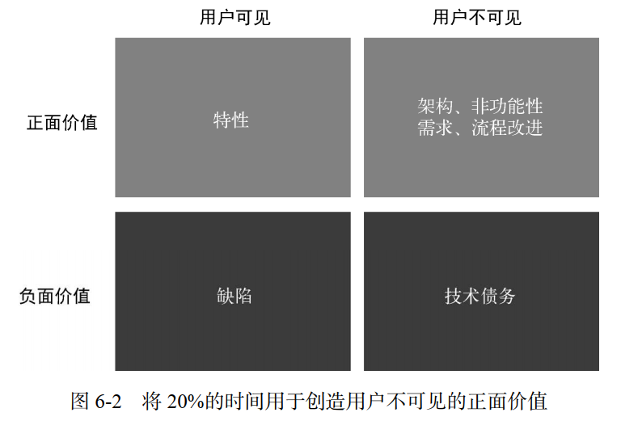
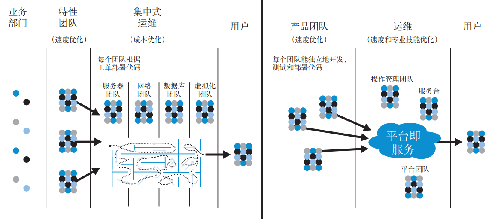
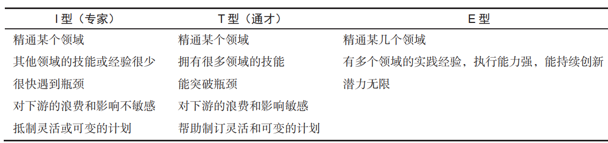

# 1 选择合适的价值流

## 1.1 绿地项目与棕地项目
软件服务或产品常被分为绿地项目和棕地项目：

- 绿地项目是指**全新的软件项目**。这种项目通常还处在规划或实施的早期阶段，有机会构建全新的应用和基础设施，并没有太多限制。
   - **DevOps 绿地项目通常是指一些试点项目**，用于证明公有云或私有云方案的可行性，或者尝试采用自动化部署工具或相关工具等
- 棕地项目是指那些**已经服务客户长达几年甚至几十年的产品或服务**。这种项目通常背负大量的技术债务，譬如无自动化测试、运行在无人维护的平台上等

应用的年龄并不是影响性能的主要因素； 相反， 性能取决于应用架构在当前（或重构后）是否具有可测试性和可部署性。维护棕地项目的团队可能非常愿意尝试 DevOps，尤其在他们认为传统方法无法实现当前目标的情况下（特别是当优化已经迫在眉睫时）。

## 1.2 记录型系统和交互型系统

- 传统的记录型系统是指类似于 ERP 的系统（例如 MRP系统、人力资源系统、财务报表系统等），它的交易和数据的正确性是至关重要的；
   - 变化速度通常较慢，并且有监管和合规性要求，侧重于**做的正确**
- 交互型系统则是指面向客户或员工的可交互系统，例如电子商务系统和办公软件。
   - 变化速度通常较快，因为它需要快速响应反馈，通过实验找到最能满足客户需求的方式，侧重于**做的迅速**

## 1.3 从最乐于创新的团队开始
在每一个组织中，不同的团队或个人都会对创新持有不同的态度：

## 1.4 扩大DevOps的范围
基于已经取得的成功，逐步扩大 DevOps 计划的应用范围。遵循低风险的顺序，有条不紊地提高可信度和影响力，并获取支持。

- **发现创新者和早期采用者**： 一开始，把重点放在真正有意愿改进的团队上
- **赢得沉默的大多数**： 在下一阶段，力求将 DevOps 实践扩展到更多的团队和价值流，目标是建立更稳固的群众基础
- **识别“钉子户”**： 是指那些高调的、有影响力的反对者

# 2 理解、可视化和运用价值流

## 2.1 确定Devops团队成员

- **产品负责人**： 作为业务方的代言人，定义系统需要实现的功能。
- **开发团队**： 负责开发系统功能。
- **QA 团队**： 给开发团队提供反馈，并确保系统功能符合需求。
- **运维团队**： 负责维护生产环境，并确保系统能够良好地运行。
- **信息安全团队**： 负责系统和数据的安全。
- **发布经理**： 负责管理和协调生产环境部署以及发布流程。
- **技术主管或价值流经理**：（精益方法论的定义）负责“从始至终地保障价值流的产出满足或超出客户（和组织）期望”。

## 2.2 绘制价值流图
深入理解工作方式，并用价值流图进行记录 
。**绘制价值流图的目标并不是记录所有的步骤和细节，而是识别出阻碍价值流快速流动的环节，从而缩短前置时间和提高可靠性**。

## 2.3 专门的转型团队
团队应该负责实现明确定义的、可度量的、系统级的目标，措施：

- 转型团队的成员专门执行 DevOps 转型工作（而不是让他们继续做之前的工作，但要花20%的时间来做 DevOps 转型）
- 选择熟悉多个领域的通才作为团队成员
- 选择与其他部门长期保持良好关系的人作为团队成员
- 如果可能，为团队找一个独立的办公区域，使各位成员尽可能多地相互交流，并和其他部门保持适当的距离。

# 3 组织架构
**康威定律**：**系统设计受限于组织自身的沟通结构。组织的规模越大，灵活性就越差，这种现象也就越明显**。组织结构决定了工作方式和工作成果。

## 3.1 组织结构类型

**过度职能导向的危害：**

- 执行工作的人通常都不太理解自己的工作与价值流目标有什么关系（“我之所以要配置这台服务器，是因为别人要我这么做”）。这样就无法让员工发挥创造性和主动性。
- 决策逐级下达至各个职能部门，最后调整局部的优先级，而这又会降低其他团队的速度。每个团队都在加速工作，而最终的结果却是所有项目都以同样缓慢的速度向前推进
- 除了导致长时间等待和交付周期延长以外，这种情况也会导致糟糕的交接、大量的返工、交付质量下降、瓶颈和延期等问题

**职能导向也可以成就高效运转的组织**。组建跨职能和以市场为导向的团队是实现快速流动和可靠性的一种方式，但并不是唯一的方式。只要价值流中的所有人都能意识到客户和组织的目标，不管他们在组织中处于什么位置，都可以通过职能导向取得所预期的 DevOps 成果。

Note：**起决定性作用的并不是组织形式，而是人们的行为和反应。成功的根本原因不在于其组织结构，而在于它的发展能力和员工的工作习惯**。

## 3.2 使团队成员都成为通才
让每一位团队成员都成为通才。**给工程师提供学习必要技能的机会**，让他们有能力构建和运行所负责的系统，并定期让他们在不同的职位间轮岗。 **全栈工程师**这个术语现在通常是指那些熟悉或至少大致理解整个应用栈（例如代码、数据库、操作系统、网络和云）的通才。

## 3.3 保持小规模团队
**两个披萨原则**：两个比萨够团队的所有成员吃，这样的团队通常有 5～ 10 人。

- 它确保团队成员对系统有清晰、相同的理解
- 它限制正在开发的产品或服务的增长率，保证第一点
- 它分散权力并实现自主
- 领导“双比萨”团队是让员工获得领导经验的一种方式

