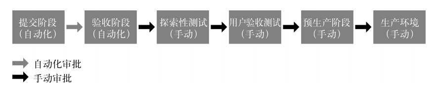
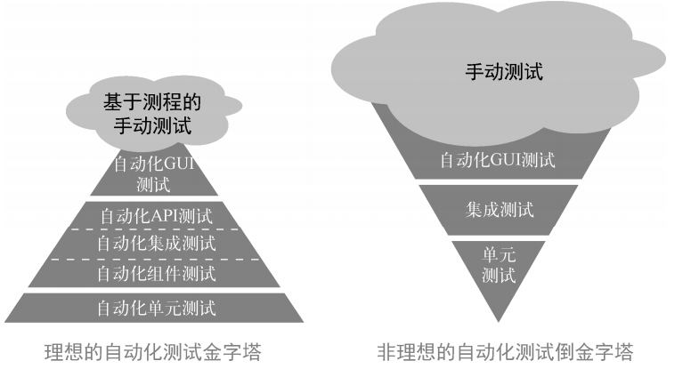
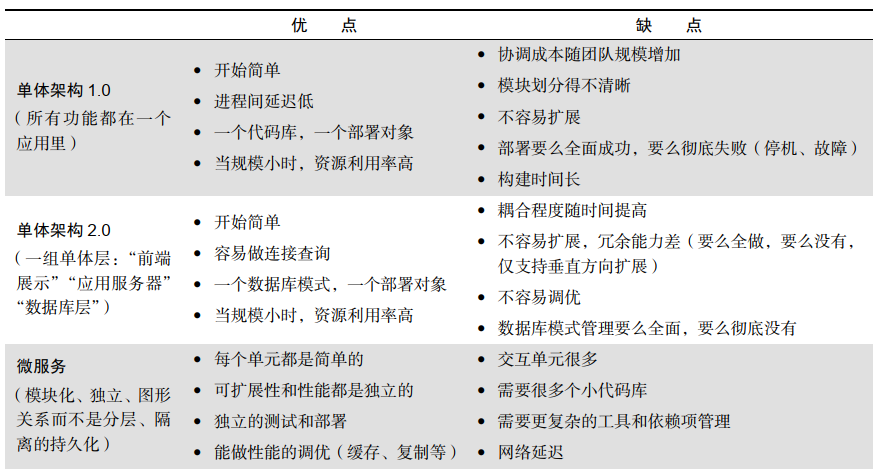

# 1 部署流水线

## 1.1 按需搭建开发、测试和生产环境
**开发人员最好能按需或自己创建工作站，并在其上运行类生产环境**。这样一来，他们就能把在类生产环境中运行和测试代码作为日常工作的一部分，并且及早且持续获得有关工作质量的反馈。
自动化构建和配置环境的工具和方式有：

- 复制虚拟化环境（如 VMware 虚拟机镜像、执行 Vagrant 脚本，以及启动 Amazon EC2 虚拟机镜像文件）；
- 构建“裸金属物理机”的自动化环境搭建流程（例如，使用 PXE 方式通过基线镜像进行安装）；
- 使用“基础设施即代码”的配置管理工具（例如 Puppet、 Chef、 Ansible、 SaltStack、CFEngine 等）；
- 使用操作系统自动化配置工具（例如 Solaris Jumpstart、 Red Hat Kickstart 和 Debian preseed）；
- 使用一组虚拟镜像或容器（例如 Vagrant 和 Docker）搭建环境；
- 在公有云（例如 Amazon Web Services、 Google App Engine 和 Microsoft Azure）、私有云或其他 PaaS（平台即服务，如 OpenShift 和 Cloud Foundry 等）中创建新环境。

通过获得完全可控的环境，开发人员能在与生产服务和其他共享资源安全隔离的情况下，快速地重现、定位和修复缺陷。

## 1.2 扩展完成的定义
大多数现代软件开发方法论都指定采用短的迭代周期，而非大爆炸方法（例如瀑布模型）。一般来说，部署的间隔时间越长，软件质量越差。
“完成”是指不仅实现了功能正确的代码，而且在每个迭代周期结束时，**已经在类生产环境中集成和测试了可工作和可交付的代码**。完成”不是指开发人员认为已经完工，而是指可以成功地构建和部署应用，并且确定它在类生产环境中按照预期运行（最好早在迭代结束之前，就处理过与生产环境类似的负载和数据集）。
通过让开发团队和运维团队共同掌握代码和环境互动的方式，并尽早频繁地实施代码部署，生产环境的部署风险得以显著降低。这也避免了在项目的最后时刻才发现架构问题，并完全消除了这一类安全隐患。

# 2 自动化测试
如果没有自动化测试，那么我们编写的代码越多，测试代码所花费的时间和金钱也会越多。**恐惧是心灵杀手。它使新手不敢变更，因为他们不了解系统。它也使老手不敢变更，因为他们太了解系统**。
现在，当谷歌的开发人员提交代码时，就会自动触发测试套件，它包含成千上万个自动化测试用例。只有当提交的代码通过自动化测试后，才会被自动地合并到主干，并可以部署到生产环境。谷歌每小时或每天都在构建很多程序，然后从中选择可发布的版本。所有人都秉持**“绿色提交”（ Push on Green）**的交付理念。

> 常说的**瀑布式 Scrum 反模式**（ water-Scrum-fall anti-pattern）：表面上采用敏捷开发实践，但实际上，所有测试和缺陷修复仍然在项目快结束时才进行。

## 2.1 持续构建、测试和集成
创建自动化测试套件的目的是提高集成频率，**使测试从阶段性活动演变成持续性活动**。通过搭建部署流水线，当新的变更进入版本控制系统时，就会触发一系列自动化测试。
部署流水线还存储了**每一份代码的构建历史**，包括某次构建执行过哪些测试，测试结果如何，以及部署到了什么环境中。结合版本控制系统中的历史信息，可以快速地找到导致部署流水线失败的原因和可能的修复方法。

## 2.2 快速可靠的自动化测试

### 尽早发现错误
重现集成测试发现的错误不但难度高，而且很耗时，甚至连验证错误已被修复也很困难。因此，**每当验收测试或集成测试发现一个错误，就应该编写相应的单元测试，**以便更快、更早、更廉价地识别这个错误。

### 测试驱动开发
要确保自动化测试可靠，最有效的一个方法是通过**测试驱动开发**（ Test-Driven Development，TDD）和**验收测试驱动开发**（ Acceptance Test-Driven Development， ATDD）等技术在日常工作中编写自动化测试。在对系统做任何变更时，都要先编写一个自动化测试用例，执行并确保测试失败，然后再编写实现功能的代码，并且让代码通过测试。

### 集成性能测试
编写和执行自动化性能测试的目标是验证整个应用栈（代码、数据库、存储、网络、虚拟化等）的性能，并把它作为部署流水线的一部分，这样才能尽早发现问题，并以最低的成本和最快的速度解决问题。可能需要在项目启动时就搭建性能测试环境，并确保能够为尽早、正确地搭建准备好所需资源。为了能尽早发现性能问题，**应该记录所有性能测试结果，并对比上一次结果**，评估各项性能指标。

# 3 持续集成
解决大批量合并问题的对策是，应用持续集成和基于主干的开发实践，让每个开发人员每天都至少向主干提交一次代码。这样做能够将代码提交量降低为开发团队每日的工作量。开发人员提交得越频繁，每次的提交量就越小，他们离理想的单件流状态也就越近。**每日提交代码，也迫使开发人员进一步分解工作**，同时保持主干处于可发布状态。

版本控制系统为团队间的沟通提供了一套完整的机制——每个人对系统都有了更好的理解，并且都了解部署流水线的状态，而且能在出现问题时互相帮助，从而实现更高的质量和更快的部署速度。 

# 4 自动化部署
大多数具有持续集成和测试功能的工具，也有扩展部署流水线的能力。通常在生产验收测试执行完之后，这些工具可以将验证过的构建版本发布到生产环境中（这样的工具包括** Jenkins Build Pipeline插件**、ThoughtWorks的 GoCD和 Snap CI、Microsoft Visual Studio Team Services，以及 Pivotal Concourse）。

## 4.1 自动部署的要求

- **用相同的方式处理所有环境的部署**： 通过对所有环境（例如开发环境、测试环境和生产环境）采用相同的部署机制，可以提高生产环境部署的成功率，因为它已经在流水线中被成功地部署过很多次了。
- **对部署执行冒烟测试**： 在部署过程中，应该测试依赖的所有系统（例如数据库、消息总线和外部服务）是否能正常访问，并通过单次测试看看系统是否能正常工作。如果以上任何一个测试失败，那么部署就是失败的。
- **维持环境的一致性**： 上述步骤创建了一步搭建环境的流程，使得开发环境、测试环境和生产环境有了共同的搭建机制。必须持续保证这些环境的搭建方式是一致的。

## 4.2 自动部署的能力

- 保证在持续集成阶段构建的软件包可以部署到生产环境中；
- 使生产环境的就绪情况一目了然；
- 为能在生产环境中部署的任何代码，建立一键式和自助式的发布机制；
- 自动记录审计和合规管理所需的相关内容，包括在哪台机器上运行了命令，运行了什么命令，是谁授权的，以及结果如何；
- 通过冒烟测试验证系统正常工作，并且数据库连接字符串等配置正确；
- 为开发人员快速提供反馈，使他们能够尽快了解部署结果（例如部署是否成功，应用是否能在生产环境中正常运行，等等）。

# 5 演进式架构原则
任何成功的产品或公司，其架构都必须在生命周期里不断演进。比如eBay 的架构演进过程如下： Perl 语言加文件系统（ v1， 1995 年）， C++语言加 Oracle 数据库（ v2， 1997 年）， XSL加 Java 语言（ v3， 2002 年），全栈 Java 语言（ v4， 2007 年）， Polyglot 微服务（从 2013 年开始）。
**接口定义清晰的松耦合架构**优化了模块间的依赖关系，提高了生产力和安全性，让小型且高产的“双比萨”团队可以执行小的变更，并能安全和独立地进行部署。因为每个服务都有一个定义明确的 API，所以更容易测试，团队之间的服务等级协议条款也更容易确定。

主要的架构原型：

