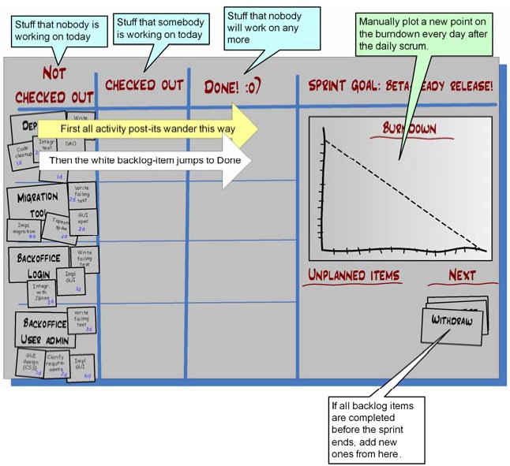
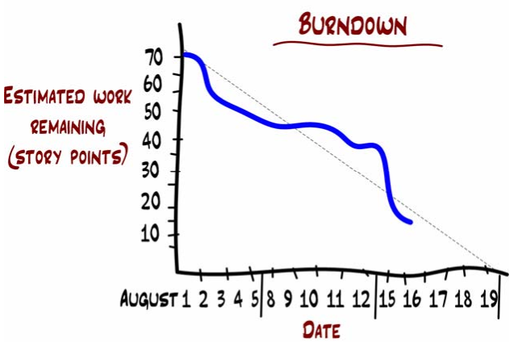
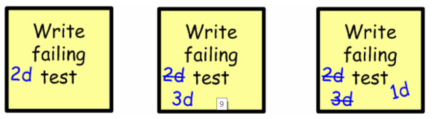

# 1 Sprint Backlog

## 1.1 白板
使用白板记录本sprint的所有task和当前的进展状态，样式如下：

## 1.2 burnDown chart

- Sprint 的第一天， 8 月 1 号，团队估算出剩下 70 个故事点要完成。这实际上就是**整个 sprint 的估算生产率**
- 在 8 月 16 号， 团队估算出还剩下 15 个故事点的任务要做。跟**表示趋势的虚线**相对比，团队的工作状态还是差不多沿着正轨的。按照这个速度，他们能在 sprint 结束时完成所有任务。

# 2 每日例会
一般开站立会议，以防止持续时间超过 15 分钟。

## 2.1 更新白板
每个人都会一边描述**昨天已经做的事情和今天要做的事情**，一边移动任务板上对应的即时贴。如果他讲的是一个**未经计划的条目**，那他就新写一张即时贴，贴到板上。如果他**更新了时间估算**，那就在即时贴上写上新的时间，把旧的划掉。

## 2.2 如何处理今天没有任务的情况

- **羞辱式做法**： “如果你不知道怎么帮助团队，我建议你还是回家去，或者看书，或者怎么都行。要不也可以找个地方坐下，等别人需要帮忙的时候你就过去。”
- **守旧式做法**： 简单给他们分配个任务了事。
- **施加同事压力的做法**： 对他们说，“Joe，还有 Lisa，你们两个可以放松点，我们会站在这里慢慢等，直到你们找到帮助我们完成目标的事情为止。”
- **奴役式做法**： 对他们说，“你们今天可以给大伙儿干干杂活。倒咖啡、做按摩、清理垃圾、做午饭，一切一切大家今天让你们做的事情。”你会惊讶的发现 Joe 和 Lisa 在霎那之间就找出了有用的技术任务

如果一个人常常逼得你要这样做，那就应该考虑是不是把他单独找出来做辅导。倘若问题依然存在，你就需要衡量一下这个人对于团队的重要性。

