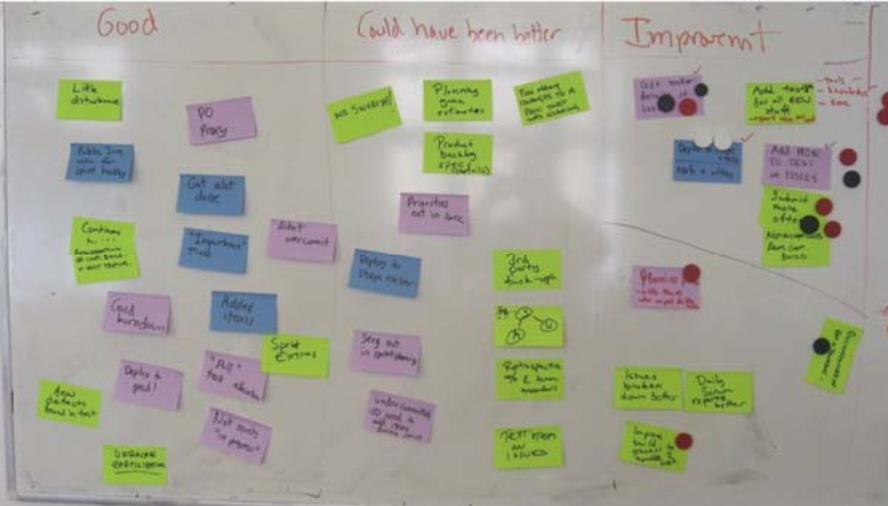

# 1 Sprint Demo

## 1.1 为什么要坚持demo
一次做得不错的演示，即使看上去很一般，也会带来深远影响。

- 团队的成果得到认可。他们会**感觉很好**。
- 其他人可以**了解你的团队在做些什么**。
- 演示可以吸引相关干系人的注意，并**得到重要反馈**。
- 演示是一种社会活动，不同的团队可以在这里相互交流，讨论各自的工作。这很有意义。
- **做演示会迫使团队真正完成一些工作，进行发布**（即使是只在测试环境中）。如果没有演示，我们就会总是得到些99%完成的工作。有了演示以后，也许我们完成的事情会变少，但它们是真正完成的。这比得到一堆貌似完成的工作要好得多，而且后者还会污染下一个 sprint。

## 1.2 demo注意事项

- 确保清晰阐述了 sprint 目标。 如果在演示上有些人对产品一无所知，那就花上几分钟来进行描述。
- 不要花太多时间准备演示，尤其是不要做花里胡哨的演讲，集中精力演示可以实际工作的代码。
- 节奏要快，也就是说要把准备的精力放在保持演示的**快节奏**上，而不是让它看上去好看。
- 让演示关注于业务层次，不要管技术细节。注意力放在“我们做了什么”，而不是“我们怎么做的”。
- 可能的话，让观众自己试一下产品。
- **不要演示一大堆细碎的 bug 修复和微不足道的特性**。你可以提到一些，但是不要演示，因为它们通常会花很长时间，而且会分散大家的注意力，让他们不能关注更加重要的故事

# 2 Sprint Review

- 根据要讨论的内容范围，设定时间为 1 至 3 个小时。
- 参与者：产品负责人，整个团队。
- 我们换到一个封闭的房间中，或者舒适的沙发角，或者屋顶平台等等类似的场所。只要能够在不受干扰的情况下讨论就好。
- 我们一般不会在团队房间中进行回顾，因为这往往会分散大家的注意力。
- 指定某人进行记录。
- Scrum master 向大家展示 sprint backlog，在团队的帮助下对sprint 做总结。包括重要事件和决策等。
- 轮流发言。每个人都有机会在不被人打断的情况下讲出自己的想法，他认**为什么是好的，哪些可以做的更好，哪些需要在下个 sprint 中改变**。
   - good point
   - to be impove
- 我们**对预估生产率和实际生产率进行比较**。如果差异比较大的话，我们会分析原因。
- 快结束的时候， Scrum master 对具体建议进行总结，得出下个 sprint 需要改进的地方

review示例：
> 补充：附件是在Nokia的sprint review上总结记录

# 3 Sprint之间的修正
力求保证不在同一天举行 sprint 回顾和下一个sprint 计划会议。在启动新的 sprint 之前，每个人都应该至少度过一个不需要考虑 sprint 的夜晚。
> 补充：在Nokia，一般在Sprint结束的最后一个周五进行review meeting，然后在下个周的周一进行plan meeting。大家有一个周末的时间进行充分的休息

