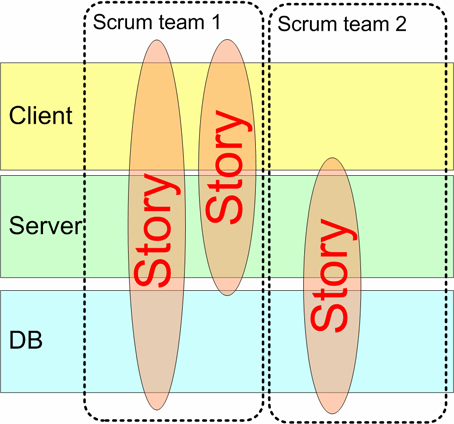
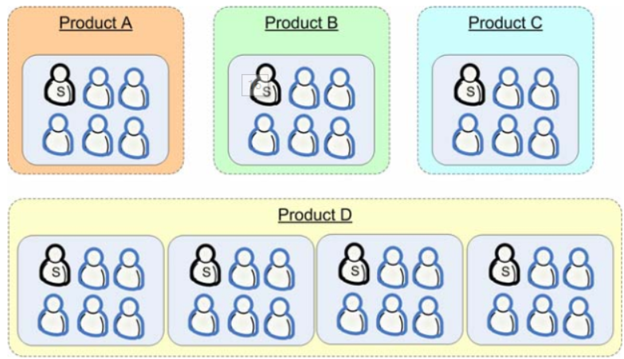
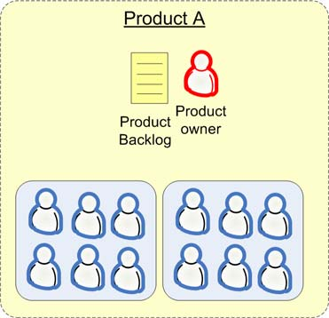
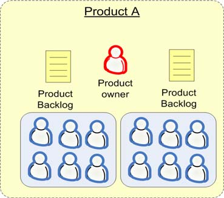
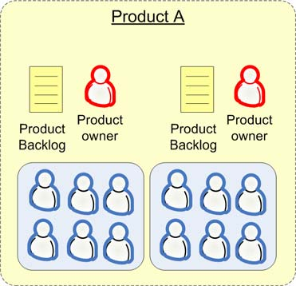

# 1 如何创建团队
我的经验是，**宁可团队数量少，人数多**，也比弄上一大堆总在互相干扰的小团队强。要想拆分小团队，必须确保他们彼此之间不会产生互相干扰！
5 到 9 个人被公认为是“最佳的”团队构成人数。可以考虑拆分团队，但要先做实验，观察虚拟团队，然后确保在回顾会议上有足够的时间来讨论这种问题。迟早就会发现针对你所在环境的解决方案。需要重视的是，必须要让团队对所处环境感到舒适，而且不会常常彼此干扰。

**创建跨组件的团队**实施 多团队Scrum 的时候，所做的第一件事情就是**打乱特定于组件的团队，创建跨组件的团队**（下图）。它减少了诸如“我们没法完成这个条目，因为我们在等 server 那帮家伙完成他们的工作”之类的情况发生。

# 2 同步多个团队的Sprint

- 可以利用 sprint 之间的时间来重新组织团队！如果各个sprint 重叠的话，要想重新组织团队，就必须打断至少一个团队的 sprint 进程。
- 所有团队都可以在一个 sprint 中向同一个目标努力，他们可以有更好的协作。
- 更小的管理压力，即更少的 sprint 计划会议、 sprint 演示和发布。

# 3 Scrum-of-scrums meeting
例如下面的团队分配，一个产品需要多个scrum team进行，所以就有两个层次的scrum：

- 一个是“产品层次”的 Scrum-of-Scrums，包括 Product D 中的所有团队
- 另外一个是“团体层次”的 Scrum-of-Scrums，包括所有的产品 

## 3.1 产品层次的 Scrum-of-Scrums
这个会议非常重要，在会议上我们会讨论集成问题，团队平衡问题，为下个 sprint 计划会议做准备：

1. 每个人围着桌子坐好，描述一下上周各自的团队都完成了什么事情，这周计划完成什么事情，遇到了什么障碍。
1. 其他需要讨论的跨团队的问题，例如集成

## 3.2 团体层次的 Scrum-of-Scrums
会议的形式为：

1. 开发主管介绍最新情况。例如即将发生的事件信息
1. 大循环。每个产品组都有一个人汇报他们上周完成的工作，这周计划完成的工作，及碰到的问题。其他人也会作报告（配置管理领导， QA 领导等）
1. 其他人都可以自由补充任何信息，或者提问问题

这是个**发布概要信息的会议**，而不是提供讨论或者反映问题的场所。只要保证这一点， 15 分钟常常就足够了。

# 4 救火团队
救火团队（实际上我们管他们叫“**支持团队**”）有两项工作。

- 救火
- 保护 Scrum 团队远离各种干扰，包括挡开那些不知从何而来的、增加临时特性的要求

这种方式效果很好。因为 Scrum 团队有了空间努力工作，所以他们最后能够稳定系统。同时救火队员也完全放弃了预先计划的想法，他们完全是针对外部反应展开工作，只管修复即将出现的下一个问题。

# 5 是否拆分产品backlog

## 5.1 一个产品负责人，一个 backlog
这就是“只能有一个”的模型，也是我们**最推崇的模型**。这种模型的优点是：**你可以让团队根据产品负责人当前的优先级来自行管理。产品负责人关注他所需要的东西，团队决定怎么分割工作**。

## 5.2 一个产品负责人，多个 backlog
在这种策略中，产品负责人会维护多个产品 backlog，每个团队对应一个。它的劣势在于，**产品负责人要把故事分配给团队，而这项工作交给团队自己处理会更好**。

## 5.3 多个产品负责人，每人一个产品 backlog
它跟第二个策略有点像，每个团队都有一个产品 backlog，但每个团队也都有一个产品负责人！缺点：如果两个产品 backlog 都对应同一个代码库，那两个产品负责人可能会发生严重的利害冲突。

