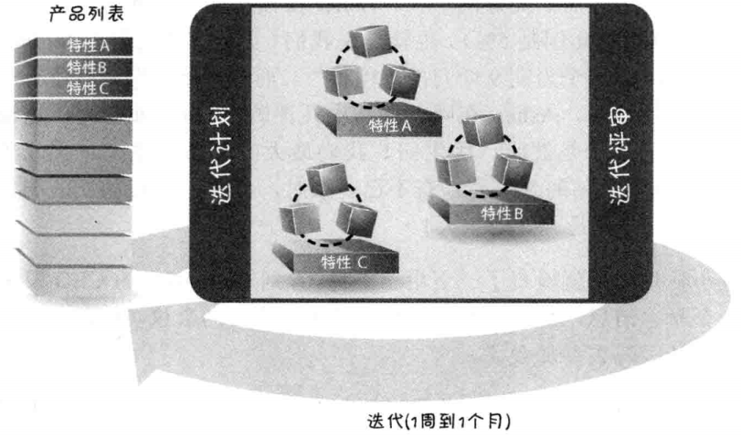
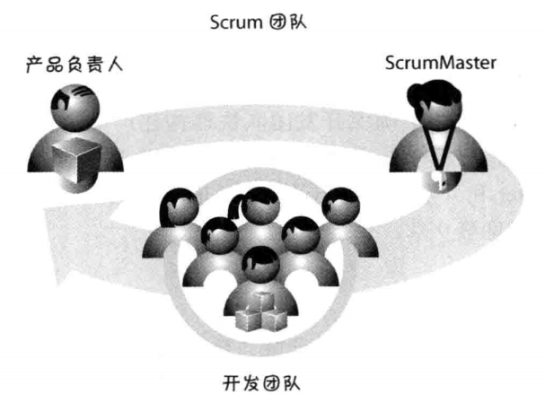
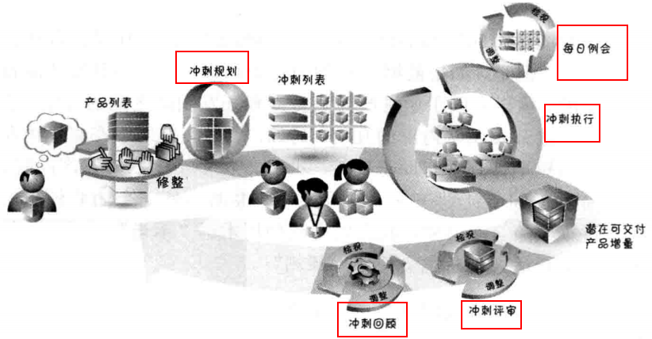
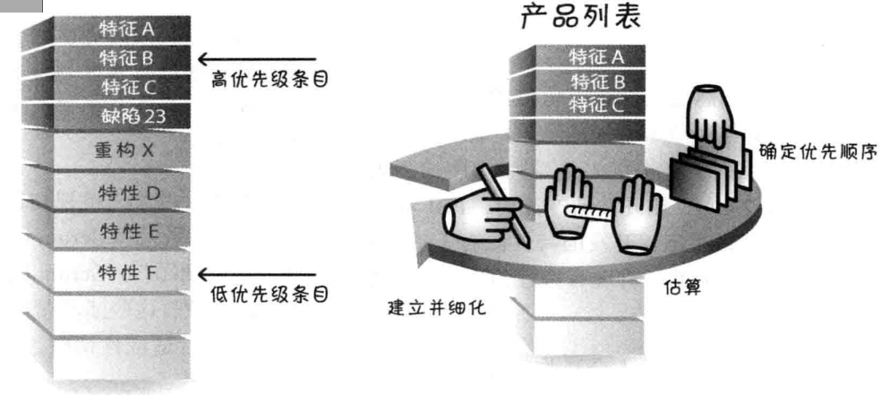

# 1 什么是Scrum
> Scrum是橄榄球术语，表示犯规或求出界后重新开始比赛

Scrum是一种用于开发创新产品和服务的**敏捷方式**。

- 产品列表：按优先级排列、产品所需的特性和其他功能的列表，也叫**User Story**。
- 迭代周期位1周到1个月，**一般为3周一个Sprint，每个周期包括****设计、构建、测试****。**
- 每个迭代结束，应该有一个可发布的产品。

Scrum不是按照制定的规则解答开发过程中的问题，它**是一种价值观**，让团队有能力提出并解决自己的重大问题。Scrum框架建立在一套**价值观、原则和实践**之上，个团队可以根据具体实践添加特定的方法，形成自己的Scrum版本。

# 2 Scrum角色

## 产品负责人
有权决定要构建哪些特性并以何种顺序构建（即我的Nokia中看到的APO角色），并对产品解决方案全面负责。

## scrum master

- 充当团队的教练，发挥教导作用，普及Scrum的价值观、原则和实践。
- 保护团队不受外界干扰，提高生产率
- Scrum master**是领导者，不是管理者**

## 开发团队
团队一般为5-9个人，包括：架构师（PA），程序员，测试、管理员，UI设计师等。负责产品设计、构建和测试。

# 3 Scrum活动
Scrum框架中的大部分活动如下：
> 冲刺又叫**Sprint**

## Sprint过程
一个完整的Sprint的顺序活动为：

1. 产品负责人牵头制定**product backlog（产品列表**），里面包含多个端到端的User story
1. **Sprint planning（冲刺规划）**：制定并**commit（承诺）**本Sprint可以完成交付的User Story
1. 每日例会：团队成员同步、检查和调整计划
   1. 完成了什么？
   1. 今天计划做什么？
   1. 有什么障碍，需要什么帮助？
4. **Sprint review（冲刺评审）**：检查和调整正在构建的产品，参与者进行交谈，指导下一步的计划。
4. **Sprint Retro（冲刺回顾）**：关注必须要的过程改进，并在下一个Sprint采用执行，帮助团队成长。

## Product Backlog

## 冲刺列表
从Backlog中，选择一个User Story分解成任务，并估算每个任务完成需要的时间（按小时计算），保证团队成员可以**保持可持续性的节奏**完成这些任务。

## 怎么叫一个特性完成
完成的最低限度定义是：**产出一个完整的产品功能，经过设计、构建、集成、测试并且编写了文档。**

