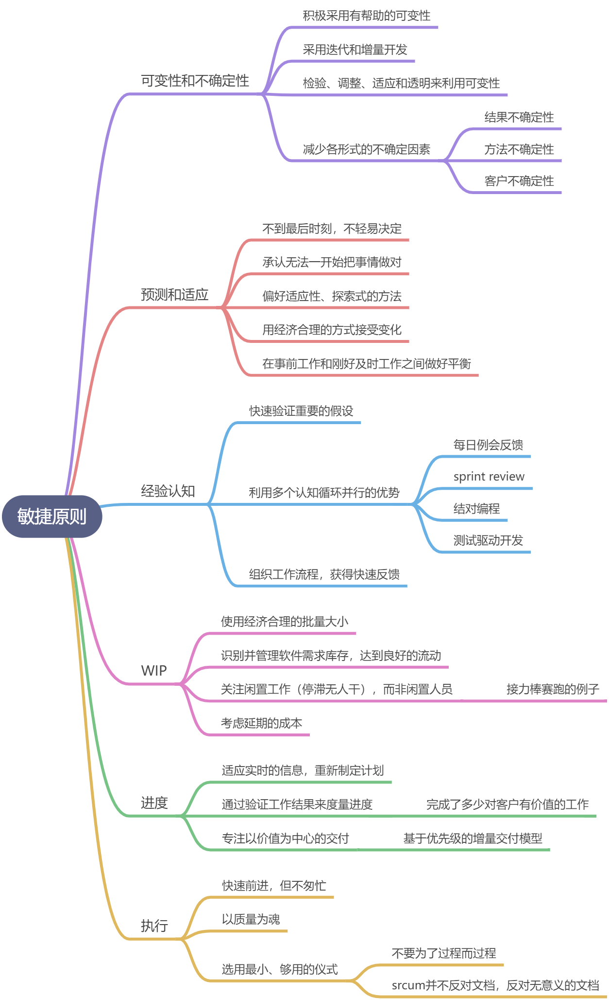
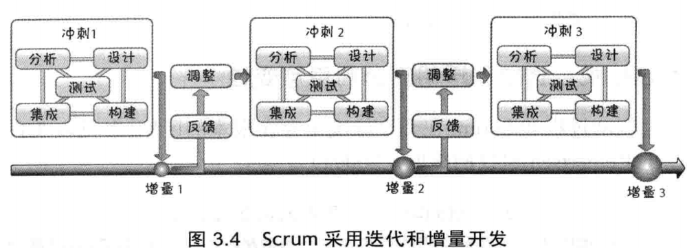
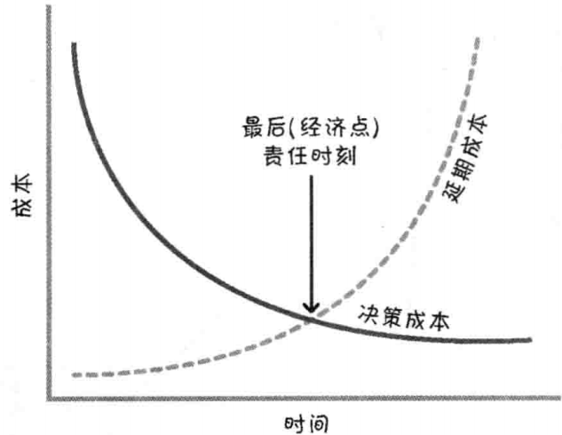

# 迭代和增量开发
每个Sprint都包含一部分的**分析、设计、构建、集成和测试工作，**而不是一个Sprint设计，一个Sprint构建这样的瀑布式的假敏捷：

# 最后责任时刻LRM
推迟作出承诺，直到最后责任时刻再作出重要的、不可逆转的决定。最后责任时刻指**不做决定的成本大于做决定的成本时：**

# 预测性的事前工作与适应性的刚好及时工作
Scrum中，我们承认不可能事先精确的获得所有的需求和计划，所以**需要找到平衡点**，即前期工作和刚好及时工作之间的平衡：

# WIP
WIP即work in process，指的是**已经开始但是尚未完成的工作**。在开发中，必须识别WIP并进行妥善处理。

## 合理的批量大小
小批量的好处：

# 敏捷与瀑布式的对比
| **Topic ** | **Plan-Driven Principle ** | **Agile Principle** |
| --- | --- | --- |
| **Similarity between****development and****manufacturing** | Both follow a defined process.  | Development isn’t manufacturing; development creates the recipe for the product. |
| **Process structure ** | Development is phase-based and sequential. | Development should be iterative and incremental. |
| **Degree of process****and product****variability** | Try to eliminate process and product variability. | Leverage variability through inspection, adaptation, and transparency. |
| **Uncertainty****management** | Eliminate end uncertainty first, and then means uncertainty. | Reduce uncertainties simultaneously. |
| **Decision making ** | Make each decision in its proper phase. | Keep options open. |
| **Getting it right the****first time** | Assumes we have all of the correct information up front to create the requirements and plans. | We can’t get it right up front. |
| **Exploration versus****exploitation** | Exploit what is currently known and predict what isn’t known. | Favor an adaptive, exploratory approach. |
| **Change/emergence ** | Change is disruptive to plans and expensive, so it should be avoided. | Embrace change in an economically sensible way. |
| **Predictive versus****adaptive** | The process is highly predictive. | Balance predictive up-front work with adaptive just-in-time work. |
| **Assumptions****(unvalidated****knowledge)** | The process is tolerant of long-lived assumptions. | Validate important assumptions fast. |
| **Feedback ** | Critical learning occurs on one major analyze-design-code test loop. | Leverage multiple concurrent learning loops. |
| **Fast feedback ** | The process is tolerant of late learning. | Organize workflow for fast feedback. |
| **Batch size (how muchwork is completedbefore the nextactivity can start)** | Batches are large, frequently100%—all before any.Economies of scale should apply. | Use smaller, economically sensible batch sizes. |
| **Inventory/work inprocess (WIP)** | Inventory isn’t part of the belief system so is not afocus. | Recognize inventory and manage it to achieve good flow. |
| **People versus workwaste** | Allocate people to achieve high levels of utilization. | Focus on idle work, not idle workers. |
| **Cost of delay ** | Cost of delay is rarely considered. | Always consider cost of delay. |
| **Conformance to plan ** | Conformance is considered a primary means of achieving a good result. | Adapt and replan rather than conform to a plan. |
| **Progress ** | Demonstrate progress by progressing through stages or phases. | Measure progress by validating working assets. |
| **Centricity ** | Process-centric—follow the process. | Value-centric—deliver the value. |
| **Speed ** | Follow the process; do things right the first time and go fast. | Go fast but never hurry. |
| **When we get highquality** | Quality comes at the end, after an extensive test-and-fix phase. | Build quality in from the beginning. |
| **Formality (ceremony) ** | Formality (well-defined procedures and checkpoints)is important to effective execution. | Employ minimally sufficient ceremony. |

