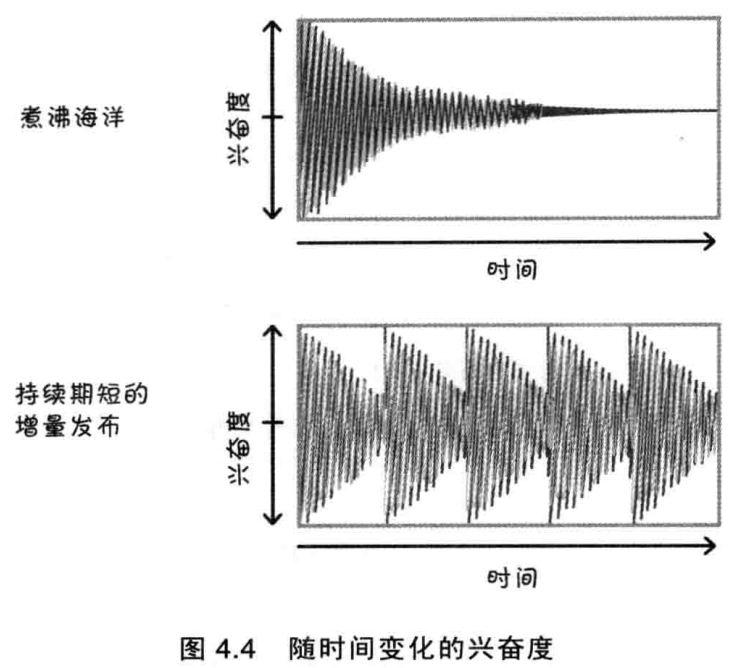
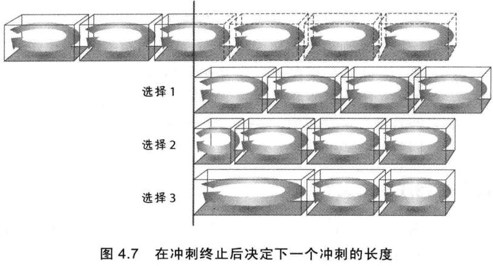

# 1 Sprint优点
| **时间盒的优点** | **短开发周期的优点** |
| --- | --- |
| - 设定task的数量限制- 强制排序优选顺序- 展示进度- 避免不必要的完美主义- 促进task结束- 增强可预测性 | - 容易规划- 反馈快- 错误有限- 投入产出比高- 有助于成员满血复活- 检查点多 |

# 2 目标变更和澄清

- **变更**是工作和资源的变动，在经济上会造成潜在的严重浪费，中断工作流或在一个sprint中大量的增加工作范围。
- **澄清**是在sprint执行期间提供更多的细节来帮助团队来实现冲刺目标。

**敏捷讲究乐于接受变化，但要用一种平衡的、经济合理的方式**。
除了直接的经济后果，变更还可能损害团队的士气和信任关系。产品负责人作出承诺，最后出尔反尔，这样做自然影响团队士气，进而影响到他们努力做完其他User Story的意愿。另外，违背承诺还会伤及Scrum团队的信任，开发团队不会再相信产品负责人是一个说一不二的人。

# 3 目标异常终止
假如sprint的目标变得完全无效，Scrum团队可以金阿姨产品负责人**异常终止当前sprint**。当前sprint突然结束，团队需要聚在一起执行一次sprnt review。然后团队和产品负责人一起计划下一个sprint，设置不同的目标并开发新的user story。

# 4 完成的定义
完成的检查表样例：

- 设计评审完成
- 代码完成
   - 代码重构完成
   - 代码是标准格式
   - 代码已加注释
   - 代码已提交
   - 代码已检查
- 最终用户文档已经更新
- 完成测试
   - 单元测试
   - 集成测试
   - 回归测试
   - 平台测试
   - 语言测试
- 零已知缺陷
- 完成接收测试
- 已在生产环境上线

