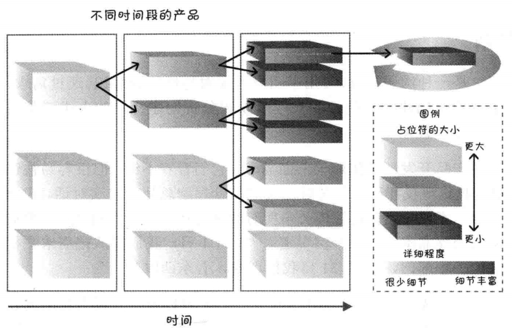
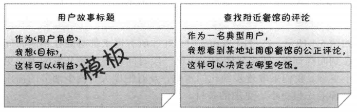
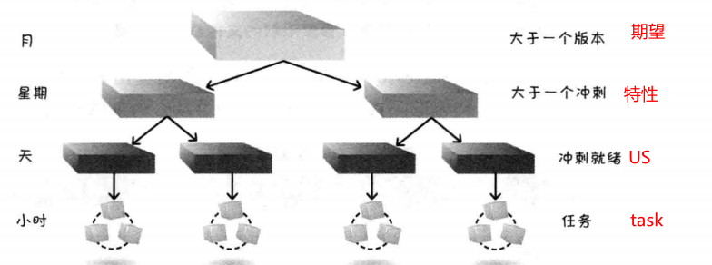
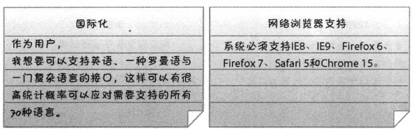
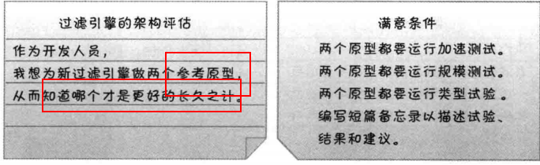
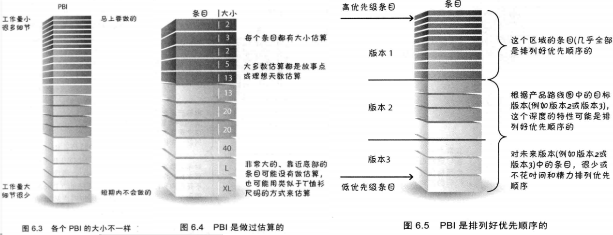
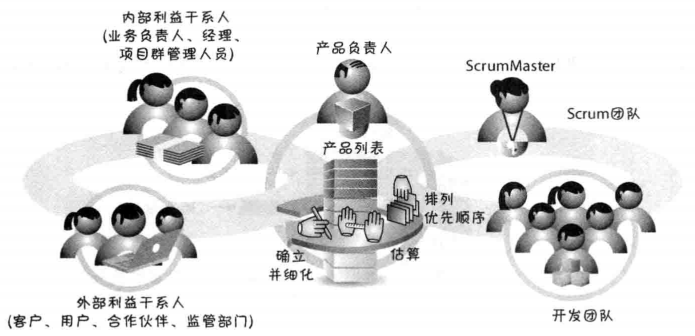
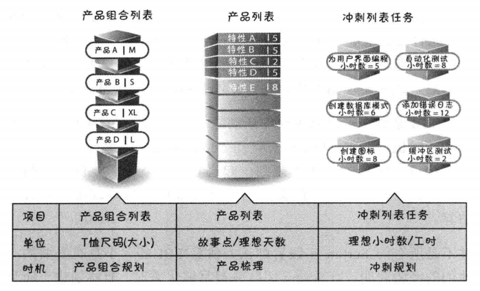
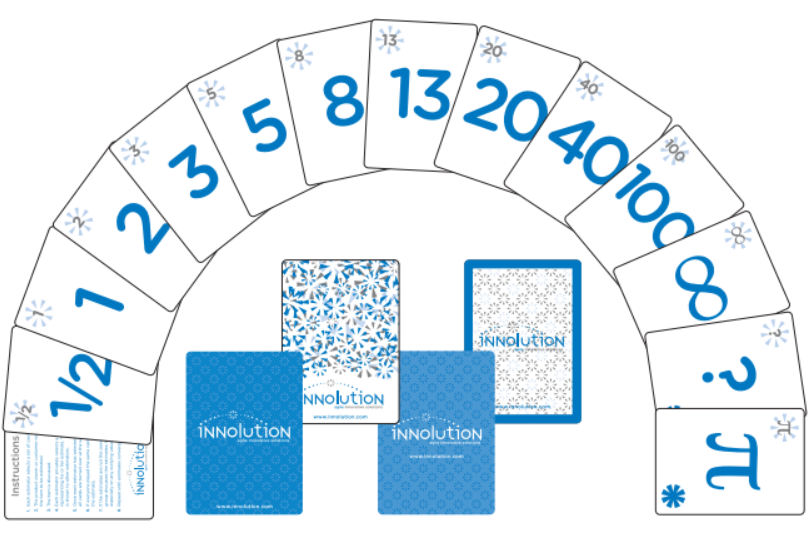

# 1 逐步细化
使用Scrum时，我们不会再前期就投入大量的时间和成本详细的描述需求。因为等过段时间进一步了解特性之后，**细节是会变的，所以要避免在今后可能丢弃的需求上投入太多精力和时间**。
在开始的时候，先使用PBI（占位符）代表大块的业务功能。随着时间的推移，经过讨论和详细了解之后，将最初的PBI修改成更小，更详细的PBI，**最终每个PBI可以作为一个足够小足够详细的User Story放入一个Sprint中**：

# 2 User Story

## 基本内容
用户故事是用于陈述业务价值的一种简便格式，帮助业务人员和开发人员都能理解需求。用户故事可以描述为以下三部分：

- 卡片：简洁地描述
- 对话：探讨需求，估算
- 确认：user story中包含确认信息，一般为满意的条件，**便于用作测试的验证**

User Story的通用模板如下：

## 详细程度
我们可以编写不同抽象层级的user story来捕获客户及用户需求：

> 注意，task不是User Story，在写User story时要避免task级别的细化

# 3 INVEST原则
INVEST原则用户衡量User Story是否足够好：

- 独立（Independent）：Story应该时独立的，相互之间时**松散耦合的**。相互依赖程度高的story会使估算和任务规划复杂化，很难确定优先级。
- 可协商（Negotiable）：story细节时可协商的，后续讨论细化
- 有价值（Valuable）：Story应该对客户和用户有价值，不然就应该丢掉。
   - **对于技术相关的工作（优化、代码结构搭建等）应该属于技术任务**，可以作为Story下属的task，步单独列为user story。
- 可估算（Estimatable）：可以估算出完成story的工作量和成本。可能的无法估算的原因：
   - story太大，太模糊
   - 知识积累不够，需要获取更多信息
- 大小合适（Samll）：
- 可测试（Testable）：story相关的测试要么通过，要么失败。完成story可以进行end to end的测试，不能写完代码却不可测试。

# 4 其他类型的Story

## 非功能性需求
非功能性需求代表了**系统级的约束**，它们会英雄产品列表中绝大多数的user story的设计与测试。**非功能性需求可以作为User story，也可以作为每个story的完成定义。**

## 知识获取型Story
获取需求或设计方案相关信息的探索活动，都叫做知识获取，包括：**原型、概念验证、试验、代码学习**等。学习和试验代码的工作可以作为story写入产品列表：

# 5 产品列表Product backlog
产品列表是一个按优先顺序排列的，预期产品功能列表，都是具有实际价值的特性和功能。

## 四大特征

- **详略得当**：每个user story的相近程度并不全都相同。马上要做的story在列表顶部，内容详细。后面的story内容粗略，留待后面补充
- **涌现的**：产品列表根据不断涌现的、有价值的信息持续更新。
- **做过估算的**：每个story都有大小估算，估计开发测试完成这个条目需要多少工作。
- **排列优先顺序的：**

## 制定产品列表的活动

- 确定并细化User Story
- 对Story进行点数估算
- 为story制定优先级顺序

上述活动和参与人员如下：

# 6 估算

## story point粒度
在整个生命周期，需要在不同的粒度级别上进行估算：

## 估算单位

- 故事点
- 理想天（**注意，不是自然天）**

## 规划扑克牌

### 牌面含义
扑克牌如下图所示，不同的点数有不同的涵义：

| 点数 | 解释 |
| --- | --- |
| 0 | 条目已经完成或条目太小不需要给出点数 |
| 1/2 | 标记微小的条目 |
| 1、2、3 | 标记小的条目 |
| 5、8、13 | 标记中等大小的条目。13是最大的条目，大于13的story需要再次拆分 |
| 20、40 | 标记大的条目，一个完整特性或主题级别的story |
| 100 | 标记非常大的特性，或一个史诗story |
| ∞（无穷大） | 条目太大无法给出点数 |
| ？ | 完全不了解，需要进一步研究和澄清，当前无法给出点数 |
| π（或咖啡杯） | 停止讨论，休息一下 |

### 规划扑克牌的使用规则

1. 产品负责人选择一个story，读给每个成员听
1. 开发团队讨论该story，并要求产品负责人澄清需要确认的问题
1. 每个成员私下选择一个牌作为自己的估算点数，此阶段不允许与其他成员讨论
1. 所有成员亮牌，如果大家选择的点数一致，则说明达成了共识；
1. 如果选择点数不一致，则每个成员需要解释自己估算的理由，大家集中展开讨论
1. 讨论过后，从新从第三步开始，直到达成共识

