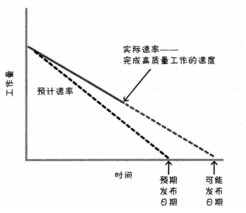
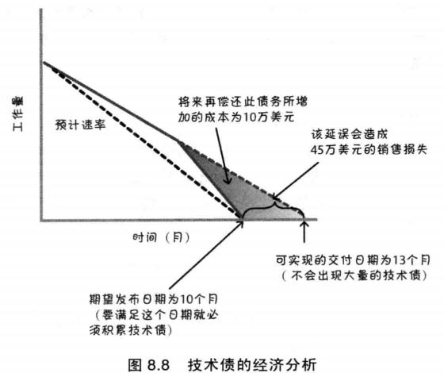
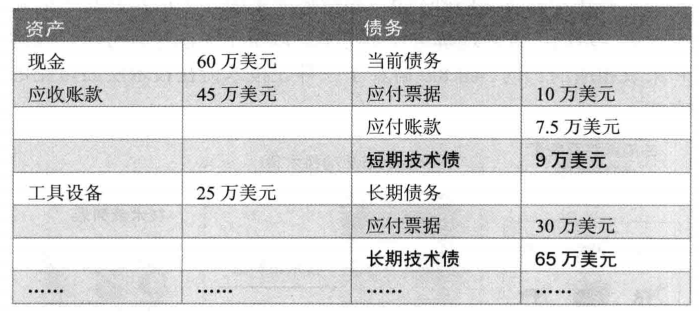
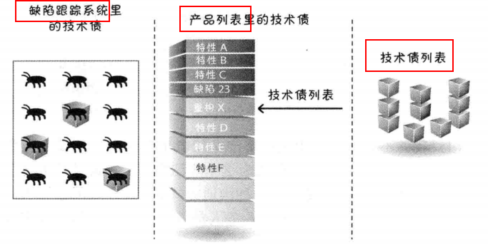
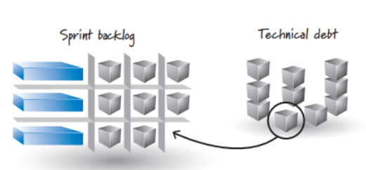

# 1 技术债的定义

**技术债**指我们有意选择的捷径，或可能损害软件系统的不良实践。例如下面常见的几种：

- 不合适或糟糕的设计
- 测试覆盖不充分
- 手工测试过多
- 集成和版本管理不善
- 缺乏平台经验

就像财务债，技术债也需要支付利息，通常是以**额外补做开发工作**的形式。我们可以选择继续支付利息（绕过问题），也可以选择偿清本金（重构代码等）。

# 2 技术债的后果

- 爆发点不可预期：到某个临界量，产品会变得不可管理或混乱
- 交付时间延长：当前或许节省了时间，实际却是借用了未来的时候，要还的
- 缺陷数量增加
- 开发和支持成本上升：继续开发新特性？修复现有缺陷？需要更多的成本
- 产品萎缩：产品越来越失去活力
- 可预测性降低
- 表现越来越差
- 挫败感增加：团队成员都倍受挫折，使得开发的乐趣消失殆尽
- 客户满意度降低

# 3 技术债的起因

- **不可避免的技术债**：不管如何预防都会积累
- **低级技术债**：团队成员、组织或开发过程不成熟导致
- **策略性技术债**：在债务累计收益大于债务成本时，选择承担债务不去修复

低级和策略性技术债一般是**迫于如期完工的压力**造成的，比如下面两个常见的误区：

- 试图通过加班提高速率，而不是修改范围或延长交付日期
- 减少测试以提高速率

# 4 管理技术债

## 管理应计技术债

- **使用良好的技术实践**：停止向产品增加低级债务，采用**简洁设计、测试驱动、持续集成、自动化测试、重构**等技术
- **使用强完成定义**：所有相关任务都完成，才算一个story完成，不能把一些之前该完成的工作拖到后期
- **理解技术债经济**：正确理解技术债如何影响决策：

## 让技术债可见

- **在业务层面可见**：量化技术债，在资产成本表中显示，可以让产品负责人有清晰的评判：

- **在技术层面可见**：可以将技术债作为列表，或加入产品开发列表，或专门的bug跟踪系统，以保证不会被遗忘

## 偿还技术债
五大选择方式：

- 并非所有的技术债都应该偿还：比如如下情况不需要偿还技术债
   - 行将就木的产品
   - 一次性的原型产品
   - 短命产品
- 童子军原则，有债就还：每次改动代码，就要尝试让产品设计和实现更好，而不是更差。团队需要流出一定比例的实践用于偿还技术债。
   - 提高每个user story的点数
   - 在sprint plan meeting上专门留出计划的时间
- 先偿还高利息的技术债
- 分期偿还技术债：将技术债务分摊到每个sprint中，分阶段完成
- 一边做有客户价值的任务，一边偿还技术债

