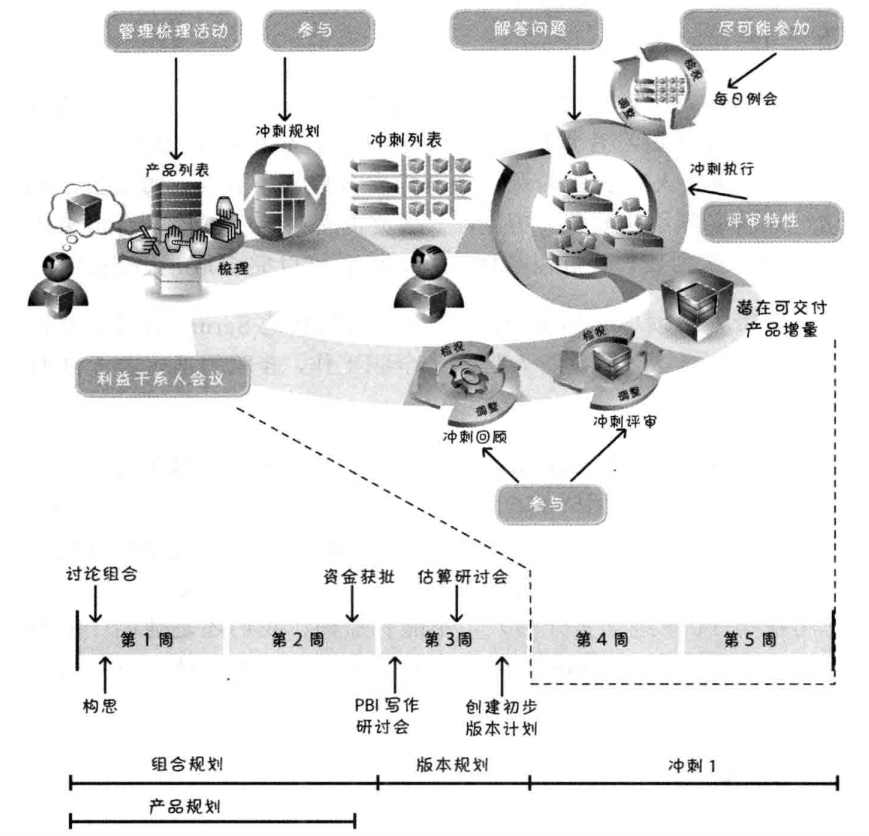

# 1 主要职责

# 2 需要具备的技能

# 3 日常工作内容

# 4 谁担任产品负责人
不同类型的产品开发工作中的产品负责人：

| 开发类型 | 产品负责人 |
| --- | --- |
| 内部开发 | 受益于解决方案的业务方代表或客户 |
| 商业开发 | 实际客户和用户的内部代理人：产品经理，市场人员，项目经理 |
| 外包开发 | 为解决方案出资并从中受益的公司代表或客户 |
| 组建团队（架构开发） | 能对列表中的技术条目排列出最佳优先顺序的技术人员 |

