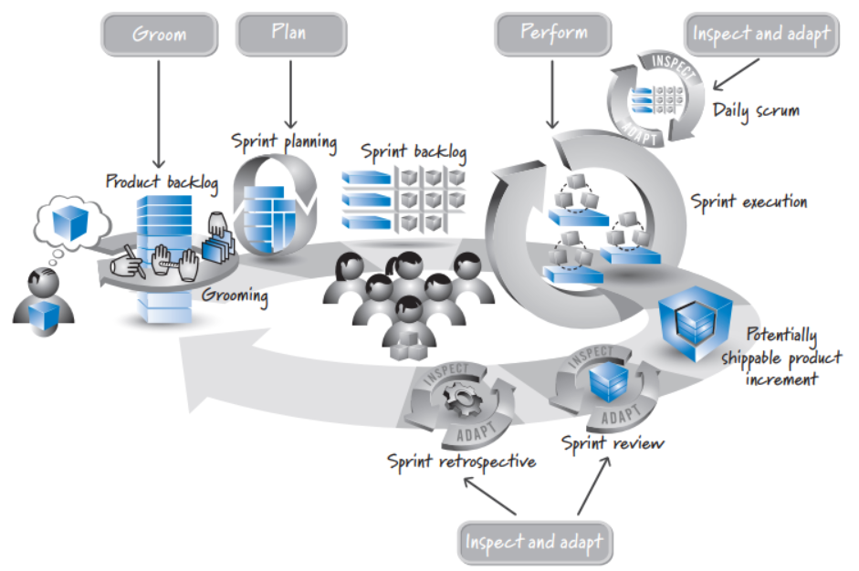
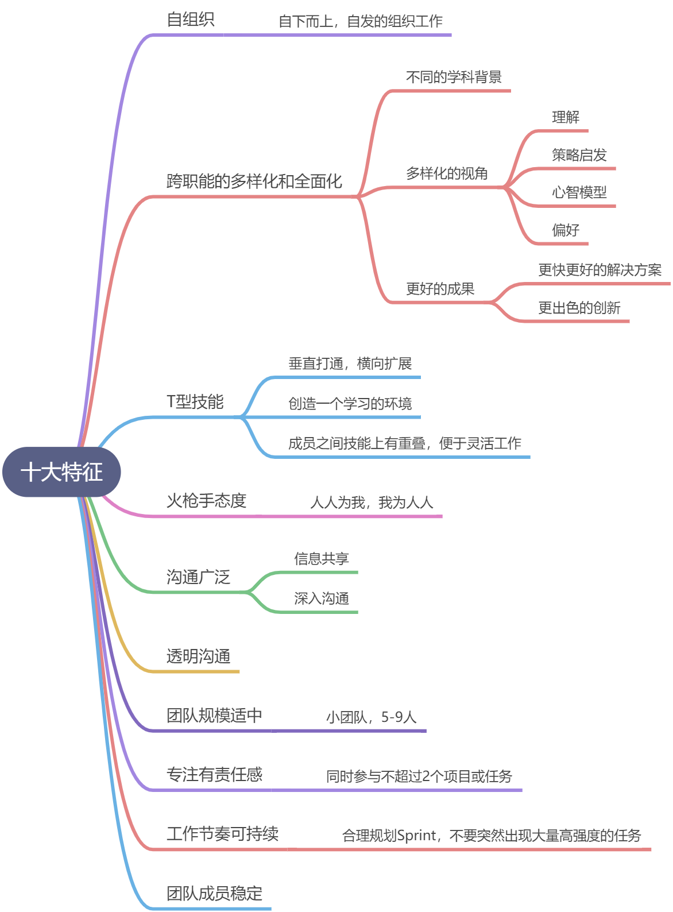
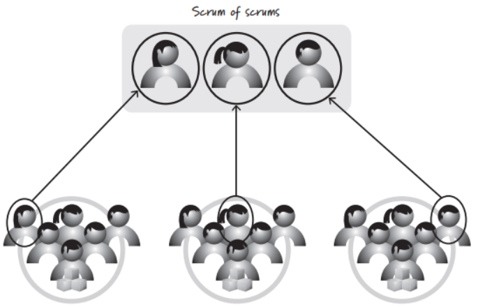
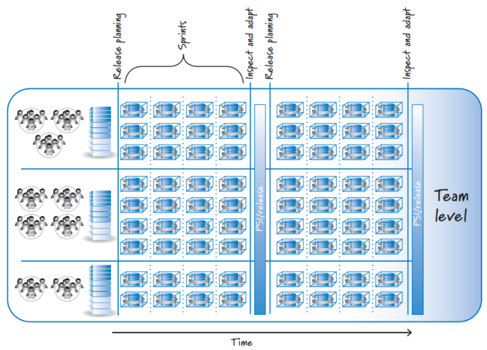

# 1 主要职责

# 2 团队的十大特征

# 3 团队结构
如果是小产品，按照上面的十大特征组建一个开发团队并找到合适的scrum master和产品负责人即可。如果是大型组织，则需要协调多个scrum团队的工作，需要团队间的合作。
协调多个团队的两个方法是：

- SOS： Scrum of scrum
- 版本火车

## Scrum of Scrum

- 我的团队完成了哪些功能，可能对其他团队产生什么影响
- 下次会议前，我的团队将做哪些事情
- 我的团队有哪些问题需要其他团队帮忙解决

## 版本火车
版本火车是按照一个共同的节奏协调跨团队的合作，使多个团队的愿景、规划和依赖关系保持一致，实现快速、灵活的工作流。**就像一个火车时刻表，没有团队按照约定的时间把东西放在火车上**。如果团队错过火车也没啥，因为后面还有另一列火车定点出发。
