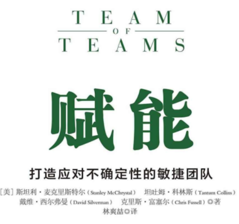

**赋能： 进行决策权力的“去中心化”**

# 自序

- 在我们的彻底变革中， 很少有计划之中的事， 也很少有计划是因为我们的事先预见而制订出来的。 我们开始不断地进行“**改变——评估——再改变**”这样的快速循环。我们正处于一个新环境中， 21世纪多种因素和人类永恒互动的综合作用， 使得我们需要充满活力， 需要不断适应新环境的做事方式。

- 与父辈相比或与祖父辈相比， 我们既不懒也不笨， 但**适用于他们的经验却就是无法成为我们获取成功的诀窍**。 我们别无选择， 只有理解并且适应这些变化。 在未来的几年里， 能否做到这一点将决定我们是否能成功。

- 人们对于效率依然会孜孜以求，但达到这一目的的方式必须有所变化。 效率依然是重要的， 但更加不可或缺的是调整适应不确定性并且持续变化的能力。

- 我们控制的组织、 我们确定的流程以及我们锻造并培育的关系与我们士兵的身体条件一样不再是一成不变的了，所以我们必须不停地领导一个组织向上攀登， 达到其必须具备的状态，必要时甚至要推动组织这么做。 **如果停止推动并且组织不再前进， 甚至安于现状， 组织就会倒退**。对于以前被证明有效的流程， 我们也会觉得沿用起来没问题， 却不去想这些流程到底还有没有效。 如果按部就班地做了以前多次做过的事情， 我们就很少会受到责备。不过成功的标准不应该是觉得舒服或避开责备。

# 一 不确定性已经显现

- 过去的战斗讲究的是规划和纪律， 如今则更讲求敏捷和创新。

- 在这场战斗中， 我们被迫清空大脑， 因为我们认为的那些战争和世界的运行方式已经失效。 我们必须**抛弃所熟悉的组织结构**， 并且沿着几条完全不同的线索重建它们， 将我们**刚强的架构置换成灵活的机体**， 因为面对复杂威胁正在掀起的巨浪， 这是唯一的制胜之道。
   - **共享意识**：极端透明的信息分享原则
   - **赋能**：决策权力的“去中心化”
   - 消除各单位之间的壁垒和等级制度

- 在今天的世界， 获取成功的办法更多的是应对持续变化的环境， 而不是根据一堆已知的或者相对稳定的变量进行选择。 敏捷性必须成为我们首要的素质，而不是效率。

- 一面面白色书写板开始出现在我们的总部，代替了地图的位置。很快，到处都能看到白色书写板。站在白色书写板四周，手上拿着记号笔，我们大声交流，分析哪些是我们知道的，哪些是我们怀疑的， 哪些又是我们所不知道的。**我们不再画静止的地理特征，不再画事物本身，而是画易变的关系，画事物之间的关系**。

- 我们在战场上所观察到的敌军行动， 其实更接近于下图中并不稳定的关系模式， 而不是我们所熟悉的自上而下的架构； 而后者正是我们在接受训练时所要设想面对的。伊拉克“基地”组织不是最大的， 也不是最强的， 不过和普罗透斯（经常变化外形使人无法捉到他）一样， 它是一个可怕的对手， 因为它可以随心所欲地改变自己的形态。

- 一个组织的健康程度就好像人类机体一样， 不能在真空中对其进行评价， 它是组织与周边环境互动的产物。

- 特拉法加战役：纳尔逊的核心做法是， 在其所统领的组织中培育一种文化， 让组织中所有的个体都有主动性， 并且**能够进行关键性的思考， 同时反对简单地执行命令**。
- **他获得成功的核心奥秘在于耐心， 在于不懈地培育自己属下的才干和自我调整能力**， 而这也是从理论上的战略走向实际胜利的必经节点，也因为这一点， 教条化的理论家和那些纸上谈兵的海军将领无法像真正的领导者那样获得决定性的成功。

# 二 还原论

- 知识在很大程度上是**经验法则**， 而人们要通过漫长的学徒期来积累经验， 才能成为够格的工匠。 一个老牌机械师写道： “机械师通常并不具备正确的、 充足的知识。 **有时有些人会给你一些不错的建议， 但这只是例外， 而非规律**。 "——太像公司当前的现状了。

- **泰勒科学管理：技术能力**与**组织运转方式**之间产生了不匹配， 通过严格的还原性优化、 标准化， 能够将技术潜力极大地发挥出来， 成为实际的生产力。（想想“发条型宇宙”理解这句话的意思）泰勒的哲学， 也就是把凭直觉做事的人换掉，将“管理”制度化作为纪律 。

- 还原论是当今管理理念的基石：大多数的组织架构图表看上去都十分类似： 一堆垂直化纵列的组合， 每个纵列其实就是一个部门， 专门负责一个领域； 还有一堆水平的分层， 代表了权力的等级， 而最顶端、 最有权力的那一层是唯一可以调用全部纵列的层级。 **处于顶端的人物， 我们认为他们应当负责战略决策； 处于底层的人物， 我们认为他们应当根据指示行动。**

# 三 复杂到错综复杂

- 在技术获得巨大进步的条件下， 依然存在着矛盾之处——我们预见未来的能力被削弱了。

- 速度与互赖性增加的后果就是， 与一个世纪或者几十年前相比， 现在在**任何特定时间框架内的特定动作， 都可能导致更多的潜在结果**。 有些行为曾经类似于台球桌上的两到三次撞击， 如今却会牵涉到几百次撞击。

- 我们想要解决“意想不到的旋涡”中的问题， 使用的工具却是专门为“发条型宇宙”设计的， 于是我们陷入了困境.

- 牛顿、 泰勒这些思想家推崇机械的、 还原论的思维——将任何事情都分解成几个构成部分， 或者对个体因素进行优化， 但运用这种思维去控制错综复杂体系的努力大多会归于无效， 有些还会造成毁灭性的后果。

- 大数据还是无法提供我们所渴求的、有效的**长期预测能力**。 充斥大量数据的记录可以用来解释错综复杂现象是如何发生的， 以及这些现象又会如何演化， 但它们无法告诉我们这些现象何时、何地会发生。理解和预测并不总是一回事。

- 亨利·明茨伯格： “在一片未知的水域给船只设定事先规划好的路线， 这将使得船只撞上冰山的可能性达到最大。

# 四 建立有效组织

- 《韧性思维》书中，将“韧性”写成“**一种体系抵消干扰，并且保持基本功能和架构的能力**”。在一个错综复杂的世界里，干扰是不可避免的，能否具有这种吸收冲击波的能力正变得越来越重要。

- 在一个“韧性十足”的体系里，管理者会接受这样一个事实：他们不可避免地会遭遇到不曾预料到的威胁，他们不会试图建立坚强的、专门化的防御力量，而是建立一些体系来抗击打，甚至试图从击打中获利。

- "潮流的变化实在难以驾驭，不要再想着去驾驭它， 我们其实可以建造更好的舟艇。"

- 当我们意识到伊拉克“基地”组织正在占据上风时，**我们的第一反应是更加努力地工作**，大多数大型组织一旦发现自己在竞争中落后也会这么做。我们部署更多的资源、投入更多的人力，并且在现有的作战模式中试图创造出更高的效率。

- 面对威胁，预测不是唯一的解决之道。应对一个错综复杂的环境，更有效的办法是发展出“ 韧性” ，学会如何重新布局以应对未知的世界
