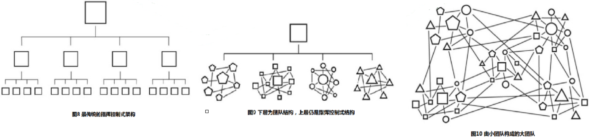

# 五 建立互信和目标共享的团队
- [联合航空173号班机事故](https://baike.baidu.com/item/%E8%81%94%E5%90%88%E8%88%AA%E7%A9%BA173%E5%8F%B7%E7%8F%AD%E6%9C%BA%E4%BA%8B%E6%95%85)在1978年， 航空公司的机组人员架构是命令型的，马尔本·A. 麦克布鲁姆分派任务，并且监督所有人完成任务的情况，他还可以发号施令，总之整个体系是为追求效率而设计的。一旦危机到来， 每个机组人员都会眼巴巴地看着他，等待他的指令。

- 海豹突击队之所以能够取得如此出色的战绩，并不仅仅是因为其成员出色的个人素质，还因为这批战士有机地融合成了一个整体。

- 打造超级团队。 第一步是要在队伍中建立起互信。在一个自上而下的指挥体系里， 重要的联系是垂直隶属关系， 而**团队建设则是一种网状关系的架构**（毕竟每个团队成员之间都有联系）。

- 海豹突击队并不是让成员根据上级明确的命令行事，而是让队员们能够在一个小团体内构筑互信，并且根据实际情况调整应对。为此，海豹突击队基本水下爆破训练的教官们专门打造了一个训练课程， 使士兵们单靠个人执行命令根本无法挺过来。

- 如果一支团队是由互信和明确的目的所锻造的，那么这支团队将更有战斗力。在面对迅速变化的局势时，这样的一群人能够即时反应，且迅速协调一致。

- 如果你去看一张传统的组织架构图，每个人的目标和对大背景的了解都是有局限性的、具体的，而他们的目标和对大背景的了解与整个组织的总体战略目标相去甚远。而应付错综复杂局面的团队成员必须**全面了解团队境况和总体目标**。只有当所有的成员都理解任务的目标以及战略背景时， 大家才能够对正在产生的风险做出评估， 并且明白该如何与队友进行互动。（就好像足球运动员不仅要能守住自己的那一块草皮， 而要对整块场地上发生的事情负责）

- 应对当今世界， 大家的战术反应是寻求更为强大的调整适应能力， 而小型互助团队相比于自上而下的统治性机构， 更具备这种能力。

- 指挥控制式架构与团队之间的基本架构是有区别的。 前者的基础是还原论的可预见性， 在执行事先计划好的流程时显得十分有效； 而后者在效率上或许有所欠缺， 但长处在于调整适应能力更强。

- 当团队中建立起互信和目标分享的特质后， 就有能力解决一些单个管理者无法预见的问题——**这些解决问题的方案往往是自下而上冒出来的， 而不是来自自上而下的命令**。

# 六 建立关系

- 分开来看， 每一支部队的成员都能在横向上展示出互信和对目标的共同追求， 但这些部队的对外联系却是垂直化的， 它们都与指挥部的上层结构连通， 使得自己就像组装线上的一名工人。 也就是说， **团队与团队之间的横向有效联系是不存在的**。

- 球队如果想要在比赛中如同一个整体般良好地运作， 既要有**专门化的分工**（守门员大多数时间里待在球门附近； 前锋大多数时间里则不用龟缩在球门附近）， 同时**在责任分工范围上还要有所重叠**（每个人都要能够临时做一些其他人的工作） 。 同时， 他们还要熟悉彼此的习惯和对一些问题的反应， 这样就能够本能地达成默契。

- 用团队架构的眼光来看我们的组织， 寻找横向联系上的薄弱点， 而不是让上级制订新的计划， 我们会发现类似的瓶颈在组织内所有的团队之间比比皆是， 这被称为“**断点**”。

- 办公室里的团队或许是具有凝聚力和调整适应力的，否则也只是空有“团队”的名号——管理者贴两张海报、准备会上发个言，然后就缩回办公室的一角，这种团队就是徒有其名。

- 小团队的架构之所以能够在局部见效，因为它比较小——在一个小团队内，成员彼此熟悉，并且共同度过成百上千个小时。一方面使小团队自身能够变得强悍， 另一方面却使小团队的类型无法在一个更广阔的范围内见效。

- 小团队所具备的优点，从组织的角度去看，有时候也是一柄双刃剑：一些特质使得小团队在获得足够的调整适应力后变得强悍，而这些特质又使得它与自己所处的总体架构格格不入。

- 当项目进度落后于计划时，增加人手的做法通常是无效的。他认为：**这就好像为了快点生出一个孩子， 分配9个女子去各怀一个月的孕**……一个软件的生产已经延迟，如果此时加派人力，则整个项目进度只会更加拖延。

- 我们的目标不是创建一支庞大的团队，我们需要创建一个由小团队构成的大团队。在一支由小团队构成的大团队中，每个个体成员无须与其他所有成员建立起关系，只要构成这个大团队的**各个小团队之间建立起小团队内部各成员之间那样的关系**就行了。（敏捷中的Scrum team？？）

- 我们不需要每一个成员去认识整个团队中的其他每一个成员，只需要每一个人去了解其他团队中的某个人。

