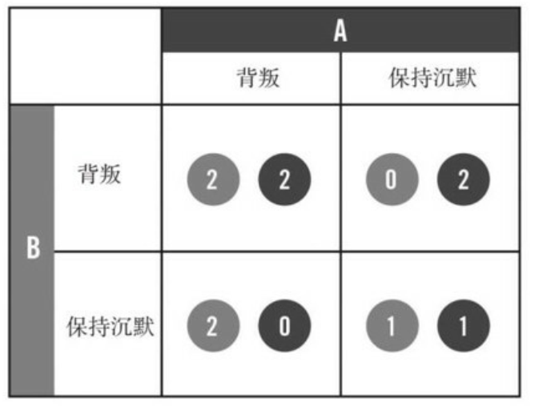

# 七 打造体系思维
- 此时，前汽车经销商身边的恐怖组织网络消失了。这样一来 我们手上的信息就一文不值了。从每个团队的角度来看，我们的这次行动都是成功的，但在总体上，我们还是在不知不觉中浪费了大量机会。在信息无法充分共享的情况下，指挥控制式上层结构统领下层的敏捷团队，就会产生这样的困扰。

- 遏制信息传播的做法，部分源自现代人对于安全的担忧，但也来自我们对清晰定义的、机械化流程的本能偏爱，无论在工厂车间内还是在组织架构表里，人们都只需知道自己的那一块工作职责所在。

- 冯·布朗指出：“你不能很简单地和承包商签合同， 让他制造土星五号火箭的一节， 然后就让他回去开工。”

- 冯·布朗创建出两种状态：“体系内”和“体系外”。那些“体系内”的人，必须对阿波罗计划的整体有所了解并且赞同。**专家们继续做各自专业领域内的事情，但他们同时也必须对整个项目有所了解，即便他们为了了解整个项目要花费本来用来做“本职工作”的时间，可能损害“效率”，也在所不惜**。

- 多样化的专业能力是必需的，**我们所需要的，是把各种专业化的知识形成一种整体的意识**。我们整支部队都有必要对作战环境和这个组织有一个基本、整体的认识。同时，我们也要保留每个团队各类出色的技能。

# 八 培养共享意识

- 在硅谷， 谷歌、 脸谱网以及其他巨头都使用开放式办公室， 让各支团队的成员、 让各个管理层级的人都能聚集在同一个地方。（Nokia的办公室就是这样）

- 新的、 淡化等级色彩的办公空间具备关键的结构和象征意义，但**仅仅把家具搬一搬是无法让整个组织获得新生的，我们还必须革新组织文化**。

- 要想获得意识共享的效果， 就要最大限度地在我们特遣部队内部， 以及和友军之间**提升透明度**。我们所需要的“透明度”是指组织内每个团队都能毫无障碍地随时知道组织其他部分的情况。

- 对于分享信息， 我们试图让那些不习惯的人变得习惯起来。 我们不变的指导原则就是“**在你觉得有可能违法之前， 一直要分享信息**”。

- 信息交叉分享使信息价值升值。信息分享得越广泛， 其价值就越高， 其所能激发出的力量也就越强大。

- 如果一个人或者一个单位能够输出高质量的情报、 能够可靠地与别人协作， 或者准确及时地提出警告， 则他们受欢迎和受尊敬的程度必然提升。 躺在功劳簿上也好， 咆哮怒喝也罢， **或许能够奏效一时， 却最终无济于事**。 

- 把大脑锁进箱子里没人能够受益， 把这些大脑拿出来才是关键的一步。

- 要在我们所需要的规模上实现透明度和信息分享， 我们不仅要重新设计我们的物理空间布局， 还要重新思考我们组织文化中的几乎每一步程序。

# 九 击败“囚徒困境”

- **囚徒困境**：两个罪犯即两个同案犯被逮捕了，他们被分别关到两个牢房里接受审讯。他们都被告知：“如果你保持沉默， 你会被判处一年徒刑；如果你出卖同伴， 你会获得自由； 但如果你的同伴出卖了你， 你就会蹲两年大狱。”出于竞争性的私利， 两个囚徒实际上都有动力去出卖对方。 然而，如同下图所显示的：
   - 如果两个囚徒互相出卖， 则他们获得的结果是一起蹲两年大狱。如果把这两个囚徒视为一个整体， 则这个结局对整体来说是最糟糕的；
   - 如果他们是一条心， 则他们获得的结局是都坐一年牢， 如果把这两个囚徒视为一个整体， 则这个结局对整体来说是最好的

- 囚徒困境的启示：
   - 囚徒困境意味着在某些情况下， **合作比竞争更好**。
   - 机构之间的竞争让它们不太愿意输出信息， 它们害怕兄弟单位不会做出相应的回应。 如果每个机构都能够配合， 则我们会取得对我们整体而言最好的结果， 但要取得这样的结果， 我们首先要克服囚徒困境。

- 如果B部队的一名作战人员，比如小布被交换到了A部队，则A部队不会把小布看成一次性的特例，而是将小布视为B部队的代表，这样**A部队对小布的感情和信任会扩展到整支B部队**，即便在B部队中，A部队只认识小布这么一个“交换生”也是如此。于是， 我们就能够慢慢地获取我们所需要的团队间的互信，从而战胜我们团队中所存在的“囚徒困境”。

- 在提名一些关键位置的关键联络官时，我们遵循两个标准：
   - 第一，如果这个人从你的团队中离去让你觉得无所谓，那么肯定要换一个人；
   - 第二， 如果这个人半夜两点打电话给你，你却认不出他的声音来，那么肯定要换一个人。

- 随着兄弟单位开始欣赏我们的关键联络官， 他们也开始向我们派遣关键联络官， 于是我们这里的人才库稳定膨胀。 因为我们的兄弟单位开始意识到， 他们派来的关键联络官越得力， 则它们一旦遇到至为艰难的任务时， 就能越快地得到特遣部队的帮助。

- “当我们一直在我们组织内低级别人员的面前谈论这一话题时，我们都能看到在哪里战事很激烈、在哪里并不激烈，哪里的人最需要情报监视与侦察系统。此外，有时候我们还会发现，交出这些资产其实对我们还是有利的……”有了这样的认识后，他们也能够确信，如果他们要执行一项至关重要的任务，也会在必要时拿到他们所要的装备。

- 诺贝尔奖获得者、 认知学家丹尼尔·卡尼曼认为人类在心理上有两条截然不同的决策路径：
   - “**第一体系”自动地、 迅速地做出决策， 而“第二体系”则深思熟虑地、 处心积虑地做出决策。**
   - 我们经常性地、 条件反射地使用“第一体系”， 比如当着某个人的面发泄情绪； 而在我们权衡利弊做出艰难的决定或试图进行错综复杂的计算时， 则会采用“第二体系”。

- 整体系统的理解和牢固的互相联系是两块基石， 正是这两块基石合在一起， 才让我们具备了共享意识。

- 一个团体或者一个群体“共同智力”的强弱， 与其各个成员的个人智力几乎没有联系， 而与各个成员之间的互动有更多的联系。

- **必须强行颠覆旧的制度， 用全新的管理架构取而代之。我们新的架构就是共享意识，它包含了两个因素：**
   - **极端的、分享性的透明度**
   - **在各个团队之间建立强关联**
