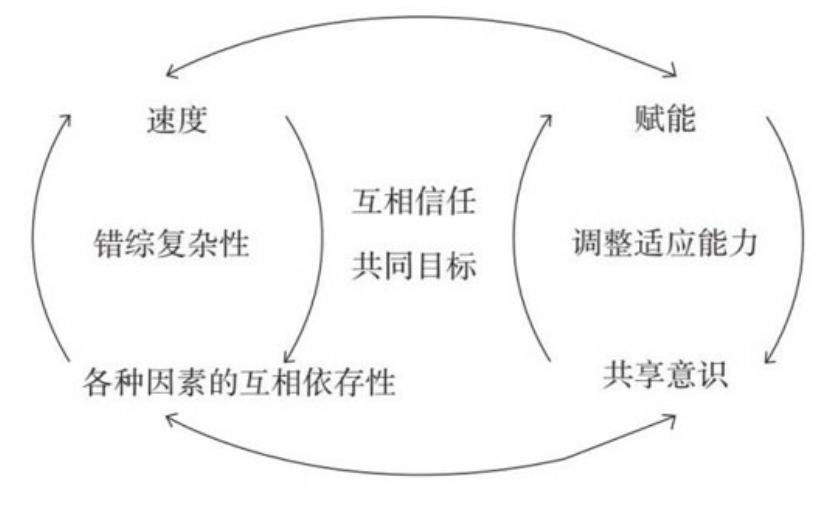

# 十二 新时代新的组织架构
- 一个组织应当向其成员赋能， 但这里有个前提： 赋能之前必须通过艰苦的努力在组织内建立起共享意识。

- 为了维系共享意识， 就必须悉心维系一套集中化的讨论区， 把大家聚拢在一起。** 赋能是一种激进的去中心化系统**， 将权力外推到组织的边缘。

- 我们的变革正是新一代心智模型的反映， 我们必须采用新一代的心智模型才能在21世纪游刃有余。 如果我们能够真正地迎合好这种变化， 我们就能释放出人类进步的巨大潜能。
