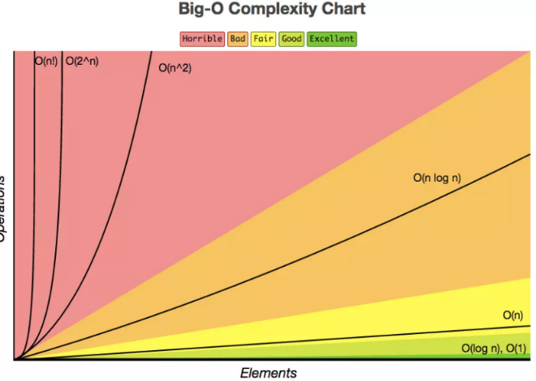

如何去衡量不同算法之间的优劣呢？主要还是从算法所占用的「时间」和「空间」两个维度去考量。
* **时间维度**：是指执行当前算法所消耗的时间，我们通常用「时间复杂度」来描述。
* **空间维度**：是指执行当前算法需要占用多少内存空间，我们通常用「空间复杂度」来描述。

# 时间复杂度
大O符号表示法，即 `T(n) = O(f(n))`。
其中n表示数据规模 ，O(f(n))表示运行算法所需要执行的指令数，和f(n)成正比。

常见的复杂度等级如下：



## 常数阶O(1)
无论代码执行了多少行，其他区域不会影响到操作，如下代码:
```c
void swapTwoInts(int &a, int &b){
    int temp = a;
    a = b;
    b = temp;
}
```

## 线性阶O(n)
在下面这段代码，for循环里面的代码会执行 n 遍，因此它消耗的时间是随着 n 的变化而变化的:
```c
int sum (int n){
    int ret = 0;
    for (int i = 0 ; i <= n ; i++){
       ret += i;
    }
    return ret;
}
```

## 平方阶O(n²)
当存在双重循环的时候，即把`O(n)`的代码再嵌套循环一遍，它的时间复杂度就是`O(n²)`了:
```c
void selectionSort(int arr[], int n){
    for(int i = 0; i < n ; i++){
      int minIndex = i;
      for (int j = i + 1; j < n ; j++ )
        if (arr[j] < arr[minIndex])
            minIndex = j;
 
      swap ( arr[i], arr[minIndex]);
    }
}
```
当然，双循环并不完全是`O(n²)`，如果某一层循环不需要循环到n，到某个值停止，那复杂度就变成了`O(n*m)`。

## 对数阶O(logn)
比如，在二分查找法的代码中，通过while循环，**成2倍数的缩减搜索范围**，也就是说需要经过 `log2^n`次即可跳出循环。


## 线性对数阶O(nlogn)
将时间复杂度为O(logn)的代码循环N遍的话，那么它的时间复杂度就是`n * O(logn)`，也就是了`O(nlogn)`。

# 递归的时间复杂度
如果递归函数中，只进行一次递归调用，递归深度为depth，在每个递归的函数中，时间复杂度为T，则总体的时间复杂度为`O(T * depth)`。

递归算法中比较难计算的是多次递归调用，比如下面这种：
```c
// O(2^n) 指数级别的数量级
int f(int n){
    if (n == 0) return 1;
    return f(n-1) + f(n - 1);//两个递归
}
```

# 空间复杂度
一个程序的空间复杂度是指运行完一个程序所需内存的大小。利用程序的空间复杂度，可以对程序的运行所需要的内存多少有个预先估计。一般分为两部分
* **固定部分**：这部分空间的大小与输入/输出的数据的个数多少、数值无关。主要包括指令空间（即代码空间）、数据空间（常量、简单变量）等所占的空间。这部分属于静态空间。
* **可变空间**：这部分空间的主要包括动态分配的空间，以及递归栈所需的空间等。这部分的空间大小与算法有关。

一个算法所需的存储空间用f(n)表示。S(n)=O(f(n))，其中n为问题的规模，S(n)表示空间复杂度。

# 时间和空间的关系
对于一个算法，其时间复杂度和空间复杂度往往是相互影响的。
* 当追求一个较好的时间复杂度时，可能会使空间复杂度的性能变差，即可能导致占用较多的存储空间
* 反之，求一个较好的空间复杂度时，可能会使时间复杂度的性能变差，即可能导致占用较长的运行时间。

# Big O Cheat Sheet

[常见数据结构和算法的复杂度速查表](./bigOSheet.pdf)

