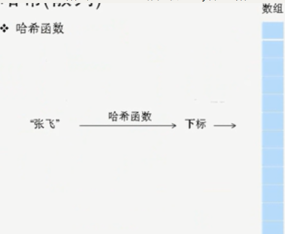

## 哈希函数

哈希映射本质是数组，通过特殊的**哈希函数**将key转换成数组的index，进行存储和读取。所以速度很快，而**哈希函数**至关重要：




## code

```cpp
#ifndef HASHMAP_H
#define HASHMAP_H
#include <vector>
#include <cstdlib>

template<typename Key, typename Value>
class HashMap
{
public:
    HashMap(int size = 101) : arr(size)
    {
        currentSize = 0;
    }
    void Put(const Key& k, const Value& v)
    {
        int index = hash(k);
        arr[index] = DataEntry(k,v);
        currentSize++;
    }
    Value Get(const Key& k)
    {
        int index = hash(k);
        if (arr[index].key == k)
            return arr[index].value;

        else
            return Value();
    }
    //关键，哈希函数
    unsigned hash(const Key& k) const
    {
        unsigned int hashValue = 0;
        for (auto i : k) {
            hashValue = 37 * hashValue + i;
        }
        hashValue %= arr.size();
        return hashValue;
    }
private:
    struct DataEntry
    {
        Key key;
        Value value;
        DataEntry(const Key& k=Key(), const Value& v=Value()):key(k),value(v){}
    };
    std::vector<DataEntry> arr;
    int currentSize;
};

#endif // HASHMAP_H
```
