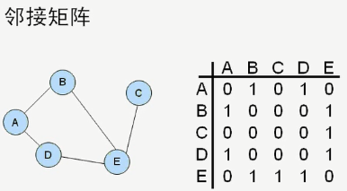
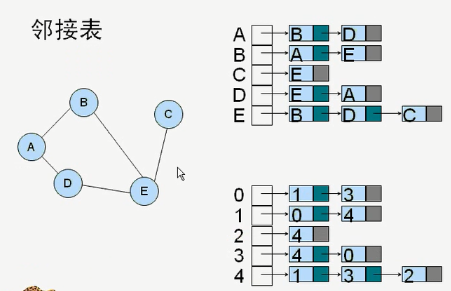
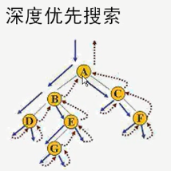
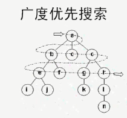

# 图的表示

## 邻接矩阵

相连的标1，不相连的为0：



```cpp
#ifndef GRAPHVERTEX_H
#define GRAPHVERTEX_H
#include <iostream>
//节点
class Vertex
{
public:
    Vertex(char lab):lab(lab){}
private:
    char lab;
};

//图
class Graph
{
public:
    Graph();
    ~Graph();
    void addVertex(char lab);
    void addEdge(int start, int end);
    void printMatrix();
private:
    Vertex* list[20]; //保存图的每个节点
    int num; //节点个数
    int Mat[20][20]; //邻接矩阵
};

Graph::Graph()
{
    num = 0;
    for (int i = 0; i < 20; i++)
        for (int j = 0; j < 20; j++)
            Mat[i][j] = 0;
}

Graph::~Graph()
{
    for (int i = 0; i < num; i++)
        delete list[i];
}

void Graph::addVertex(char lab)
{
    list[num++] = new Vertex(lab);
}

void Graph::addEdge(int start, int end)
{
    //对称，A-B和B-A都要置1
    Mat[start][end] = 1;
    Mat[end][start] = 1;
}

void Graph::printMatrix()
{
    for (int i = 0; i < num; i++)
    {
        for (int j = 0; j < num; j++)
            std::cout<<Mat[i][j]<<" ";
        std::cout<<std::endl;
    }
}
#endif // GRAPHVERTEX_H
```


## 邻接表


```cpp
#ifndef GRAPHTABLE_H
#define GRAPHTABLE_H
#include <list>
#include <iostream>

//图
template<typename T>
class Graph
{
public:
    Graph(const int num):n(num)
    {
        vertexList = new T*[n];
        headNodes = new std::list<int>[n];//一个节点对应一个链表
        nVerts = 0;
    }
    ~Graph()
    {
        delete [] vertexList;
        delete [] headNodes;
    }
    void addVertex(T* lab);
    void addEdge(int start, int end);
    void printNodes();
    void printLines();
private:
    T** vertexList; //保存所有节点的列表
    std::list<int>* headNodes;
    int n; //节点个数
    int nVerts; //计数用
};

template<typename T>
void Graph<T>::addVertex(T* lab)
{
    vertexList[nVerts++] = lab;
}

template<typename T>
void Graph<T>::addEdge(int start, int end)
{
    headNodes[start].push_back(end);
    headNodes[end].push_back(start);
}

template<typename T>
void Graph<T>::printNodes()
{
    for(int i=0; i<nVerts; i++)
        std::cout<<*vertexList[i]<<" ";
    std::cout<<std::endl;
}

template<typename T>
void Graph<T>::printLines()
{
    for(int i=0; i<nVerts; i++)
    {
        std::cout<<i<<"->";
        for(std::list<int>::iterator it=headNodes[i].begin(); it!=headNodes[i].end(); it++)
            std::cout<<*it<<"->";
        std::cout<<"end"<<std::endl;
    }
}
#endif // GRAPHTABLE_H
```


# 图的搜索
[graphvertex.h](https://www.yuque.com/attachments/yuque/0/2020/txt/690827/1582507801776-8b42ea7b-6fb8-447a-a378-c19703d4e0f2.txt?_lake_card=%7B%22uid%22%3A%221577679165933-0%22%2C%22src%22%3A%22https%3A%2F%2Fwww.yuque.com%2Fattachments%2Fyuque%2F0%2F2020%2Ftxt%2F690827%2F1582507801776-8b42ea7b-6fb8-447a-a378-c19703d4e0f2.txt%22%2C%22name%22%3A%22graphvertex.h%22%2C%22size%22%3A3232%2C%22type%22%3A%22text%2Fplain%22%2C%22ext%22%3A%22txt%22%2C%22progress%22%3A%7B%22percent%22%3A99%7D%2C%22status%22%3A%22done%22%2C%22percent%22%3A0%2C%22id%22%3A%22yWpPV%22%2C%22card%22%3A%22file%22%7D)


## DFS深度优先搜索-->使用栈

从起点开始沿着一条路径走到头，再往回返一个节点，再走另一条路径：



```cpp
//下列代码基于邻接矩阵图，类代码请参考上面代码
void Graph::showVertex(int index)
{
    //v为节点下标
    std::cout<<list[index]->lab<<" ";
}

int Graph::getNextUnVisitedVertex(int index)
{
    for (int i=0; i<num; i++)
    {
        if(Mat[index][i] == 1 && list[i]->isVisited == false)
            return i;
    }
    return -1;
}

void Graph::DFS()
{
    stack<int> gStack;//栈用来保存节点的index
    //从0个节点开始显示
    list[0]->isVisited = true;
    showVertex(0);
    gStack.push(0);//将访问过的节点放入栈

    int index;
    while (gStack.size() > 0)
    {
        index = getNextUnVisitedVertex(gStack.top());
        if (index == -1)
        {
            gStack.pop();//往回返一个节点，删除当前
        }
        else
        {
            list[index]->isVisited = true;
            showVertex(index);
            gStack.push(index);
        }
    }

    for(int i=0; i<num; i++)
        list[i]->isVisited = false;//还原记得状态

}
```


## BFS广度优先搜索-->使用队列

从起点开始，遍历所有与该节点相连的节点，一次往后：



```cpp
void Graph::BFS()
{
    queue<int> gQueue;//保存访问过的节点index
    //从0个节点开始显示
    list[0]->isVisited = true;
    showVertex(0);
    gQueue.push(0);//将访问过的节点放入栈

    int index;
    while (gQueue.size() > 0)
    {
        index = getNextUnVisitedVertex(gQueue.front());
        while (index != -1)
        {
            //找出当前节点所有关联节点，放入队列
            list[index]->isVisited = true;
            showVertex(index);
            gQueue.push(index);
            index = getNextUnVisitedVertex(gQueue.front());
        }

        gQueue.pop();//删除当前节点，因为已经show
    }

    for(int i=0; i<num; i++)
        list[i]->isVisited = false;//还原记得状态
}
```
