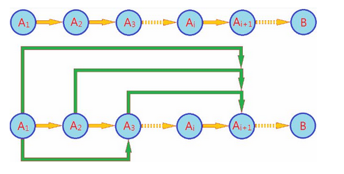

## 1. 什么是动态规划

已知问题规模为n的前提A，求解一个未知解B。（我们用An表示“问题规模为n的已知条件”）此时，如果把问题规模降到0，即已知A0，可以得到A0->B.

- 如果从A0添加一个元素，得到A1的变化过程。即A0->A1; 进而有A1->A2; A2->A3; …… ; Ai->Ai+1. 这就是严格的归纳推理，也就是我们经常使用的**数学归纳法**
- 对于Ai+1，只需要它的上一个状态Ai即可完成整个推理过程（而不需要更前序的状态）。我们将这一模型称为马尔科夫模型。对应的推理过程叫做“**贪心法**”。

然而，Ai与Ai+1往往不是互为充要条件，随着i的增加，有价值的前提信息越来越少，我们无法仅仅通过上一个状态得到下一个状态，因此可以采用如下方案：

- {A1->A2}; {A1, A2->A3}; {A1,A2,A3->A4};……; {A1,A2,...,Ai}->Ai+1. 这种方式就是**第二数学归纳法**。
- **对于Ai+1需要前面的所有前序状态才能完成推理过程**。我们将这一模型称为高阶马尔科夫模型。对应的推理过程叫做“**动态规划法**”。

上述两种状态转移图如下图所示：




## 2. 能用动规解决的问题的特点

能采用动态规划求解的问题的一般要具有3个性质：

1. **最优化原理**：如果问题的最优解所包含的子问题的解也是最优的，就称该问题具有最优子结构，即满足最优化原理
2. **无后效性**：即某阶段状态一旦确定，就不受这个状态以后决策的影响。也就是说，某状态以后的过程不会影响以前的状态，只与当前状态有关。
3. **有重叠子问题**：即子问题之间是不独立的，一个子问题在下一阶段决策中可能被多次使用到。（该性质并不是动态规划适用的必要条件，但是如果没有这条性质，动态规划算法同其他算法相比就不具备优势）


## 3. 动规解题的一般思路

动态规划所处理的问题是一个多阶段决策问题，一般由初始状态开始，通过对中间阶段决策的选择，达到结束状态。这些决策形成了一个决策序列，同时确定了完成整个过程的一条活动路线(通常是求最优的活动路线)。如图所示。动态规划的设计都有着一定的模式，一般要经历以下几个步骤。

`初始状态→│决策１│→│决策２│→…→│决策ｎ│→结束状态`

1. 划分阶段：按照问题的时间或空间特征，把问题分为若干个阶段。在划分阶段时，注意划分后的阶段一定要是有序的或者是可排序的，否则问题就无法求解
2. 确定状态和状态变量：将问题发展到各个阶段时所处于的各种客观情况用不同的状态表示出来。当然，状态的选择要满足无后效性。
3. 确定决策并写出状态转移方程：因为决策和状态转移有着天然的联系，状态转移就是根据上一阶段的状态和决策来导出本阶段的状态。所以如果确定了决策，状态转移方程也就可写出。但事实上常常是反过来做，根据相邻两个阶段的状态之间的关系来确定决策方法和状态转移方程。
4. 寻找边界条件：给出的状态转移方程是一个递推式，需要一个递推的终止条件或边界条件。

一般，只要解决问题的阶段、状态和状态转移决策确定了，就可以写出状态转移方程（包括边界条件）。

**实际应用中可以按以下几个简化的步骤进行设计**：

1. **分析最优解的性质，并刻画其结构特征**
2. **递归的定义最优解。**
3. **以自底向上或自顶向下的记忆化方式（备忘录法）计算出最优值**
4. **根据计算最优值时得到的信息，构造问题的最优解**


## 4. 算法实现的说明

动态规划的主要难点在于理论上的设计，也就是上面4个步骤的确定，一旦设计完成，实现部分就会非常简单。使用动态规划求解问题，最重要的就是确定动态规划三要素：

- 问题的阶段
- 每个阶段的状态
- 从前一个阶段转化到后一个阶段之间的递推关系。

**递推关系必须是从次小的问题开始到较大的问题之间的转化，从这个角度来说，动态规划往往可以用递归程序来实现，不过动态规划可以充分利用前面保存的子问题的解来减少重复计算，所以对于大规模问题来说，有递归不可比拟的优势，这也是动态规划算法的核心之处**。

确定了动态规划的这三要素，整个求解过程就可以用一个**最优决策表**来描述，**最优决策表是一个二维表，其中行表示决策的阶段，列表示问题状态，表格需要填写的数据一般对应此问题的在某个阶段某个状态下的最优值**（如最短路径，最长公共子序列，最大价值等），**填表的过程就是根据递推关系，从1行1列开始，以行或者列优先的顺序，依次填写表格，最后根据整个表格的数据通过简单的取舍或者运算求得问题的最优解**。

`f(n,m)=max{f(n-1,m), f(n-1,m-w[n])+P(n,m)}`


## 5. 算法实现的步骤

1. 创建一个一维数组或者二维数组，保存每一个子问题的结果，具体创建一维数组还是二维数组看题目而定，基本上如果题目中给出的是一个一维数组进行操作，就可以只创建一个一维数组，如果题目中给出了两个一维数组进行操作或者两种不同类型的变量值，比如背包问题中的不同物体的体积与总体积，找零钱问题中的不同面值零钱与总钱数，这样就需要创建一个二维数组。
注：需要创建二维数组的解法，都可以创建一个一维数组运用滚动数组的方式来解决，即一位数组中的值不停的变化，后面会详细徐叙述
2. 设置数组边界值，一维数组就是设置第一个数字，二维数组就是设置第一行跟第一列的值，特别的滚动一维数组是要设置整个数组的值，然后根据后面不同的数据加进来变幻成不同的值。
3. 找出状态转换方程，也就是说找到每个状态跟他上一个状态的关系，根据状态转化方程写出代码。
4. 返回需要的值，一般是数组的最后一个或者二维数组的最右下角。

代码基本框架：

```c
for(j=1; j<=m; j=j+1) // 第一个阶段
    xn[j] = 初始值;
 
  for(i=n-1; i>=1; i=i-1)// 其他n-1个阶段
    for(j=1; j>=f(i); j=j+1)//f(i)与i有关的表达式
      xi[j]=j=max（或min）{g(xi-[j1:j2]), ......, g(xi-1[jk:jk+1])};
 
 t = g(x1[j1:j2]); // 由子问题的最优解求解整个问题的最优解的方案
 
 print(x1[j1]);
 
 for(i=2; i<=n-1; i=i+1）
 {  
      t = t-xi-1[ji];
 
      for(j=1; j>=f(i); j=j+1)
         if(t=xi[ji])
              break;
 }
```


## 6. 典型示例

下面通过几个典型例子，从简单到难帮助我们理解动态规划。


### 1、斐波那契数列

斐波那契数列大家都很熟悉，而且知道用递归可以很容易的做出来

```c
int solutionFibonacci(int n)
{
    if(n == 0)
    {
        return 0;
    }
    else if(n == 1)
    {
        return 1;
    }
    else
    {
        return solutionFibonacci(n-1)+solutionFibonacci(n-2);
    }
}
```

**如果用动态规划，就是把结果存到一个数组中**。

```c
int solutionFibonacci(int n)
{
	if(n==0)
    {
		return 0;
	}
    else if(n == 1)
    {
		return 1;
	}
    else
    {
		vector<int> result(n+1);
		result[0] = 0;
		result[1] = 1;
		for(int i=2;i<=n;i++){
			result[i] = result[i-1] + result[i-2];
		}
    }
	return result[n];
}
```

与之类似的还有：

- 跳台阶问题：每次只能跳一个或者两个台阶，跳到n层台阶上有几种方法
- 填充长方体问题：将一个2*1的长方体填充到2*n的长方体中，有多少种方法


### 2、数组最大不连续递增子序列

arr[] = {3,1,4,1,5,9,2,6,5}的最长递增子序列长度为4。即为：1,4,5,9

设置一个数组temp，长度为原数组长度，数组第i个位置上的数字代表0...i上最长递增子序列，当增加一个数字时，最大递增子序列可能变成前面最大的递增子序列+1，也可能就是前面最大递增子序列，这需要让新增加进来的数字arr[i]跟前面所有数字比较大小，即

- 当 arr[i] > arr[j]，temp[i] = max{temp[j]}+1，其中，j 的取值范围为：0,1...i-1
- 当 arr[i] < arr[j]，temp[i] = max{temp[j]}，j 的取值范围为：0,1...i-1

所以状态转换方程为temp[i]=max{temp[i-1], temp[i-1]+1}

```c
int MaxChildArrayOrder(vector<int>& a)
{
	int n = a.size();
	vector<int> temp(n, 1);//temp[i]代表0...i上最长递增子序列,初始值都为1

	for(int i=1;i<n;i++)
    {
		for(int j=0;j<i;j++)
        {
			if(a[i]>a[j]&&temp[j]+1>temp[i])
			{
				//如果有a[i]比它前面所有的数都大，则temp[i]为它前面的比它小的数的那一个temp+1取得的最大值
				temp[i] = temp[j]+1;
			}
		}
	}
	int max = temp[0];
	//从temp数组里取出最大的值
	for(int i=1;i<n;i++)
    {
		if(temp[i]>max)
         {
			max = temp[i];
		}
	}
	return max;
}
```


### 3、数组最大连续子序列和

如arr[] = {6,-1,3,-4,-6,9,2,-2,5}的最大连续子序列和为14。即为：9,2,-2,5

```c
int MaxContinueArraySum(vector<int>& a) 
{
	int n = a.size();
	int max = a[0];
	int sum = a[0];
	for (int i = 1; i < n; i++)
	{
		sum = std::max(sum + a[i], a[i]);//sum每次保存到第i个位置，所能得到的最大的和
		if (sum >= max)
		{
			max = sum;
		}
	}
	return max;
}
```


### 4、(最便于理解的问题）数字塔从上到下所有路径中和最大的路径

数字塔是第i行有i个数字组成，从上往下每个数字只能走到他正下方数字或者正右下方数字，求数字塔从上到下所有路径中**和最大的路径**，如有下数字塔

3

1    5

8    4    3

2    6    7    9

6    2    3    5    1

最大路径是3-5-3-9-5，和为25。我们可以分别从从上往下看跟从下往上看两种动态规划的方式去解这个题

**从上往下看**：当从上往下看时，每进来新的一行，新的一行每个元素只能选择他正上方或者左上方的元素，也就是说，第一个元素只能连他上方的元素，最后一个元素只能连他左上方的元素，其他元素可以有两种选择，所以需要选择加起来更大的那一个数字，并把这个位置上的数字改成相应的路径值，具体过程如下图所示

3                            3                            3                            3

1    5                      4    8                      4    8                      4    8

8    4    3                8    4    3                12   12  11             12   12   11

2    6    7    9          2    6    7    9           2    6    7    9         14   18   19   20

6    2    3    5    1    6    2    3    5    1     6    2    3    5    1    20   20   22   25   21

所以最大值就是最底层的最大值也就是25。

**具体运算过程**：建立一个n*n的二维数组dp[][]，n是数字塔最后一行的数字个数，二维数组每一行数字跟数字塔每一行数字个数一样，保存的值是从上方到这一个位置最大路径的值，填入边界值dp[0] [0]=3，每一行除了第一个值跟最后一个值，其他的值选择上方或者左上方更大的值与这个位置上的值相加得来的值，即dp[i][j]=Math.max(dp[i-1] [j-1], dp[i-1] [j]) + n[i][j]

```java
public static int minNumberInRotateArray(int n[][]) {
		int max = 0;
		int dp[][] = new int[n.length][n.length];
		dp[0][0] = n[0][0];//第一行
		for(int i=1;i<n.length;i++){
			for(int j=0;j<=i;j++){
				if(j==0){
					//如果是第一列，直接跟他上面数字相加
					dp[i][j] = dp[i-1][j] + n[i][j];
				}else{
					//如果不是第一列，比较他上面跟上面左面数字谁大，谁大就跟谁相加，放到这个位置
					dp[i][j] = Math.max(dp[i-1][j-1], dp[i-1][j]) + n[i][j];
				}
				max = Math.max(dp[i][j], max);
			}
		}
		return max;
	}
```

**优化**：动态规划中每一个需要创建一个二维数组的解法，都可以换成只创建一个一维数组的滚动数组解法，依据的规则是一般二维数组中存放的是所有的结果，但是一般我们需要的结果实在二维数组的最后一行的某个值，前面几行的值都是为了得到最后一行的值而需要的，所以可以**开始就创建跟二维数组最后一行一样大的一维数组，每次存放某一行的值，下一次根据这一行的值算出下一行的值**，在存入这个数组，也就是把这个数组滚动了，最后数组存储的结果就是原二维数组中最后一行的值。

拿到本题来说，开始创建一个一维数组dp[n]，初始值只有dp[0]=3，新进来一行时，仍然遵循dp[i] [j]=Math.max(dp[i-1] [j-1], dp[i-1] [j]) + n[i] [j]，现在为求dp[j]，所以现在dp[i-1] [j]其实就是数组中这个位置本来的元素即dp[j]，而dp[i-1] [j-1]其实就是数组中上一个元素dp[j-1]，也就是说dp[j]=Math.max(dp[j], dp[j-1])+n[i] [j]

```java
public static int minNumberInRotateArray2(int n[][]) {
		int[] temp = new int[n.length];
		temp[0] = n[0][0];
		for(int i=1;i<n.length;i++){
			for(int j=i;j>=0;j--){
				if(j==i){//最后一个，值是确定的，当前值+左上方的值
					temp[i]=temp[i-1]+n[i][j];
				}else if(j==0){//第一个，值确定，当前值+上方值
					temp[0]+=n[i][0];
				}else{
					temp[j]=Math.max(temp[j], temp[j-1])+n[i][j];
				}
			}
		}
		int max = temp[0];
		//从temp数组里取出最大的值
		for(int i=1;i<temp.length;i++){
			if(temp[i]>max){
				max = temp[i];
			}
		}
		return max;
	}
```

这样空间复杂度就大幅度下降了。

从下往上看时：从下往上看时大体思路跟从上往下看一样，但是要简单一些，因为不用考虑边界数据，从下往上看时，每进来上面一行，上面一行每个数字有两条路径到达下面一行，所以选一条最大的就可以

3                            3                            3                           25

1    5                      1    5                      1    5                     18   22

8    4    3                8    4    3                17  16  17              17  16  17

2    6    7    9          8    9    12  14         8    9   12  14         8    9    12  14

6    2    3    5    1    6    2    3    5    1     6    2    3    5    1    6    2    3    5    1
所以最大值就是最上面数字就是25.

具体方法也是建立一个二维数组，最下面一行数据添到二维数组最后一行，从下往上填数字，所以状态转化方程是dp[i][j]=Math.max(dp[i+1][j+1], dp[i+1][j]) + n[i][j]，具体解决方法跟从上往下看一样，就不写具体代码了。

优化：滚动数组，只创建一个一维数组，数组初始值是数字塔最下面一行的值，每次新加一行值，将数组中的值改变，最后数组中第一个数字就是最大路径的值。状态转化方程就是temp[j] = Math.max(temp[j], temp[j+1])+n[i][j]。具体代码如下

```java
public static int minNumberInRotateArray3(int n[][]) {
		int[] temp = new int[n.length];
		for(int i=0;i<n.length;i++){
			temp[i] = n[n.length-1][i];
		}
		for(int i=n.length-2;i>=0;i--){
			for(int j=0;j<=i;j++){
				temp[j] = Math.max(temp[j], temp[j+1])+n[i][j];
			}
		}
		return temp[0];
	}
```

从下往上看跟从上往下看相比，虽然逻辑较为简单，但是从下往上看时需要得到完整的数字塔之后才能开始计算，而从上往下看时可以随着数字塔的深入来计算，也可以返回任意一层的结果，是最好的方法。


### 5、两个字符串最大公共子序列

比如字符串1：BDCABA；字符串2：ABCBDAB，则这两个字符串的最长公共子序列长度为4，最长公共子序列是：BCBA

具体思想：设 X=(x1,x2,.....xn)和 Y={y1,y2,.....ym} 是两个序列，将 X 和 Y 的最长公共子序列记为LCS(X,Y)，如果 xn=ym，即X的最后一个元素与Y的最后一个元素相同，这说明该元素一定位于公共子序列中。因此，现在只需要找：LCS(Xn-1，Ym-1)就好，LCS(X,Y)=LCS(Xn-1，Ym-1)+1；如果xn != ym，这下要麻烦一点，因为它产生了两个子问题：LCS(Xn-1，Ym) 和 LCS(Xn，Ym-1)。

动态规划解法：先创建一个解空间即数组，因为给定的是两个字符串即两个一维数组存储的数据，所以要创建一个二维数组，设字符串X有n个值，字符串Y有m个值，需要创建一个m+1*n+1的二维数组，二维数组每个位置（i，j）代表当长度为i的X子串与长度为j的Y的子串他们的最长公共子串，之所以要多创建一个是为了将边界值填入进去，边界值就是第一行跟第一列，指X长度为0或者Y长度为0时，自然需要填0，其他位置填数字时，当这两个位置数字相同，dp[i][j] = dp[i-1][j-1]+1；当这两个位置数字不相同时，dp[i][j] = Math.max(dp[i][j-1], dp[i-1][j])。最后二维数组最右下角的值就是最大子串。

```java
public class MaxTwoArraySameOrder {
	public static int MaxTwoArraySameOrderMethod(String str1,String str2) {
		int m = str1.length();
		int n = str2.length();
		/*
		 * 定义一个二维数组保存公共子序列长度
		 * dp[i][j]表示字符串1从头开始长度是i，字符串2从头开始长度是j，这两个字符串的最长公共子序列的长度
		 * 设置数组行列比他们长度大一往二维数组中填写数字时，每个位置的数字跟他上方或者左方或者左上方数字有关系，这样处理边界数字时不用处理这种情况，方便接下来的循环
		 */
		int dp[][] = new int[m+1][n+1];
		/*
		 * 初始化第一行第一列
		 * dp[0,j]表示啥？表示字符串1的长度是0，字符串2的长度是j，这两个字符串的最长公共子序列的长度是0，因为，字符串1 根本就没有嘛
		 */
		for(int i=0;i<=m;i++){
			dp[i][0] = 0;
		}
		for(int i=0;i<=n;i++){
			dp[0][i] = 0;
		}
		for(int i=1;i<=m;i++){
			for(int j=1;j<=n;j++){
				/*
				 * 如果当c[i][j]时，字符串1从头开始长度是i，字符串2从头开始长度是j时他们最后一个字符相同
				 * 就同时把他们向前移动一位，找c[i-1][j-1]时长度最大的再加一
				 * 表现在二维数组中就是c[i][j]左上方的点
				 */
				if(str1.charAt(i-1) == str2.charAt(j-1)){
					dp[i][j] = dp[i-1][j-1]+1;
					/*
					 * 如果当c[i][j]时，他们最后一个字符不相同
					 * 要将str1往前移动一位的c[i-1][j]的lcs长度，或者将str2往前移动一位的c[i][j-1]的lcs长度
					 * 哪个长，将它赋给c[i][j]
					 * 表现在二维数组中就是c[i][j]上方的点或者左方的点
					 */
				}else{
					dp[i][j] = Math.max(dp[i][j-1], dp[i-1][j]);
				}
			}
		}
		return dp[m][n];
	}
	public static void main(String[] args) {
		String str1 = "BDCABA";
		String str2 = "ABCBDAB";
		int array = MaxTwoArraySameOrderMethod(str1,str2);
		System.out.println(array);
	}
 
}
```


### 6、背包问题

在N件物品取出若干件放在容量为W的背包里，每件物品的体积为W1，W2……Wn（Wi为整数），与之相对应的价值为P1,P2……Pn（Pi为整数），求背包能够容纳的最大价值。

像这种固定数值的组合问题，比如这个问题的W总容量，跟下个实例零钱问题的总钱数，都是适合用动态规划来解决的问题，对于这样的问题，动态规划的解法就是：创建一个二维数组，横坐标是从1开始到W，纵坐标是组成W的各种元素，本题中就是指W1，W2……Wn，数组中每个位置（i，j）的数字就是当组成元素只有W1，W2……Wi，背包可放容量为j时的结果，本题中就是容纳的最大价值。所以很容易分析出，当（i，j）时，如果Wi能放的下，空间减小，但是会增加Pi的价值，如果Wi不能放的下，空间不变，是（i-1，j）的价值，取其中最大值就好了，即状态转化方程为能放的下，dp[i][j] = Math.max(dp[i-1][j], dp[i-1][j-w[i]]+p[i])；放不下，dp[i][j] = dp[i-1][j]；

```java
public static int PackageHelper(int n,int w[],int p[],int v) {
		//设置一个二维数组，横坐标代表从第一个物品开始放到第几个物品，纵坐标代表背包还有多少容量，dp代表最大价值
		int dp[][] = new int[n+1][v+1];
		for(int i=1;i<n+1;i++){
			for(int j=1;j<=v;j++){
				if(j>=w[i]){
					/*
					 * 当能放得下这个物品时，放下这个物品，价值增加，但是空间减小，最大价值是dp[i-1][j-w[i]]+p[i]
					 * 当不放这个物品时，空间大，物品还是到i-1，最大价值是dp[i-1][j]
					 * 比较这两个大小，取最大的，就是dp[i][j]
					 */
					dp[i][j] = Math.max(dp[i-1][j], dp[i-1][j-w[i]]+p[i]);
				}else{
					//如果放不下，就是放上一个物品时的dp
					dp[i][j] = dp[i-1][j];
				}
			}
		}
		return dp[n][v];
	}
```

优化：滚动数组，只创建一个一维数组，长度为从1到W，初始值都是0，能装得下i时，dp[j] = Math.max(dp[j], dp[j-w[i]]+p[i])；装不下时，dp[j] = dp[j];

```java
public static int PackageHelper2(int n,int w[],int p[],int v) {
		//设置一个二维数组，横坐标代表从第一个物品开始放到第几个物品，纵坐标代表背包还有多少容量，dp代表最大价值
		int dp[] = new int[v+1];
		for(int i=1;i<=n;i++){
			for(int j=v;j>0;j--){
				if(j>w[i]){
					dp[j] = Math.max(dp[j], dp[j-w[i]]+p[i]);
				}else{
					dp[j] = dp[j];
				}
			}
		}
		return dp[v];
	}
```


### 7、找零钱问题：有几种方法

具体思路同背包问题，这里只分析一下动态转化方程，能用这种零钱，分为用了这种零钱的方法跟没用到这种零钱的方法，dp[i][j] = dp[i-1][j] + dp[i][j-num[i]]；如果不能用这种零钱，即所组成的面额小于当前零钱，直接等于不用这种零钱的数值，dp[i][j] = dp[i-1][j]。这里要特别注意的是。1、开始填写二维数组边界值时，第一行是填写只用第一种面额零钱组成相应数额的方法，要注意是总数额除以第一种面额取余为0才能组成，即如果第一种面额为2，不能组成3,5的数额等；2、填写二维数组第一列时，代表到用到面额为i时，剩余数额为0，即只用i就可以组成相应数额，这也是一种方法，所以第一列的值，第一个为0，后面全为1.

```java
public static int SmallMoney(int num[],int target) {
		int m = num.length;
		int dp[][] = new int[m][target+1];
		dp[0][0] = 1;
		for(int i=1;i<=target;i++){
			if(i%num[0] == 0){
				dp[0][i] = 1;//第一行数值填写
			}else{
				dp[0][i] = 0;
			}
		}
		for(int i=0;i<m;i++){
			dp[i][0] = 1;//第一列数值填写
		}
		for(int i=1;i<m;i++){
			for(int j=1;j<=target;j++){
				if(j<num[i]){
					dp[i][j] = dp[i-1][j];
				}else{
					dp[i][j] = dp[i-1][j] + dp[i][j-num[i]];
				}
			}
		}
		return dp[m-1][target];
	}
```

优化：动态数组，同背包问题即以上分析。

```java
public static int SmallMoney2(int num[],int target) {
		int m = num.length;
		int dp[] = new int[target+1];
		dp[0] = 1;
		for(int i=1;i<=target;i++){
			if(i%num[0] == 0){
				dp[i] = 1;
			}else{
				dp[i] = 0;
			}
		}
		for(int i=1;i<m;i++){
			for(int j=1;j<=target;j++){
				if(j>=num[i]){
					dp[j] = dp[j] + dp[j-num[i]];
				}
			}
		}
		return dp[target];
	}
```


### 8、找零钱问题：所用面额数量最少

跟上面思路相同，代码不同点：1、填写边界值时，第一行仍是看取余是不是为0，如果为0，填的是除以它的商，即用了几张。2、填写边界值第一列时，  第一列代表用了这一面额的纸币且剩下的数额为0，代表值用着一种纸币就可以构成这种数额，用的张数应该填到（i，j）处，所以第一列都是0；3、写状态转化方程时，要注意判断，如果数额小于面额，直接等于上一层值，dp[i][j]=dp[i-1][j]；  如果数额等于面额，直接等于1；如果数额大于面额，先判断当用掉一张面额时，使用当前面额的剩余数额处是否有值，和不使用当前面额的剩余数额处是否有值，即当dp[i-1][j]!=0&&dp[i][j-num[i]]!=0即这两处都有值，就看那一个更小，如果不都有，仅仅选择一个有值的就好了，具体见代码：

```java
public static int SmallMoney(int num[],int target) {
		int m = num.length;
		int dp[][] = new int[m][target+1];
		dp[0][0] = 0;
		for(int i=1;i<=target;i++){
			if(i%num[0] == 0){
				dp[0][i] = i/num[0];//填入的是张数
			}else{
				dp[0][i] = 0;
			}
		}
		for(int i=1;i<m;i++){
			dp[i][0] = 0;//第一列应该为0
		}
		for(int i=1;i<m;i++){
			for(int j=1;j<=target;j++){
				if(j<num[i]){
					dp[i][j] = dp[i-1][j];
				}else if(j == num[i]){
					dp[i][j] = 1;
				}else{
					if(dp[i-1][j]!=0&&dp[i][j-num[i]]!=0){//当两处都有值，即两种方法都可以组成当前数额，取用的张数更小的
						dp[i][j] = Math.min(dp[i-1][j], dp[i][j-num[i]]+1);
					}else{//如果不能，取能组成的就好
						dp[i][j] = dp[i-1][j]!=0?dp[i-1][j]:dp[i][j-num[i]];
					}
				}
			}
		}
		return dp[m-1][target];
	}
```

优化：滚动数组，具体思路一样

```java
public static int SmallMoney2(int num[],int target) {
		int m = num.length;
		int dp[] = new int[target+1];
		dp[0] = 0;
		for(int i=1;i<=target;i++){
			if(i%num[0] == 0){
				dp[i] = i/num[0];
			}else{
				dp[i] = 0;
			}
		}
		for(int i=1;i<m;i++){
			for(int j=1;j<=target;j++){
				if(j<num[i]){
					dp[j] = dp[j];
				}else if(j == num[i]){
					dp[j] = 1;
				}else{
					if(dp[j]!=0&&dp[j-num[i]]!=0){
						dp[j] = Math.min(dp[j], dp[j-num[i]]+1);
					}else{
						dp[j] = dp[j]!=0?dp[j]:dp[j-num[i]];
					}
				}
			}
		}
		return dp[target];
	}
```


## 7. 动态规划和分治区别

动态规划算法：它通常用于求解具有某种最优性质的问题。在这类问题中，可能会有许多可行解。每一个解都对应于一个值，我们希望找到具有最优值的解。动态规划算法与分治法类似，其基本思想也是将待求解问题分解成若干个子问题，先求解子问题，然后从这些子问题的解得到原问题的解。与分治法不同的是，适合于用动态规划求解的问题，经分解得到子问题往往不是互相独立的。

分治法：若用分治法来解这类问题，则分解得到的子问题数目太多，有些子问题被重复计算了很多次。如果我们能够保存已解决的子问题的答案，而在需要时再找出已求得的答案，这样就可以避免大量的重复计算，节省时间。我们可以用一个表来记录所有已解的子问题的答案。

总结：

不管该子问题以后是否被用到，只要它被计算过，就将其结果填入表中。这就是动态规划法的基本思路。
————————————————
原文链接：[https://blog.csdn.net/zw6161080123/article/details/80639932](https://blog.csdn.net/zw6161080123/article/details/80639932)
