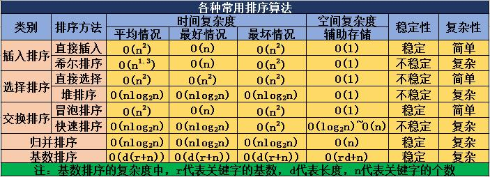
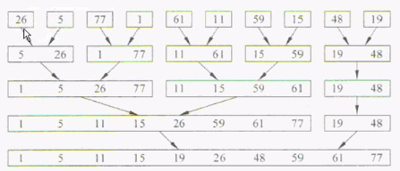
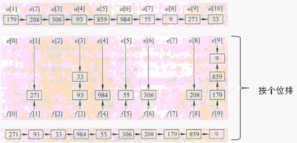

# 各排序算法复杂度和稳定性


---


# 简单排序


## 冒泡排序

```cpp
/*
冒泡排序：
从左向右扫描，比较相邻的两个数据，如果左边数据大于右边，就互换位置
*/
#include <iostream>

using namespace std;

void bubbleSort(int list[], int n)
{
    int num = 0;
    for (int i = 0; i < n - 1; i++)
    {
        for (int j = i + 1; j < n; j++)
        {
            if (list[i] > list[j])
            {
                swap(list[i], list[j]);
            }
        }
    }
}

int main()
{
    int a[]={2,4,6,5,3,1,9,7,10,8};
    bubbleSort(a, 10);
	
    for(int i = 0; i < 10; i++)
        cout<<a[i]<<"   ";
	
    return 0;
}
```


## 选择排序

```cpp
/*
选择排序：
从当前未排序的数组中选择最小的数，放到数组最前面.
和冒泡排序相同复杂度
*/
#include <iostream>

using namespace std;

void selectSort(int list[], int n)
{
    int minIdx = 1;
    for (int i=0; i < n - 1; i++)
    {
        minIdx = i;
        for (int j = i+1; j < n; j++)
        {
            if (list[j] < list[minIdx])
            {
                minIdx = j;
            }
        }
        swap(list[i], list[minIdx]);
    }
}

int main()
{
    int a[]={2,4,6,5,3,1,9,7,10,8};
    selectSort(a, 10);
	
    for(int i = 0; i < 10; i++)
        cout<<a[i]<<"   ";
	
    return 0;
}
```


## 插入排序

```cpp
/*
插入排序
从第二个数开始与前面数进行比较，前面数大就移动到后面，与前面所有数比较之后，就可以确定当前数要插入的位置，然后插入。
这样数组前面的数都是排好序的。
插入排序比冒泡和选择排序循环次数少
*/
#include <iostream>

using namespace std;

void insertSort(int *a, const int n)
{
    int sorted; //已经排好序的个数
    int in; //即将参与排序的
    int count = 0; //循环进程次数
    //默认index=0第一个数已经排好，所以即将参与排序的从第二个开始
    for (in = 1; in < n; in++)
    {
        int inValue = a[in]; //要参与排序的值
        sorted = in;
        while(sorted > 0 && a[sorted - 1] >= inValue)
        {
            //如果已经有排好序的，并且排好序的最后一个大于当前要参与排序的，则最后一个向后移动一位
            a[sorted] = a[sorted - 1];
            sorted--;
            count++;
        }
        //循环结束，已经比较了一边，当前sorted的位置就是in数需要插入的位置
        a[sorted] = inValue;
    }
    cout<<count<<endl;
}

int main()
{
    int a[]={2,4,6,5,3,1,9,7,10,8};
    insertSort(a, 10);

    for(int i = 0; i < 10; i++)
        cout<<a[i]<<"   ";

    return 0;
}
```

---


# 复杂排序


## 快速排序

最流行，速度最快的排序算法，使用递归进行。流程如下：

1. 选择一个数作为枢轴
2. 小于枢轴的数放在左边，大于枢轴的数放在右边。（具体执行为：从首尾同步进行，从首选择比枢轴大的，从尾选比枢轴小的，然后互换位置）
3. 对左边的数，继续选枢轴，继续步骤2（递归）
4. 对右边的数，继续选枢轴，继续步骤2（递归）

```cpp
/*
快速排序
1.选择一个数作为枢轴
2.小于枢轴的数放在左边，大于枢轴的数放在右边。（具体执行为：从首尾同步进行，从首选择比枢轴大的，从尾选比枢轴小的，然后互换位置）
3.对左边的数，继续选枢轴，继续步骤2（递归）
4.对右边的数，继续选枢轴，继续步骤2（递归）
*/
#include <iostream>

using namespace std;

template<class T>
void quickSort(T* a, const int leftIdx, const int rightIdx)
{
    if (leftIdx < rightIdx)
    {
        //选择枢轴,选择第一个数
        int i = leftIdx + 1;//左边起始位置跳过枢轴
        int j = rightIdx;
        int keyValue = a[leftIdx];
        
        while(i < j)//跳出循环时，i=j，处于中间位置
        {    
            while(a[i] < keyValue)
            {
                //左边开始，如果数小于枢轴，继续增加index
                i++;
            }
            while(a[j] > keyValue)
            {
                //右边开始，如果数大于枢轴，继续减小index
                j--;
            }
            if (i < j)
            {
                //如果i<j, 说明数没有交叉，需要互换位置
                swap(a[i],a[j]);
            }
        }
        //将之前选定的枢轴移动中间位置
        //如果不移动枢轴，下次枢轴就还是这个值，没法继续排序下去
        swap(a[leftIdx], a[j]);
        
        //对左边，右边进行递归
        quickSort(a, leftIdx, j -1);
        quickSort(a, j + 1, rightIdx);
    }
}

int main()
{
    int a[]={2,4,6,5,3,1,9,7,10,8,12,25,99,67};
    quickSort(a, 0, 13);

    for(int i = 0; i <= 13; i++)
        cout<<a[i]<<"   ";
    cout<<endl;
    return 0;
}
```


## 归并排序

和快速排序速度相当，并且是十分稳定的算法，也是使用递归进行。流程入下图所示：



缺点是占用空间，需要一个和原数组一样大小的临时空间。

```cpp
/*
归并排序
*/

#include <iostream>
#include <algorithm>

using namespace std;

//合并函数，将包含两个排好序的数组合并到另一个数组
//l=第一个已经排好序的第一个数的index
//m=第一个已排好序的最后一个数的index
//n=两个已排序子数组的总个数
template<class T>
void merge(T* initList, T* mergedList, const int l, const int m, const int n)
{
    int i1;//第一个排好序的子数组index
    int i2;//第二个排好序的子数组的index
    int iResult; //合并后数组的index
    for (i1=l, i2=m+1, iResult=l; i1<=m && i2<=n-1; iResult++)
    {
        if(initList[i1] <= initList[i2])
        {
            //I1小，合并数组里先放i1
            mergedList[iResult] = initList[i1];
            i1++;
        }
        else
        {
            //I2小，合并数组里先放i1
            mergedList[iResult] = initList[i2];
            i2++;
        }     
    }
    //由于两个已排序子数组不一定一样长，所以需要将剩下的数复制到mergedList
    copy(initList + i1, initList + m + 1, mergedList + iResult); //复制第一个子数组剩下的，没有的话copy函数直接返回
    copy(initList + i2, initList + n, mergedList + iResult); //复制第一个子数组剩下的，没有的话copy函数直接返回
}

//一次归并函数
//n=initList的个数
//s为每次归并前当前每个已排序子数组的个数
template<class T>
void mergeOnce(T* initList, T* resultList, const int n, const int s)
{
    int i;
    for(i=0; i<n-2*s+1; i+=2*s)
    {
        merge(initList, resultList, i, i+s-1, i+2*s);
    }
    //如果有剩余没有和它归并的,就复制到末尾
    if ((i+s-1) < n)
    {
        merge(initList, resultList, i, i+s-1, n);
    }
    else
    {
        copy(initList+i, initList+n, resultList+i);
    }   
    //打印一下归并后结果
    cout<<"after merge once:  ";
    for(int i = 0; i < n; i++)
        cout<<resultList[i]<<"   ";
    cout<<endl;
}

//归并排序算法, 循环归并直至归并结束
//n=数组个数
template<class T>
void mergeSort(T* a, const int n)
{
    T* tmpList = new int[n];
    for(int s=1; s<n; s*=2)  //这里s和mergeOnce里s含义相同
    {
        //一次循环调用两次，这样只用a,tmpList两个数组
        mergeOnce(a, tmpList, n, s);
        s *= 2;
        mergeOnce(tmpList, a, n, s);
    }
    delete tmpList;
}

int main()
{    
    int m[]={26,5,77,1,61,11,59,15,48,19}; //要排序的数组
    mergeSort(m, 10);
    
    cout<<endl;
    for(int i = 0; i < 10; i++)
        cout<<m[i]<<"   ";
    cout<<endl;
    
    return 0;
}
```


## 基数排序

基数：十进制的基数是10， 二进制的基数是2......
缺点：和归并排序一样，占用一倍的内存。
基数排序有两种：**MSD**(高位优选排序)和**LSD**(低位优先排序)。都是分别对个十百...分别进行排序。
例如： LSD排序过程如下：

```cpp
/*
基数排序：按照个十百位依次排序
LSD方式
*/
#include <iostream>
#include <list>

using namespace std;

void radixSort(int* data,const int n)
{
    //先计算最大的数是多少位
    int digits = 1; //初始化1位
    int radix = 10;//基数是10
    for (int i=0; i<n; i++)
    {
        while(data[i] >= radix)
        {
            radix *= 10;
            digits++;
        }
    }
    
    list<int> lists[10];//基数10，所以构建10个链表，对应0-9
    int d,j,k,factor; //factor每次*10，用于数组/factor,提取每位
    for (d=1, factor=1; d<=digits; factor*=10, d++)
    {
        //内循环：将数组的数按照每位排序，放入对应index链表中
        for(j=0; j<n; j++)
        {
            //将数组的数，放到每位的值对应的index中
            lists[(data[j]/factor)%10].push_back(data[j]);
        }
        //内循环2：循环每个链表将链表中数放回数组
        for(j=0, k=0; j<10; j++)
        {
            //一个链表可能有多个值，需要循环
            while(!lists[j].empty())
            {
                data[k] = lists[j].front();
                k++;
                lists[j].pop_front();
            }
        }
    }
}

int main()
{
    int data[] = {179,208,306,93,859,984,55,9,271,33};
    radixSort(data, 10);
    
    for(int i=0; i<10; i++)
        cout<<data[i]<<"   ";
    
    return 0;
}
```


## 堆排序

堆是一个有大小规则的结构，因此堆排序的方法很简单，就是：
**把未排序的数据一个一个放入堆中，然后再一个一个取出来即可**。
